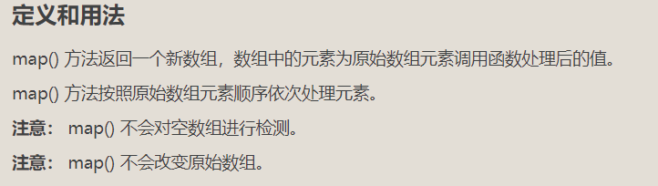

## Generator函数

Generator最大的特点就是可以交出函数的执行权（即暂停执行）

它和普通函数写法不太一样，主要有两个不同：

1、function关键字与函数名之间有一个星号(*)

2、Generator函数体内部使用yield语句，可以定义不同的内部状态

本质上：

整个Generator函数就是一个封装的异步任务，或者说是异步任务的容器

yield命令是异步不同阶段的分界线   所以有时也会把yield当成是return 

（yield就像是暂停  next就像是继续）

让Generator函数动起来，我们需要使用.next()方法 作用是分阶段的执行Generator函数

每次调用.next()方法，会返回一个对象

表示当前阶段的信息，有两个属性: value和done属性(true表示函数已经执行完毕  fase表示没有执行完)

**yield语句只能在Generator函数里面**

## 代理与反射 Proxy和Reflect

代理和反射为开发者提供了拦截并向基本操作嵌入额外行为的能力。


## 箭头函数

const ccc = (参数列表) =>{}

### 参数的注意点

放入一个参数

```
参数括号可以省略
const power = num =>{
	return num * num 
}
```

代码块中只有一行代码

```
const mul = (num1,num2) => num1 * num2
可省略大括号和return
```

### 箭头函数中的this指向

箭头函数中的this会向外层作用域中，一层层查找，直到有this的定义

## 数组

### set的基本用法

它类似于数组，但是成员的值都是唯一的，没有重复的值。

**set.has()**方法返回一个布尔值来指示对应的值value是否存在Set对象中

### map()方法




### from()方法

from() 方法用于通过拥有 length 属性的对象或可迭代的对象来返回一个数组

如果对象是数组返回 true，否则返回 false

```
语法：
Array.from(object, mapFunction, thisValue)
```

| 参数          | 描述                                        |
| ------------- | ------------------------------------------- |
| *object*      | 必需，要转换为数组的对象。                  |
| *mapFunction* | 可选，数组中每个元素要调用的函数。          |
| *thisValue*   | 可选，映射函数(mapFunction)中的 this 对象。 |

```
var setObj = new Set(["a", "b", "c"]);
var objArr = Array.from(setObj);
objArr[1] == "b";  // true
```

### fill()方法

fill() 方法用于将一个固定值替换数组的元素

```
语法： 
array.fill(value, start, end)
```

| 参数    | 描述                                       |
| ------- | ------------------------------------------ |
| *value* | 必需，填充的值。                           |
| *start* | 可选，开始填充位置。                       |
| *end*   | 可选，停止填充位置 (默认为 array.length)。 |

```
let arr1 = [1, 2, 3, 4, 56, 7, 7, 8, 9]; 
arr1.fill(4, 2, 5);
console.log(arr1)  //   [1, 2, 4, 4, 4, 7, 7, 8, 9]
let arr2 = [1, 2, 3, 4, 56, 7, 7, 8, 9];
arr2.fill(4);
console.log(arr2)  //  [4, 4, 4, 4, 4, 4, 4, 4, 4]
```

#### fill()的小坑

fill()的参数不是基本类型时，比如数组、对象，并不是将它的值填充到数组，而是将它的地址填充到数组，所以填

充后数组的每一项都指向的是同一个对象，就会出现"牵一发而动全身"的现象。


解决方案


### 直接获取数组中最大最小值

```
var arr = [1,2,3,4,5];
let max = Math.max(min).apply(math,arr);
```

### forEach()

```
var arr = [1,2,3,4,5];
arr.forEach((item, index) =>{
	if(item == 3){
	console.log(index);
	}
}
forEash循环一旦开始，无法在中间被停止
```

### some()

```
var arr = [1,2,3,4,5];
arr.some((item, index) =>{
	if(item == 3){
	console.log(index);
	return true
}
}
在找到对应的项之后，可以通过 return true固定的语法，来终止some循环
```

### every()

```
var arr = [1,2,3,4,5];
const res = arr.every(item => item)

针对数组中的每一个元素进行比对，只要有一个元素比对结果为false则返回false，反之要所有的元素比对结果为true才为true
```

### flat() flatMap(）

flat()用于将嵌套的数组“拉平”，变成一维的数组。该方法返回一个新数组，对原数据没有影响。


flatMap()方法对原数组的每个成员执行一个函数（相当于执行`Array.prototype.map()`），然后对返回值组成的

数组执行`flat()`方法。该方法返回一个新数组，不改变原数组。


## 字符串

### padStart() padEnd()

`padStart()`和`padEnd()`一共接受两个参数，第一个参数是字符串补全生效的最大长度

第二个参数是用来补全的字符串

如果原字符串的长度，等于或大于最大长度，则字符串补全不生效，返回原字符串。


### replace()和replaceAll()

replace只能替换第一个匹配


replaceAll可以一次性替换所有匹配


## 正则表达式


### 字符组常用缩写

 

###         量词简写

                                                                                                                                                                                                                                                                                                                                                                                                                                                                            

### 多选分支


## promise

### 为什么需要 promise

> 需求

通过 ajax 请求 id, 再根据 id 请求用户名, 再根据用户名获取 email

> 回调地狱

在回调函数中嵌套回调

Promise 解决了回调地狱

### Promise 的基本使用

Promise 是一个构造函数, 通过 new 关键字实例化对象

> 语法

```js
new Promise((resolve, reject) => {})
```

- Promise 接受一个函数作为参数
- 在参数函数中接受两个参数
  - resolve: 成功函数
  - reject: 失败函数

> promise 实例

promise 实例有两个属性

- state: 状态
- result: 结果

##### promise 的状态

第一种状态: pending(准备, 待解决, 进行中)

第二种状态: fulfilled(已完成, 成功)

第三种状态: rejected(已拒绝, 失败)

##### promise 状态的改变

通过调用 resolve()和 reject()改变当前 promise 对象的状态

> 示例

```js
const p = new Promise((resolve, reject) => {
  // resolve(): 调用函数, 使当前promise对象的状态改成fulfilled
  resolve()
})
console.dir(p) // fulfilled
```

> 示例

```js
const p = new Promise((resolve, reject) => {
  // resolve(): 调用函数, 使当前promise对象的状态改成fulfilled
  // reject(): 调用函数, 使当前promise对象的状态改成rejected

  // resolve()
  reject()
})
console.dir(p)
```

- resolve(): 调用函数, 使当前 promise 对象的状态改成 fulfilled
- reject(): 调用函数, 使当前 promise 对象的状态改成 rejected

> promise 状态的改变是一次性的

##### promise 的结果

> 示例

```js
const p = new Promise((resolve, reject) => {
  // 通过调用resolve, 传递参数, 改变 当前promise对象的 结果
  resolve('成功的结果')
  //reject('失败的结果')
})
console.dir(p)
```

### Promise 的方法

#### then 方法

```
const p = new Promise((resolve, reject) => {
  // 通过调用resolve, 传递参数, 改变 当前promise对象的 结果
  resolve('成功的结果')
  //reject('失败的结果')
})

// then方法函数
// 参数
// 1. 是一个函数
// 2. 还是一个函数
// 返回值: 是一个promise对象
p.then(
  () => {
    // 当promise的状态是fulfilled时, 执行
    console.log('成功时调用')
  },
  () => {
    // 当promise的状态是rejected时, 执行
    console.log('失败时调用')
  }
)
console.dir(p)

```

```
then 方法返回一个新的 promise 实例, 状态是 pendingconst p = new Promise((resolve, reject) => {
  // 通过调用resolve, 传递参数, 改变 当前promise对象的 结果
  //resolve('123')
  reject('失败的结果')
})

// then方法函数
// 参数
// 1. 是一个函数
// 2. 还是一个函数
// 返回值: 是一个promise对象
p.then(
  (value) => {
    // 当promise的状态是fulfilled时, 执行
    console.log('成功时调用', value)
  },
  (err) => {
    // 当promise的状态是rejected时, 执行
    console.log('失败时调用', err)
  }
)
console.dir(p)

```

>then 方法返回一个新的 promise 实例, 状态是 pending

```
const p = new Promise((resolve, reject) => {
  // 通过调用resolve, 传递参数, 改变 当前promise对象的 结果
  resolve('123')
  //reject('失败的结果')
})

// then方法函数
// 参数
// 1. 是一个函数
// 2. 还是一个函数
// 返回值: 是一个promise对象
const t = p.then(
  (value) => {
    // 当promise的状态是fulfilled时, 执行
    console.log('成功时调用', value)
  },
  (reason) => {
    // 当promise的状态是rejected时, 执行
    console.log('失败时调用', reason)
  }
)
console.dir(t)

```

>promise 的状态不改变, 不会执行 then 里的方法

>在 then 方法中, 通过 return 将返回的 promise 实例改为 fulfilled 状态

>如果在 then 方法中, 出现代码错误, 会将返回的 promise 实例改为 rejected 状态

```
// 如果promise的状态不改变, then里的方法不会执行
const p = new Promise((resolve, reject) => {
  resolve()
})

const t = p.then(
  (value) => {
    console.log('成功')
    // 使用return可以将t实例的状态改成fulfilled
    //return 123

    // 如果这里的代码出错, 会将t实例的状态改成rejected
    console.log(a)
  },
  (reason) => {
    console.log('失败')
  }
)

t.then(
  (value) => {
    console.log('成功2', value)
  },
  (reason) => {
    console.log('失败', reason)
  }
)

```


#### catch 方法

```
const p = new Promise((resolve, reject) => {
  // reject()
  // console.log(a)
  throw new Error('出错了')
})

// 思考: catch中的参数函数在什么时候被执行?
// 1. 当promise的状态改为rejected时, 被执行
// 2. 当promise执行体中出现代码错误时, 被执行
p.catch((reason) => {
  console.log('失败', reason)
})
console.log(p)
```

**Promise.race()方法**

只要任何一个异步操作完成，就立即执行下一步的.then操作


### async/await使用注意事项

1、如果在function中使用了await，则function必须被async修饰

2、在async方法中，第一个await之前的代码会同步执行，await之后的代码会异步执行


## EventLoop(事件循环)

JavaScript是一门单线程执行的编程语言，即同一时间只能做一个任务

为了防止某个耗时任务导致程序假死的问题，js把待执行的文件分为了两类：


JS主线程从“任务队列”中读取异步任务的回调函数，放到执行栈中依次执行。这个过程是循环不断的，所以整个的这种运行机制又称为EventLoop(事件循环)


## Ajax


### 跨域

#### 同源策略

同源策略是浏览器的一种安全策略

同源：协议、域名、端口号 必须完全相同

违背同源策略就是跨域


#### XSS 跨站脚本攻击


### 解决跨域

#### JSONP (非官方)


#### CROS (官方)

https://developer.mozilla.org/zh-CN/docs/Web/


