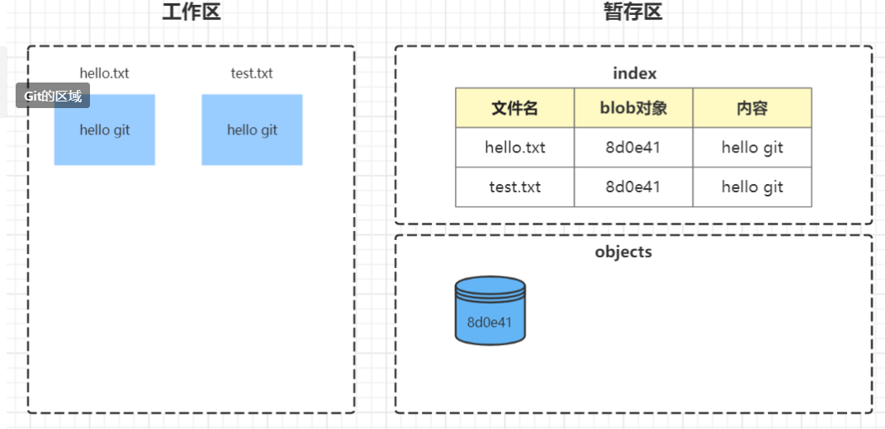

## Git

### 原理初探

如果要深入的理解Git的原理, 我们可以从`init`开始, 逐步的分析每一步Git背后到底做了什么

经过前面的学习和操作, 我们知道`git init`会创建一个本地仓库

1. 到底什么是本地仓库?
2. 本地仓库到底又是如何管理代码的呢?

#### 本地仓库的结构

当执行`git init`时, 会在当前目录下生成一个`.git`的目录, 这个目录就是本地仓库, 结构如下


这里有很多的文件, 每一个文件都有具体的作用. 后面我们会一个个详细分析

我们先重点研究**objects**

git objects[对象]分为3类

- blob: 数据对象
- tree: 树对象
- commit: 提交对象

#### Git是如何保存代码的

Git在add时, 将文件的内容通过Hash SHA-1算法生成一个基于Hash值的**键值对数据库**


这里有几个概念我们展开讲

1. 文件内容
2. Hash算法
3. 文件压缩

##### **文件内容**

只要文件内容相同, 最终生成的Hash串就是一样的. 跟文件名无关


##### Git中的Hash算法

为了理解Git中的Hash算法, 我们先简单的介绍一下Hash算法

把任意长度的输入通过算法变换成固定长度的输出

- MD5: 128bit(16字节, 32个16进制)
- SHA1: 160bit(20字节, 40个16进制)


通过观察, 我们可以看到, 在objects目录下生成了一个文件:

- 文件名`8d0e41`就是生成的Hash串
- 文件的内容是一串乱码, 这个是将文件经过zlib压缩后的数据

这样就就建立了一个映射关系, 即: 通过hash串, 找到对应的文件, 进而读取到文件的内容.

这种结构就是所谓的**键值对数据库**

- 键: Hash值
- 值: 文件内容


其实, Git生成Hash串的算法并不是很复杂. 通过下面算法就可以得到

```
'blob 长度\0内容'
```

下面借助Linux的命令得到同样的Hash串

```
echo 'blob 10\0hello git' | sha1sum
```

- 10: 是文件的长度, 除了`hello git`9个字符外, 还有一个`\n`, 长度为10
- `hello git`是文件的内容
- sha1sum: 是Linux自带的计算Hash串的命令


##### 相关命令

Git提供一些命令来管理数据库, 这类命令(工具)不同于之前我们使用的命令, 如`git add`. `git commit`

为了区分, 我们将Git命令分为两类

- 底层(plumbing)命令
- 高层(porcelain)命令

这里, 我们先介绍一个底层命令: `git cat-file`

通过`git cat-file`命令来查看object信息

```
# 获得object的类型
git cat-file -t hash
# 获得object的数据
git cat-file -p hash
# 获得object的长度
git cat-file -s hash
```

#### Git的区域

##### 概念

Git 与一般的版本控制工具有所不同, 在**工作区**和**仓库区**之间, 还有一个暂存区

1. 什么是暂存区
2. 暂存区的作用

暂存区是介于工作区和仓库区的一个区域. `.git/index`就是暂存区

暂存区临时存放了一些修改, 比如写代码的过程中出现了灵感, 想记录下来, 但是又不想真正形成一次提交.

此时, 就可以保存到暂存区, 我的理解就是一个存放**草稿**的区域

为了搞清楚 Git 的暂存区, 我们先谈谈工作区

##### 工作区

> 工作区: 顾名思义就是我们工作的区域

说人话, 就是我们写代码的地方, 可以看得到的地方

在工作区中, 每一个文件只有两种状态

- 未跟踪
- 已跟踪
  - 未修改
  - 已修改
  - 已暂存


对于刚创建的文件, 状态是未跟踪(untracked)

- 通过`git add`将文件添加到暂存区, 此时文件状态就变成 staged, 也就被 git 管理起来了
- 此时, 如果修改了文件, 状态变成`modified`, 然后可以再次通过`add`命令添加到暂存区

##### 暂存区

有别于其他的 SCM(Source Code Management), 暂存区(index/stage)是 Git 特有的一个区域.

暂存区可以看作一个文件名到 blob 对象的**索引表**, 这也是为什么暂存区叫 index 的原因


通过`git ls-files -s`命令查看

```text
文件权限 blob对象 文件名
```

通过这张索引表, 就可以清楚的知道

工作区中的文件`hello.txt` 对应 blob 对象`4567`, 通过 blob 对象又可以找到压缩后的文件内容


这样每次提交代码需要两步操作

- 先通过`git add`将工作区的内容先添加到暂存区
- 再通过`git commit`将暂存区的内容提交到本地仓库

直到杰哥接触到这个命令`git add -i`, 交互式暂存.

我是这么理解的, 暂存区相当于`购物车`, 而 commit 相当于支付. 有了购物车的好处是,

1. 可以对购物车里的部分文件进行提交
2. 可以对购物车里的文件进行管理, 比如从购物车中移除

进一步地说, 就是保证每次提交都是真正需要提交的内容, 在提交之前有一个地方(暂存区)可以随便造

##### 仓库区

仓库区就是保存了不同版本的**代码仓库**

通过命令`git commit`将 index 中的内容提交到仓库区.


status 相关命令

```sh
# 对比工作区和暂存区的差异
git status
git status -s
```


- A: 添加到了暂存区
- M: 修改
- D: 删除
- ??: 未跟踪

查看暂存区命令

```sh
# 查看当前暂存区索引表
git ls-files
git ls-files -s
```


交互式暂存

```sh
# 交互式暂存
git add -i
```

每次执行`git add`时, 会根据文件内容生成 blod 对象的 Hash 串

如果此时修改了文件内容. 可以看到工作区的状态从`added`变成了`modified`

如果想找回上一次修改的内容. 可以通过

```sh
# 使用暂存区的内容覆盖工作区
git checkout -- hello.txt
```

但是这样, 最近一次的工作成果就没有了

如果添加到了暂存区, 这个时候 hello.txt 就会对应到新的 blob 对象`4567`, 而之前的对象`8d0e`就变成垃圾对象

可以通过使用`git prune`清理垃圾对象

```sh
# 清理垃圾对象(列出, 模拟)
git prune -n
# 清理垃圾对象
git prune
```


#### Git add详解

`git add`命令是我们使用频率很高的命令.

通过前面的介绍, 我们大概知道了这个命令就是将工作区的文件添加到暂存区

接下来, 我们将重点分析`git add`命令在执行后具体产生了哪些变化


在工作区创建一个文件`hello.txt`

```sh
echo 'hello git` > hello.txt
```

继续观察`.git`本地仓库, 没有任何变化

当执行了`git add hello.txt`后, `.git`里多出了`index`和一个`blob`对象


创建一个新的文件`test.txt`

```sh
echo 'hello git' > test.txt
```

添加到暂存区

```sh
git add test.txt
```

观察发现, 在objects里依然只有一个blob对象

但是, 观察index索引表, 发现工作区的两个文件都指向同一个blob对象



#### Git commit详解

在执行`git commit`时, 会产生两个对象

- 一个是`tree blob`
- 一个是`commit blob`

```sh
git commit -m 'c1'
```


查看一下commit对象的内容

```sh
git cat-file -p 1b9353
```

查看一下tree对象的内容


第二次提交

创建一个新的文件`111.txt`, 并提交

```sh
echo '111' > 111.txt
git add 111.txt
git commit -m 'c2'
```


从数据结构上来说

- commit对象与commit对象之间形成一个单向链表. 通过parent指针可以找到每一个commit对象
- tree与blob形成了树状结构.可以认为tree是目录, blob是文件

第三次提交, 我们修改一下test.txt的内容, 改成`hello git~`

```sh
vim test.txt
git add test.txt
git commit -m 'c3'
```


第四次, 我们做的稍微复杂一点. 我们创建一个目录, 在目录下再创建一个文件

```sh
mkdir sub
echo 'foo' > sub/foo.txt
git add .
git commit -m 'c4'
```


#### Git分支详解

首先, 我们简单的复习一下什么是分支

> 分支是主线某个状态的一个复制, 在不影响主线情况下, 可以有新的变化

我们通过实际例子来理解

我们的工作一般都是在一条主线(master)上进行, 每一次提交会形成一个commit对象, 如下图所示


客户提出了一个新的需求, 而这个需求的开发需要一段时间才能完成.

为了不影响主线的稳定性和持续进行. 我们会怎么做?

我们可以把整个项目复制一份, 在复制的项目上开发新功能, 开发完成通过测试后, 再将改动的代码整合回主线.

那么, 这个复制出来的项目就是一个分支


现在, 我们了解到分支的提出主要是为了开发新功能而不影响主线的正常运行

通过上面的例子, 我们大概可以知道

1. 分支和主线有一部分内容是相同的, 有一部分是不同的
2. 在分支上可以做新的开发, 而不会影响到原来的主线
3. 在分支上开发完成后, 通常还是要将改动合并回主线

##### 相关命令

```
# 查看已有分支
git branch
# 创建分支
git branch 分支名
# 切换分支
git checkout 分支名
# 合并分支
git merge
```

##### 分支的本质

git branch可以查看当前所有的分支, 本质上是显示`.git/refs/heads`目录下的文件.


查看文件具体的内容


- 文件名(dev, master)表示一个分支
- 文件的内容是最近一次commit对象的Hash串

因此, 我们得出一个重要的结论

>提示
>
>Git中的分支本质上是一个指针, 指向该工作流中最近的一次commit

##### 命令详解

先做3次提交

通过`git log --oneline`查看commit对象


使用`git branch 分支名`可以基于现有的commit对象, 在`.git/refs/heads`下产生一个文件

当执行`git branch dev`时创建了一个dev分支

本质上就是在`.git/refs/heads`目录下创建了一个文件

- 文件名: dev
- 文件内容: d434d9f


HEAD指针永远指向当前所在的分支

执行`git checkout`的作用之一, 就是改变HEAD的指向, 本质就是修改了HEAD文件中的内容


把分支切换到`dev`后, 我们就可以在dev分支上进行修改, 这些修改是不会影响到原来的master分支的


此时, 我们可以通过`git chekout`在分支间来回切换, 工作区的内容也会随之变化

#### Fast-forward合并

此时, 如果我们要把在dev分支上的改动合并回master, 需要

1. 切换到master分支
2. 执行merge


像这样的合并是比较快的, 叫做Fast-forward(快速向前)的合并方式, 只是指针的移动

#### Three-way合并

在上面的例子中. 我们基于master的c3 commit创建了dev分支.

在后面仅仅只在dev上改动了代码. master一直指向c3 commit.

这样合并时就非常简单, 也很快, 只需要将master指针指向新的c4 commit就可以. 这种方式就是Fast-forward

但是如果, master和dev同时都有改动, 将会如何呢?看下面的例子

###### 步骤一

在master分支创建一个文件, 并提交


######  步骤二

切换到dev分支, 创建dev.txt文件并提交


执行命令, 查看log

```sh
git log --oneline --graph --all
```


- --graph: 以图形展示log
- --all: 显示所有分支


###### 步骤三


此时, 会自动创建一个新的commit对象`e02bdf6`, 同时指向`99fe8a`和`1740e`


有的地方, 把这种合并称为Three-way(三方合并)


### config


###  创建Git仓库


### 创建公钥

#### ssh-keygen参数

ssh-keygen -t rsa -C “”

-C是公钥中的备注


