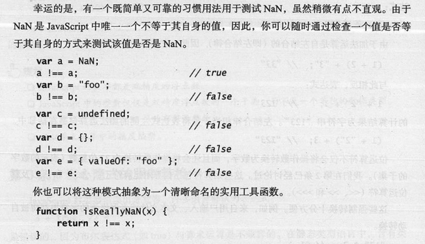

###  初识JavaScript

#### JavaScript是什么

JavaScript是世界上最流行的语言之一，是一种运行在客户端上的脚本语言（Script是脚本的意思）

脚本语言：不需要编译，运行过程中由JS解释器(JS引擎)逐行来进行解释并执行

现在也可以基于Node.js技术进行服务器端编程

#### JavaScript的作用

表单动态校验（密码强度检测）（JS产生最初的目的）

网页特效

服务端开发（Node.js）

桌面程序（Electron）

App（Cordova）

控制硬件-物联网（Ruff）

游戏开发（cocos2d-js）

#### JS的组成


### JS初体验

#### 1.行内式JS

```
<input type="button" value="123" onclick="alert('456')">
```

##### 注意

可以将单行或者少量代码写在HTML标签的事件属性中（以on开头的属性），如：onclick

注意单双引号的使用：在HTML中我们推荐使用双引号，JS中推荐使用单引号

可读性差，在html中编写大量代码时，不方便阅读

引号异错，引号多层嵌套时，非常容易弄混

#### 2.内嵌JS

```
<script> alert('123'); </script>
```

##### 注意

可以将多行JS代码写到<script>中

内嵌JS是学习时常用的方式

#### 3.外部JS文件

```
引入：<script src="my.js"> </script>
```

##### 注意

利于HTML页面代码结构化，把大段JS代码独立到HTML页面之外，既美观，也方便文件级别的复用

引用外部JS文件的script标签中间中不可以写代码

适用于JS代码量比较大的情况

#### 输入输出语句


#### 变量

##### 声明变量 var、let、const

```
var age；
var myname=prompt('请输入你的名字')；

一般不用 var 因为没有作用域的限制

主要用 let 和 const
其中 let来声明变量 用const来声明常量(不变的量)
	声明对象时，常用const
```

##### 注意

同时声明多个变量时，只需要写一个var，多个变量名之间用逗号隔开

只声明不赋值 结果为undefined

JS的变量数据类型是只有在运行过程中，根据等号右边的值来确定的

JS是动态语言 变量的数据类型是可以变化的

#### 数据类型

##### 数字型Number

###### 数字型三个特殊值

Infinity，代表无穷大，大于任何数值

-Infinity，代表无穷小，小于任何值

NaN，Not a number 代表一个非数值

###### 数字型范围

最大值和最小值

```
alter(Number.MAX_VALUE);//1.7976931348623157e + 508
alter(Number.MIN_VALUE);//5e-324
```

##### 测试NaN



##### 转义符


##### 获取变量数据类型

typeof 可用来获取检测变量的数据类型

prompt 取过来的值是字符型的

##### 数据类型转换

###### 转换为字符串


###### 转换为数字型（重）


###### 转化为Boolean型


代表空，否定的值会被转换为false，如' '、0、NaN、null、undefined

其余值都会被转换为true

#### 运算符

##### 比较运算符


##### 赋值运算符


##### 运算符优先级


#### 断点调试

浏览器中按F12-->sources-->找到需要调试的文件-->在程序的某一行设置断点

Watch：监视，通过watch可以监视变量的值的变化

F11：程序单步执行，让程序一行一行的执行代码，此时，观察watch中变量的值得变化

#### 数组

```
1.利用new创建数组
var arr=new Array();
2.利用数组字面量创建数组
var arr= [];
数组中可以存放任意类型的数据，例如字符串，数字，布尔值等
var arrStus=['23'，1，true];
```

##### 修改数组长度

1.通过修改length长度新增数组元素 达到扩容的目的

2.新增数组元素 修改索引号 追加数组元素

#### 函数

##### 两种声明函数方法

###### 1.命名函数

```
function 函数名(){
	函数体;
}
```

###### 2.函数表达式（匿名函数）

```
//var 变量名 = function(){}
var fun = function(){
	函数体;
}
```

##### arguments的使用

```
function fun(){
	console.log(arguments);//里面存储了所有传递过来的实参
}
fun(1,2,3);
arguments 是伪数组 并不是真正意义上的数组
1.具有数组的length属性
2.按照索引的方式进行存储
3.并没有真正数组的一些方法
```

##### 立即调用函数

```
格式：
（function(){
}）();
```


#### 对象

##### 创建对象

1.利用对象字面量创建对象

```
var obj={
	uname:'guo',
	age:18,
	sex:'男',
	sayHi:function(){
		console.log('Hi~');
	}
}
1. 里面的属性或者方法我们采用键值对的形式 键 属性名 ： 值 属性值
2. 多个属性或者方法中间用逗号隔开
3. 方法冒号后面跟的是一个匿名对象
```

2.利用 new Object创建对象

```
var obj = new Object();
Obj.uname = 'guo';
obj.age = '18';
obj.sayHi = function(){
	//函数体	
}
```

3.利用构造函数创建对象

##### 使用对象

1.调用对象的属性 我们采取 对象名.属性名

2.调用属性还有一种方法 对象名['属性名']

3.调用对象的方法 对象名.方法名()

##### 遍历对象

for （变量 in 对象）

```
for(var k in obj){
	console.log(k);//k 变量 输出得到的是属性名
	console.log(obj[k]);// obj[k] 得到的是 属性值
}
```

##### 对象深拷贝的三种实现方式

**1. 使用递归的方式实现深拷贝**

**2. 通过 JSON 对象实现深拷贝**

JSON.parse(JSON.stringify(obj))

**3. 通过jQuery的extend方法实现深拷贝**

#### 内置对象

##### 查文档

MDN：https://developer.mozilla.org/zh-CN/

Math对象

Data对象

Arrays对象

### DOM

#### DOM树


文档：一个页面就是一个文档，DOM中使用document表示

元素：页面中的所有标签都是元素，DOM中使用element表示

节点：网页中的所有内容都是节点（标签，属性，文本，注释等），DOM中使用node表示

DOM把以上内容都看作是对象

#### 获取元素

##### 根据ID获取

使用**document.getElementById()**方法可以获取带有ID的元素对象

```
<div id='time'>2021-5-5<div>
<script>
//1.因为我们文档页面从上往下加载，所以得先有标签 所以script写到标签的下面
//2.返回一个元素对象
var timer = document.getElementById('time');
console.dir(timer);
//console.dir 打印返回的元素对象，更好的查看里面的属性和方法
</script>
```

##### 根据标签名获取

使用**document.getEelmentByTagName()**方法可以返回带有指定标签名的**对象的集合**

```
<ul>
	<li></li>
	<li></li>	
	<li></li>	
	<li></li>	
</ul>
<ol id='ol'>
	<li></li>
	<li></li>		
	<li></li>	
</ol>
<script>
	//1.返回的是 获取过来元素对象的集合 以伪数组的形式存储结构
	var lis = document.getElementByTagName('li');
	console.log(lis[0]);
	//2.想要一次打印里面的元素对象，可以采取遍历的方式
	//3.如果页面中只有一个li 返回的还是伪数组的形式
	//4.如果页面中没有该元素 返回的是一个为空的伪数组
	//5.还可以获取某个元素（父元素）内部所有指定标签名的子元素
	var ol = document.getElementById('ol');
	console.log(ol.getElementByTagName('li'));
</script>
```

##### 根据HTML5新增的方法获取

```
<div class="box"></div>
<div class="box"></div>
<div id="nav">
	<ul>
		<li>首页</li>
		<li>产品</li>		
	</ul>
</div>
<script>
	//1.使用document.getElementByClassName('类名')返回元素对象集合
	var boxs = document.getElementByClassName('box');
	console.log(boxs);
	//2.querySelector('选择器') 返回指定选择器的第一个元素对象
	var firstBox = doucument.querySelector('.box');
	console.log(firsitBox);
	//3.querySelectorAll('选择器') 返回指定选择器的所有元素对象集合
	var allBox = document.querySelectorAll('.box');
	console.log(allBox);
</script>
```

##### 获取body元素

**document.body** 返回body元素对象

```
var bodyEle = document.body;
```

##### 获取html元素

**document.documentElement** 返回html元素对象

```
var htmlEle = document.documentElement;
```

#### 事件基础

事件：触发--响应机制

##### 事件三要素

###### 事件源

###### 事件类型

###### 时间处理程序

```
<button id="btn">456</button>
    <script>		
		//事件源 事件被触发的对象
        //事件类型 如何触发 什么事件
        //事件处理程序 通过一个函数赋值的方法 完成
        var btn = document.getElementById('btn');
        btn.onclick = function() {
            alert("123");
        }
</script>
```

##### 执行事件的步骤

1.获取事件源

2.注册事件（绑定事件）

3.添加时间处理程序（采取函数赋值形式）

##### 常见的鼠标事件


###### 禁止鼠标右键菜单 contextmenu

contextmenu主要控制应该何时显示上下文菜单，主要用于程序员取消默认的上下文菜单

```
document.addEventLsitener('contextmenu',function(e){
	e.preventDefault();
})
```

###### 禁止鼠标选中(selectstart 开始选中)

```
document.addEventListener('selectstart',function(e){
	e.preventDefault();
})
```

###### mouseenter和mouseover的区别

mouseover鼠标经过自身盒子会触发，经过子盒子还会触发

mouseenter只会经过自身盒子触发   **原因**：mouseenter不会冒泡

#### 操作元素


##### 改变元素内容

##### **element.innerText** 与**element.innerHTML**区别

**element.innerText**

从起始位置到终止位置的位置的内容，**但它不识别html标签，同时空格和换行也会去掉**

**element.innerHTML**（主要）W3C标准

起始位置到终止位置的全部内容，**识别html标签，同时保留空格和换行**

##### 修改元素属性

```
 <button id="gzh">gzh</button>
    <button id="gjh">gjh</button>
    
    <script>
        var gzh = document.getElementById('gzh');
        var gjh = document.getElementById('gjh');
        var img = document.querySelector('img');
        gzh.onclick = function() {
            img.src = "图片/pig.jpg"; 
            img.title = 'gjh';
        }
        gjh.onclick = function() {
            img.src = "图片/dog.jpg";
            img.title = 'gzh';
        }
    </script>
```

##### 表单元素的属性操作

 type、value、checked、selected、disabled

```
<input type="text" value="输入内容">
//表单里面的值，文字内容是通过value来修改的
//如果想要某个表单被禁用 不能再点击 用disabled
btn.disabled = true;
```

将密码框类型改为文本框来显示密码

算法：利用一个flag变量，来判断flag的值，如果是1就切换为文本框，flag设置为0，如果是0就切换为密码框 再将 flag设置为1

##### 样式属性操作

###### 1.element.style 行内样式操作

使用element.style 获得修改元素样式 **在样式比较少 或者 功能简单的情况下使用**

```
<div></div>
<script>
	var div = document.querySelector('div');
	var index = 50;
	div.style.backgroundPosition = '0 '+index+'px'; 
</script>
```

###### 2.element.className 类名样式操作

**使当前的元素的类名变更**

可以通过修改元素的className更改元素的样式

修改元素的className更改元素的样式 **适合于样式较多或者功能复杂的情况**

###### 注意

1.JS里面的样式采取驼峰命名法：fontSize、backgroundColor

2.JS修改style样式操作，产生的是行内样式，权重比较高

3.className会直接更改元素的类名，会覆盖原先的类名

如果想要保留原先的类名，可以使用 多类名选择器

element.className = "原来类名 之后类名"

##### 排他思想(算法)

如果有同一组元素，我们想要某一个元素实现某种样式，需要用到循环的排他思想算法

1.所有元素全部清除样式（干掉其他人）

2.给当前元素设置样式（留下我自己）

3.注意顺序不能颠倒

```
 <button>按钮1</button>
    <button>按钮2</button>
    <button>按钮3</button>
    <button>按钮4</button>
    <button>按钮5</button>
    <script>
        var btns = document.getElementsByTagName('button');
        for (var i = 0; i < btns.length; i++) {
            btns[i].onclick = function() {
                //1.首先把所有的按钮背景颜色去掉
                for (var i = 0; i < btns.length; i++) {
                    btns[i].style.backgroundColor = '';
                }
                //2.然后让当前元素的背景颜色为 pink
                this.style.backgroundColor = 'pink';
            } 
        }
    </script>
```

#####  自定义属性的操作

###### 1.获取属性值

element.属性 （获取内置属性值 （元素本身自带的属性））

element.getAttribute('属性')  主要获得自定义的属性（标准） 自己定义的属性

###### 2.设置属性值

element.属性 = '值'; （设置内置属性值）

element.setAttribute('属性'，‘值’);  （主要针对于自定义属性）

###### 3.移除属性

removeAttribute(‘属性’)  

##### H5自定义属性

自定义属性目的：是为了保存并使用数据，有些数据可以保存到页面中而不用保存到数据库中。

###### 1.设置H5自定义属性

H5规定自定义属性data-开头作为属性名并且赋值 

```
比如<div data-index='1'></div
```

2.获取H5自定义属性

1.兼容性获取 element.getAttribute('data-index')

2.H5新增element.dataset.index（省略data-）或者 element.dataset['index']  (ie11才开始支持) 

**此方法只能获取'data-'开头的自定义属性**

如果自定义属性中里面有多个 - 连接的单词，我们获取的时候采取 驼峰命名法

```
<dib data-list-name = '666'></div>
console.log(div.dataset.listName);
```

####  节点操作

利用节点层级关系获取元素（父子兄节点关系）

**逻辑性强 兼容性稍差**

节点至少拥有**nodeType（节点类型）**、**nodeName（节点名称）**和**nodeValue（节点值）**三个基本属性

元素节点 nodeType为1

属性节点 nodeType为2

文本节点 nodeType为3（文本节点包含文字、空格、换行等）

**节点操作主要操作的是元素节点**

##### 1.父节点 parentNode

```
node.parentNode 得到的是元素最近的父级节点 如果找不到父节点就返回为null
```

##### 2.子节点

######  childNode

```
parentNode.childNode（标准）//返回包含指定节点的子节点的集合，该集合为即时更新的集合
得到的所有的子节点 包含元素节点 文本节点等
```

###### children

```
重：parentNode.children（非标准）//返回所有的子元素节点，只返回子元素节点，其余节点不返回
虽然children是一个非标准 但各个浏览器都支持 
```

| 获取第一个和最后一个元素 | 区别                                      |
| :----------------------- | ----------------------------------------- |
| firstChild               | 第一个子节点 不管是文本节点还是元素节点   |
| lastChild                | 最后一个子节点 不管是文本节点还是元素节点 |
| firstElementChild        | 返回第一个元素节点 （ie9以上支持）        |
| lastElementChild         | 返回最后一个元素节点                      |

###### **实际开发写法**

```
ul.children[0];//获取第一个元素节点
ul.children[ul.children.length-1];//获取最后一个元素节点
```

##### 3.兄弟节点

###### nextSibling

```
node.nextSibling //返回当前元素的下一个兄弟节点 包含其他节点 找不到返回null
```

###### previousSibling

```
node.previousSibling //返回当前元素上一个兄弟节点 包含其他节点 找不到返回null
```

###### nextElementSibling

```
node.nextElementSibling //返回当前元素的下一个兄弟元素节点，找不到返回null  ie9以上支持
```

###### previousElementSibling

```
node.previousElementSibling //返回当前元素的上一个兄弟元素节点，找不到返回null  ie9以上支持
```

**考虑到兼容性问题 封装一个兼容性的函数**

```
function getElementSibling(element){
	var el = element;
	while(el = el.nextSibling){
		if(el.nodeType == 1){
			return el;
		}
	}
	return null;
}
```

##### 创建节点

```
document.createElement('tagName') //动态创建元素节点
```

##### 添加节点

###### 1.appendChild

```
node.appendChild(child) node 父级 child 子级
//将一个节点添加到指定父节点的子节点列表末尾 类似于after伪元素 和数组的push
```

###### 2.insertBefore

```
node.insertBefore(child,指定元素)
//将一个节点添加到父节点的指定子节点前面 类似于before伪元素
```

##### 删除节点

removeChild

```
node.removeChild(child) //删除一个子节点 返回删除的节点
```

##### 阻止链接跳转

```
<a href = 'javascript:;'>123</a>
```

##### 复制节点

cloneNode

```
node.cloneNode() //返回调用该方法的节点的一个副本 也称为克隆节点
括号里面为空或者里面为false 则是浅拷贝 只复制标签不复制里面的内容
括号里面为true 深拷贝 复制标签和里面的内容
```

##### 三种创建元素方式区别

###### 1.doucument.write() 

直接将内容写入页面的内容流，但是文档流执行完毕，则他会**导致页面全部重绘**

###### 2.innerHTML 

创建多个元素效率更高（不拼接字符串 采取数组形式拼接） 结构稍微复杂

###### 3.createElement() 

创建多个元素效率稍低一点 但结构更清晰

不同浏览器下 innerHTML 效率要比createElement（数组形式） 高

#### 注册事件（绑定事件）

##### 传统注册方式

利用on开头的事件 onclick

###### 特点

注册事件的唯一性

同一个元素同一个事件只能设置一个处理函数，最后注册的处理函数会覆盖前面注册的处理函数

##### 方法监听注册方式

w3c 标准 推荐方式

使用addEventListener()方法  ie9之前的可使用attachEvent()代替

###### 特点

同一个元素同一个事件可以注册多个监听器

##### addEventListener  

```
eventTarget.addEventListener(type,listener [useCapture])
```

该方法接收三个参数

type：事件类型字符串，比如click、mouseover 注意不要带on

listener：事件处理函数，事件发生时 会调用该监听函数

useCapture：可选参数，是一个布尔值，默认为false

##### attachEvent

```
eventTarget.attachEvent(eventNameWithOn,callback)
```

该方法接收两个参数：

eventNameWithOn：事件类型字符串 比如 onclick 这里要带on

callback：事件处理函数 当目标触发事件时回调函数被调用

##### 注册事件兼容性解决方案


#### 删除事件

##### 传统注册方式

eventTarget.onclick = null;

##### 方法监听注册方式

```
1.eventTarget.removeEventListener(type,listener[,useCapture])
2.eventTarget.detachEvent(eventNameWithOn,callback)
```

#### DOM事件流


#### 事件对象

事件发生以后，跟事件相关的一系列信息数据的集合都放到这个对象里面，这个对象就是事件对象event，有很多属性和方法

```
eventTarget.onclick = function(event){}
eventTarget.addEventListener('click',function(event){})
例：
//div.onclick = function(e){
	//console.log(e);
	//console.log(window.event);
	//e=e||window.event;
}
```

##### 时间对象的常见属性和方法


#### 阻止事件冒泡

事件冒泡：开始有最具体的元素接收，然后逐级向上传播到DOM最顶层节点

```
标准写法：利用事件对象里面的stopPropagation()方法
e.stopPropagation()
非标准写法：IE6-8 利用事件对象cancelBubble属性
```

#### 事件委托(代理、委派)

事件委托又称为事件代理，在jQuery中称为事件委派

##### 事件委托的原理

不是每个节点单独设置事件监听器，而是事件监听器设置在其父节点上，然后利用冒泡原理影响设置每个子节点

```
var ul = document.querySelector('ul');
ul.addEventListener('click',function(){
	alert('123');
})
```

#### 鼠标事件对象MousEvent


#### 常用键盘事件


keydown和keypress在文本框里面的特点：他们两个事件触发的时候，文字还没有落入文本框中

keyup事件触发的时候，文字已经落入文本框中

```
使用addEventListener 不加 on
doucument.addEventListener('keyup',function(){
	console.log('123');
})
```

##### 键盘事件对象


注意：onkeydown和onkeyup不区分字母大小写，onkeypress区分字母大小写

在我们实际开发中，更多的使用keydown和keyup，它能识别所有的键（包括功能键）

keypress不识别功能键，但是keycode属性能区分大小写，返回不同的ASCII值

### BOM

#### BOM的构成

BOM为浏览器对象  window对象是浏览器的顶级对象，具有双重角色

1.它是JS访问浏览器窗口的一个接口

2.它是一个全局对象。定义在全局作用域中的变量、函数都会变成window对象的属性和方法

在调用的时候可以省略window，alert()、prompt()都属于window对象方法

注意window下的一个特殊属性window.name 所以全局变量尽量不要用name

#### window对象的常见事件

##### 窗口加载事件

```
window.onload = function(){}
或者
window.addEventListener("load",function(){});
```

window.onload是窗口(页面)加载事件，当文档内容完全加载完成会触发该事件(包括图像、脚本文件、CSS文件等)，就调用的处理函数

注意

1.有了window.onload就可以把js代码写到页面元素的上方

2.window.onload传统注册方式只能写一次，如果有多个，以最后一个为准

3.如果使用addEventListener 则没有限制

```
document.addEventListener('DOMContentLoaded',function(){})
```

DOMContentLoaded事件触发时，仅当DOM加载完成，不包括样式表，图片，flash等

如果页面图片较多的话，用DOMContentLoaded比较合适

##### 调整窗口大小事件

```
window.onresize = function(){}
window.addEventListener("resize",function(){});
```

window.onresize是调整窗口大小加载事件，当触发时就调用的处理函数

注意

1.只要窗口大小发生像素变化，就会触发这个事件

2.经常用这个事件完成响应式布局  window.innerWidth当前屏幕的宽度

##### 定时器

###### setTimeout()

```
window.setTimeout(调用函数,[延迟的毫秒数]);
```

setTimeout()方法用于设置一个定时器，该定时器在定时器到期后执行调用函数

同时这个函数也称为回调函数 callback:某一件事情干完，再回头调用这个函数

注意

1.调用函数可以**直接写函数**，或者**写函数名**或者采取字符串**'函数名()'**三种形式 第三种不推荐

2.延迟的毫秒数默认为0，如果写 单位为毫秒

3.定时器一般有很多，所以经常给定时器赋值一个标识符

4.window可省略

###### 停止Timeout定时器

```
window.clearTimeout(timeID)
```

###### setInterval()

```
window.setInterval(回调函数,[间隔的毫秒数]);
```

setInterval()方法重复调用一个函数，每隔一段时间，就去调用一次回调函数

注意事项与Timeout()相差不大         

###### 停止setInterval定时器

```
window.clearInterval(IntervalID);
```

#### JS执行机制


##### 同步任务

同步任务都在主线程上执行，形成一个执行栈

##### 异步任务

JS的异步是通过回调函数实现的

一般来说，异步任务有以下三种类型

1.普通事件，如:click、resize等

2.资源加载，如:load、error等

3.定时器，包括setInterval、setTimeout等

#### location对象

window对象给我们提供了一个location属性用于获取或设置窗体的URL，并且可以用于解析URL，因为这个属性返回的是一个对象，所以我们将这个属性也称为location对象


#### location对象的方法


#### URL


#### navigator对象

navigator对象包括有关浏览器的信息，它有很多属性，最常用的是userAgent，该属性可以返回由客户机发送服务器的user-agent头部的值

下面前端代码可以判断用户在哪个终端打开页面，实现跳转


#### history对象


#### offset系列

offset翻译过来就是偏移量，我们使用offset系列相关属性可以动态的得到该元素的位置(偏移)、大小等

注意：返回的数值都不带单位


##### offset与style的区别


获取用offset   更改用style

#### 元素可视区client系列

client翻译为客户端  client系列的相关属性可以动态的得到该元素的边框大小、元素大小等


#### 立即执行函数

不需要调用 能够自己执行的函数

```
(function() {})() 或者 (function(){}())

(funnction(a,b){
	console.log(a+b);
})(1,2) //第二个小括号可以看作是调用函数

(function(a,b){
	console.log(a+b);
}(2,3))
```

#### pageshow事件


#### 元素滚动scroll系列

 scroll系列的相关属性可以动态的得到该元素的大小、滚动距离等


##### onscroll事件

添加onscroll事件时 在滚动时就会触发onscroll事件

##### pageYoffset和pageXoffset


#### 三大系列总结


1.offset系列 经常用于获得元素位置 offsetLeft offsetTop

2.client系列 经常用于获取元素大小 clientWidth clientHeight

3.scroll系列 经常用于获取滚动距离 scrollTop scrollLeft

**4.注意页面滚动的距离用window.pageXOffset获得**

#### 动画实现

##### 动画函数封装

核心原理：通过定时器setInterval()不断移动盒子

实现步骤：

1.获得盒子当前位置

2.让盒子在当前位置加上一个移动距离

3.利用定时器不断重复这个操作

4.加一个结束定时器的条件

5.注意此元素需要添加定位，才能使用element.style.left

```
function animate(obj,target){
	var timer = setInterval()(function(){
	if(obj.offsetLeft >= tatget){
		clearInterval(timer);
	}
	obj.style.left = obj.offsetLeft + 1 + 'px';
	},30)
}
```

**将函数复制到js文件中，然后引用该js文件**

**即可调用已封装的函数**

##### 缓动动画原理

缓动动画就是让元素运动速度有所变化

思路：

1.让盒子每次移动的距离慢慢变小，速度就会慢慢落下来

2.核心算法：（目标值-现在的位置）/10 作为每次移动的距离 步长

3.停止的条件是：让当前盒子位置等于目标位置就停止计时器

```
function animate(obj, target) {
            // 先清除以前的定时器，只保留当前的一个定时器执行
            clearInterval(obj.timer);
            obj.timer = setInterval(function() {
                // 步长值写到定时器的里面
                // 把我们步长值改为整数 不要出现小数的问题
                // var step = Math.ceil((target - obj.offsetLeft) / 10);
                var step = (target - obj.offsetLeft) / 10;
                step = step > 0 ? Math.ceil(step) : Math.floor(step);
                if (obj.offsetLeft == target) {
                    // 停止动画 本质是停止定时器
                    clearInterval(obj.timer);
                }
                // 把每次加1 这个步长值改为一个慢慢变小的值  步长公式：(目标值 - 现在的位置) / 10
                obj.style.left = obj.offsetLeft + step + 'px';

            }, 15);
        }
```


##### 缓动动画添加回调函数

```
function animate(obj, target, callback) //cllback为回调函数
将回调函数写到定时器结束里面，动画结束以后自动进行下一步操作
```

#### 节流阀

节流阀目的：上一个函数动画内容执行完毕，再去执行下一个函数动画，让事件无法连续触发

用来防止轮播图按钮连续点击造成播放过快

核心实现思路：利用回调函数，添加一个变量来控制，锁住函数和解锁函数

```
开始设置一个变量 var flag = true;
if(flag){flag=falg;do something} 关闭水龙头
利用回调函数 动画执行完毕，flag = true 开启水龙头

var flag = true;
if(flag){
flag = false;
function animate(obj, target, function(){
flag = true;
}) 
}
```

### 移动端JS

#### 触摸事件

##### 概述


##### 触摸事件对象（TouchEvent）


