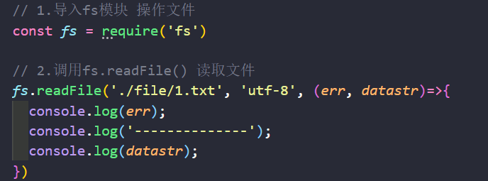
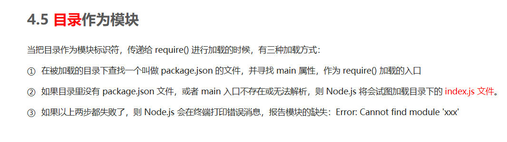
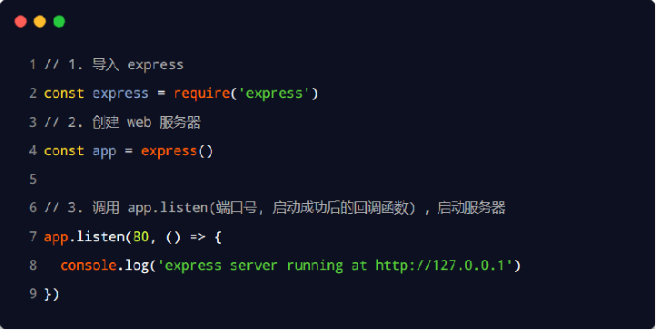
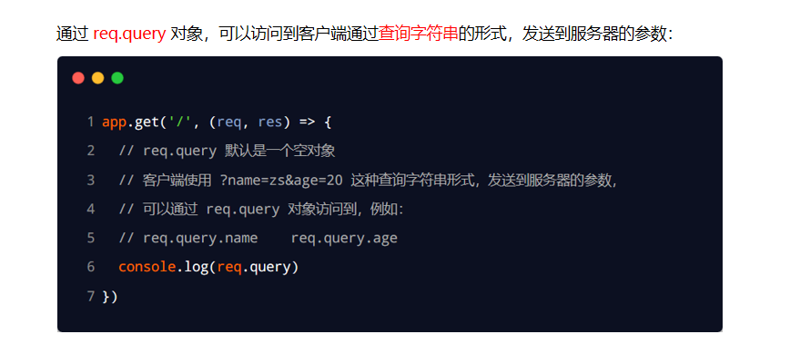
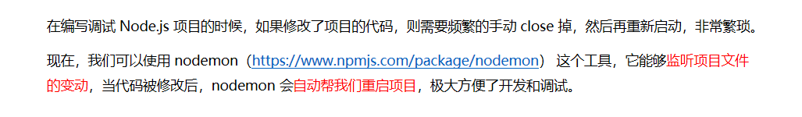
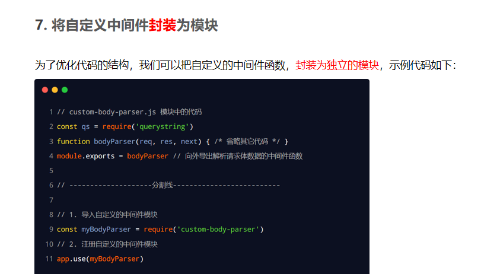
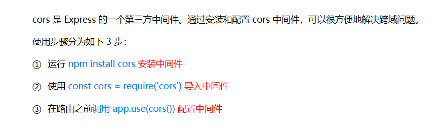
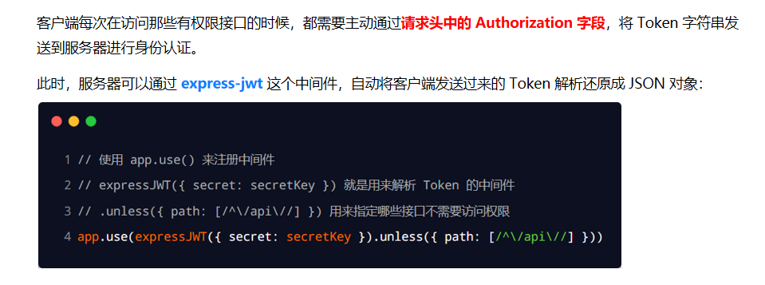

## Node.js

### Node.js简介

Node.js的优点

Node采用了与Web Workers相同的思路来解决单线程中大计算量的问题：child_process。

### 原生内置模块

#### fs文件系统模块

##### fs.readFile()

##### fs.writeFile()

#### path路径模块

##### path.join()

 	

##### path.basename()

##### path.extname() 

#### http模块

### 模块化

#### require()

#### module对象

#### module.exports()

在自定义模块中，可以使用 module.exports 对象，将模块内的成员共享出去，供外界使用。
外界用 require() 方法导入自定义模块时，得到的就是 module.exports 所指向的对象。

#### exports对象

#### exports和module.exports的使用误区

#### 模块化规范

#### 开发自己的包

##### 发布包

#### 模块加载机制

### Express

#### 基本使用

##### 基本的web服务器

##### 监听GET请求

##### 监听POST请求

##### 把内容响应给客户端

##### 获取 URL 中携带的查询参数

##### 获取 URL 中的动态参数

#### 托管静态资源

##### express.static()

##### 托管多个静态资源目录

##### 挂载路径前缀

#### nodemon

##### 作用

#### 路由

##### 模块化路由

#### 中间件

##### next 函数的作用

##### 定义中间件函数

##### 全局生效的中间件

##### 定义全局中间件的简化形式

##### 中间件的作用

##### 定义多个全局中间件

##### 局部生效的中间件

##### 定义多个局部中间件

##### 了解中间件的5个使用注意事项

##### 中间件的分类

###### 应用级别的中间件

######  路由级别的中间件

###### 错误级别的中间件

###### Express内置的中间件

###### 第三方的中间件

##### 自定义中间件

#### 接口

##### 编写 GET 接口

##### 编写 POST 接口

#### 跨域

##### 使用 cors 中间件解决跨域问题

##### cors相关的三个响应头

###### Access-Control-Allow-Origin

###### Access-Control-Allow-Headers

###### Access-Control-Allow-Methods

##### CORS请求的分类

###### 简单请求

###### 预检请求

###### 简单请求和预检请求的区别

#### 操作mysql

##### 配置 mysql 模块

##### 测试 mysql 模块能否正常工作

##### 示例

#### 身份认证

##### Session 认证机制

###### HTTP 协议的无状态性

###### Cookie

###### Session的工作原理

###### Session的局限性

##### 在 Express 中使用 Session 认证

###### 配置 express-session 中间件

###### 向 session 中存数据

###### 从 session 中取数据

###### 清空 session

##### JWT 认证机制                                  

###### JWT 的工作原理

###### JWT 的组成部分

##### 在 Express 中使用 JWT

###### JWT 的使用方式

###### 安装 JWT 相关的包

###### 导入 JWT 相关的包

###### 定义 secret 密钥

###### 在登录成功后生成 JWT 字符串

###### 将 JWT 字符串还原为 JSON 对象

###### 使用 req.user 获取用户信息

###### 捕获解析 JWT 失败后产生的错误

