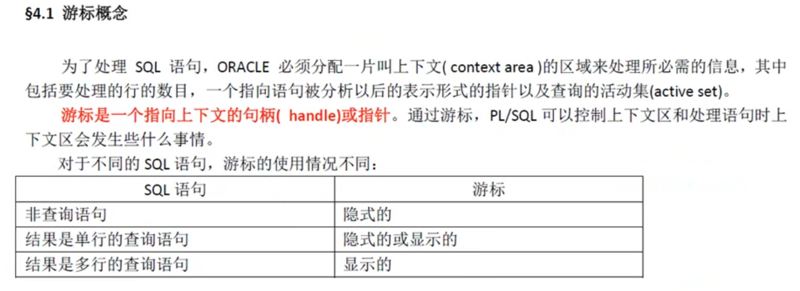

## SQL语句


### DML


### DDL


### DCL


## PL/SQL

### 结构

PL/SQL程序由三个块组成，即声明部分、执行部分、异常处理部分


```
declare
	--v_sal varchar(20);
	v_sal employees.salary%type;--类型会随着表中的数据类型而改变
begin
	select salary into v_sal from employees where employee_id = 100;
	dbms_output.put_line(v_sal); --打印
end;
```


```
declare
	--记录类型的声明
	type emp_record is record(
		v_sal employees.salary%type,--类型会随着表中的数据类型而改变
		v_email employees.email%type
	)
	--声明一个记录类型的变量
	v_emp_record emp_record;
begin
	select salary,email into v_emp_record from employees where employee_id = 100;
	dbms_output.put_line(v_sal); --打印
end;
```


### 流程控制

#### 条件语句


#### case表达式


#### 循环结构

##### LOOP

```
loop
	要执行的语句;
	exit when<条件语句>;/*条件满足，退出循环语句*/
end loop;
```

```
输出1-100:
declare
	v_i umber(5):=1;
begin
	loop
		dbms_output.put_line(v_i);
	exit when v_i >= 100
		v_i = v_i + 1;
	end loop;
end;
```

##### for

```
for 循环计数器 in [REVERSE] 下限 .. 上限 LOOP
	要执行的语句;
END loop;
每循环一次，循环变量自动加1;使用关键字REVERSE,循环变量自动减1。跟在IN REVERSE 后面的数字必须是从小到大的顺序，而且必须是整数，不能是变量或者表达式。可以使用EXIT退出循环

begin 
	for in 1..10 LOOPi
		dbms_output.put_line(‘int当前的值为：'||int);
	END LOOP;
```

##### while

```
begin
	x:=0;
	WHILE x<9 LOOP
	x:=x+1;
	DBMS_OUTPUT.PUT_LINE('内:x='||x);
END LOOP;
```

#### 游标的使用




##### 游标的属性


##### 游标的for循环


