##  React

### React开发依赖

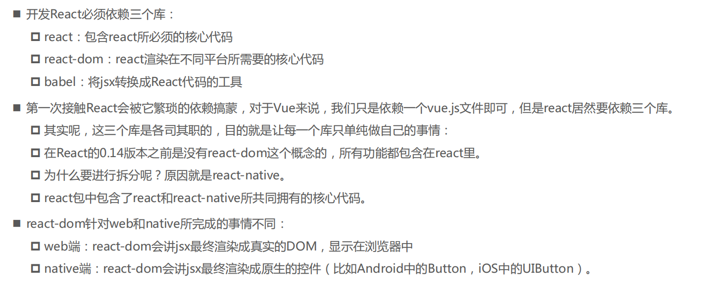

#### Babel

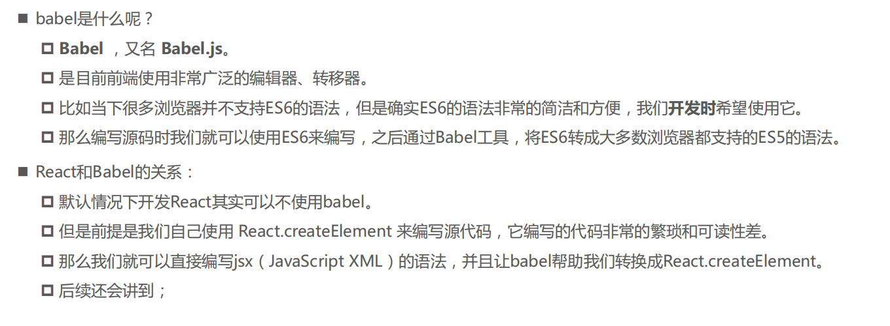

#### 引入React依赖

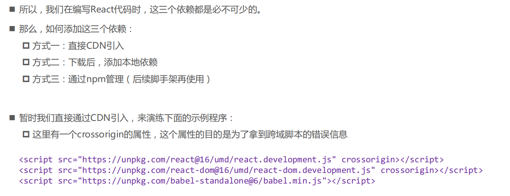

```
<script src="https://unpkg.com/react@16/umd/react.development.js" crossorigin></script>
<script src="https://unpkg.com/react-dom@16/umd/react-dom.development.js" crossorigin></script>
<script src="https://unpkg.com/babel-standalone@6/babel.min.js"></script>
```

###   JSX


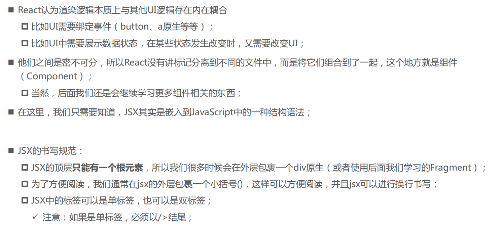

#### JSX细节

jsx中的注释

```
{/*这是注释 */}
```

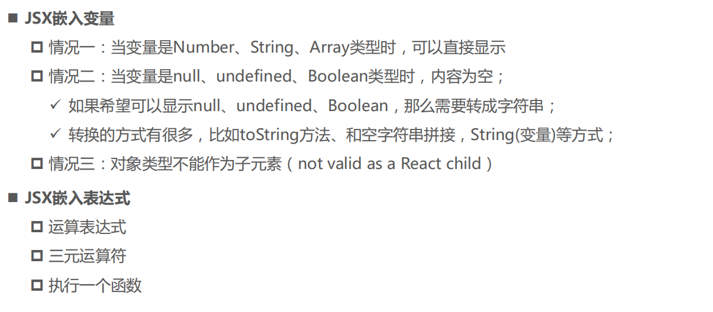

#### **this的绑定问题**

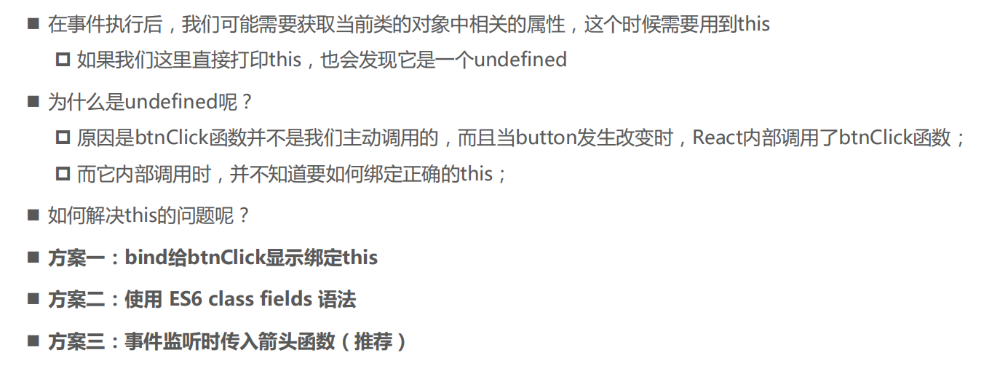

#### **事件参数传递**

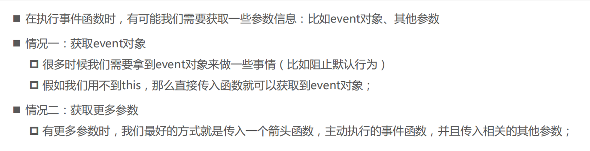

#### **React条件渲染**

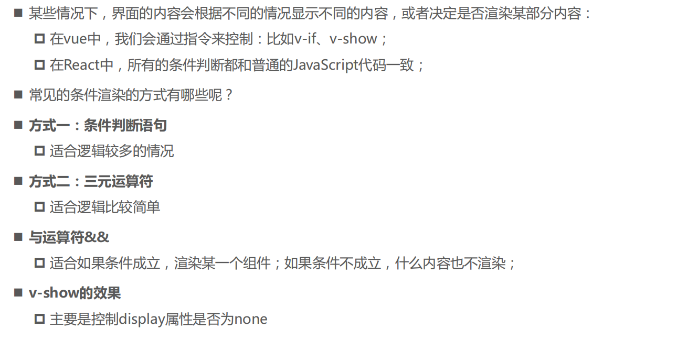

#### **React列表渲染**

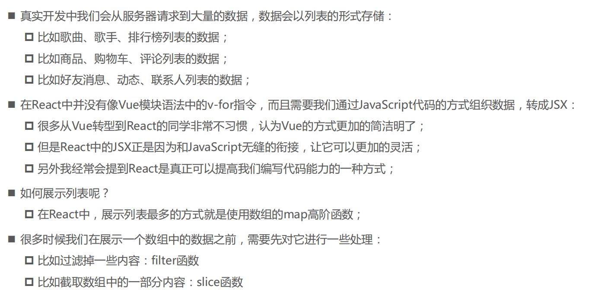

#### JSX的本质

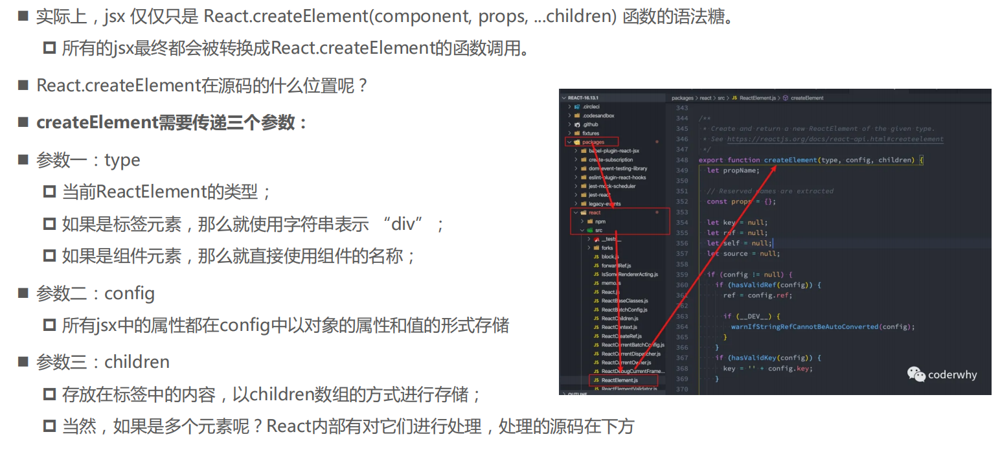

### 项目创建

#### **创建React项目**

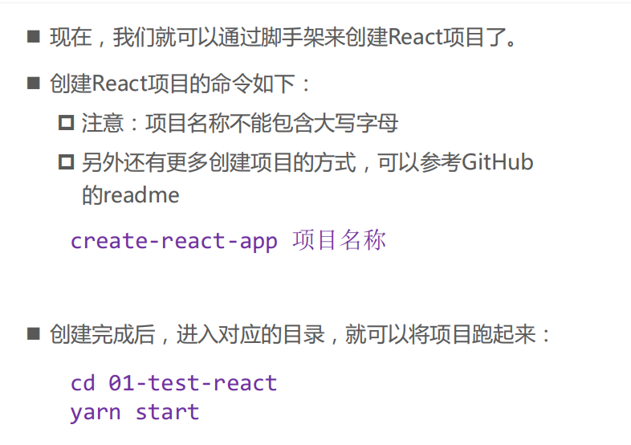

#### 目录结构分析

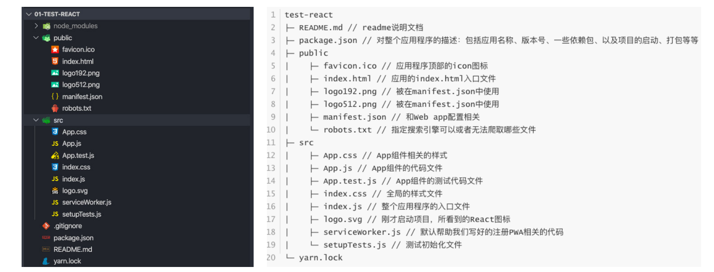

#### 了解PWA

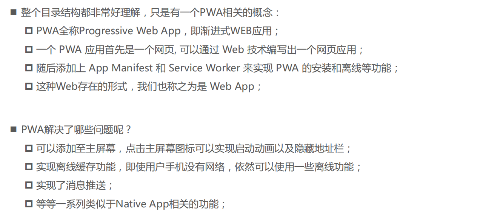

### 组件化

#### 类组件

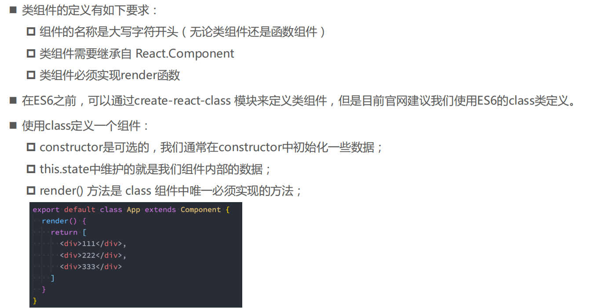

#### **render函数的返回值**

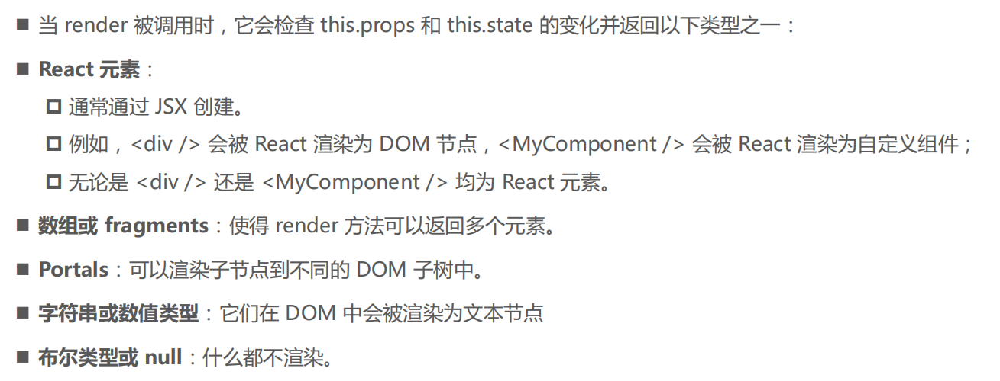

#### **函数式组件**

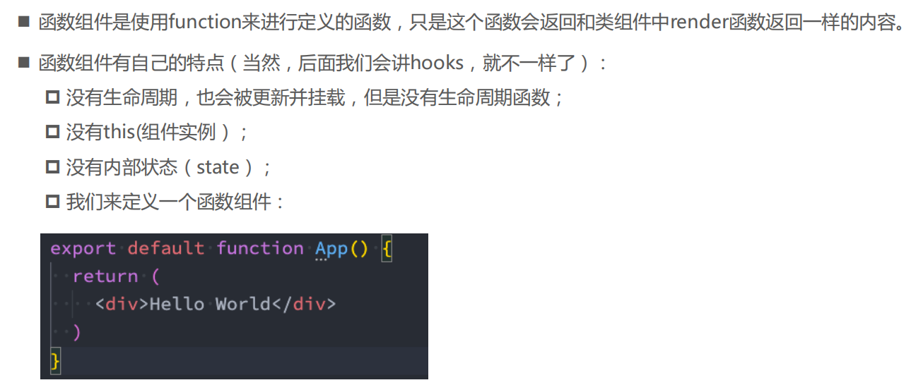

#### 生命周期函数

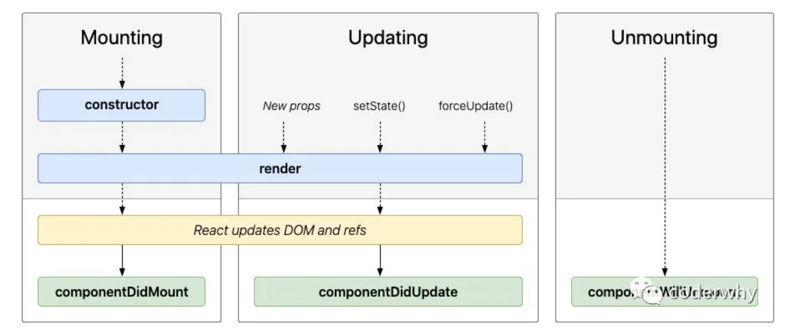

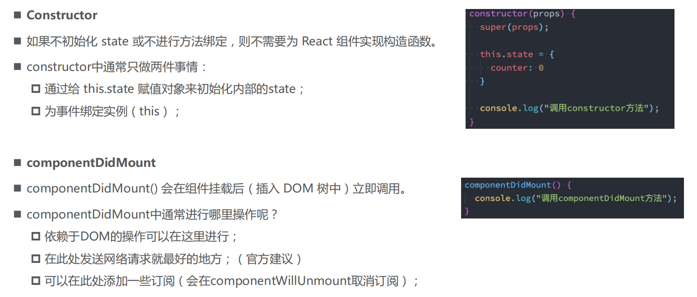

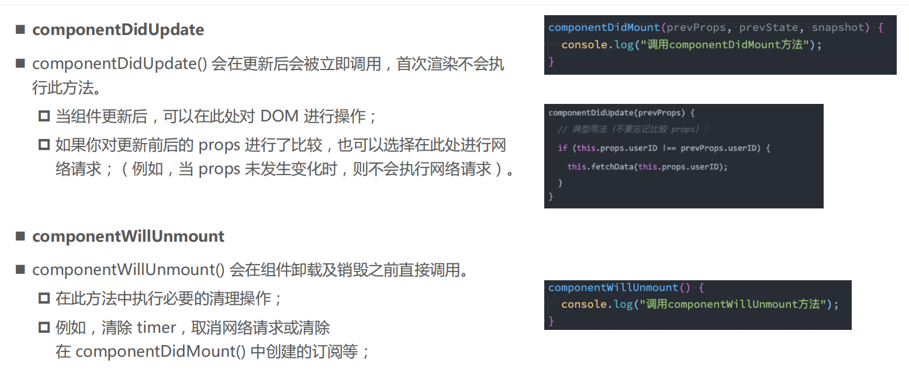

#### 不常用生命周期函数

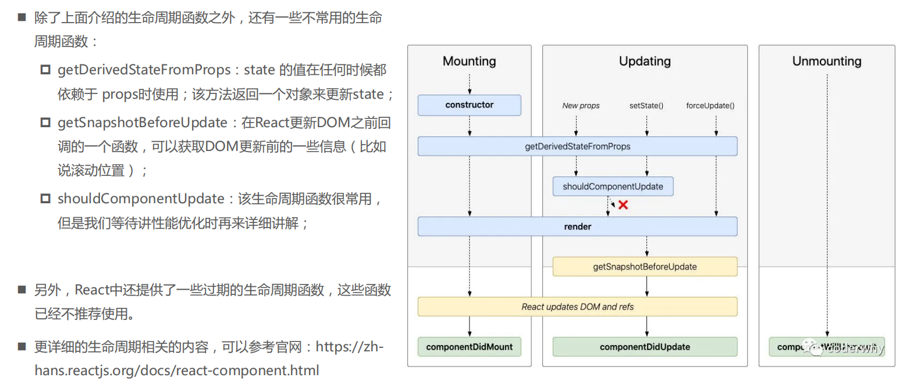

#### 组件通讯

##### **父组件传递子组件**

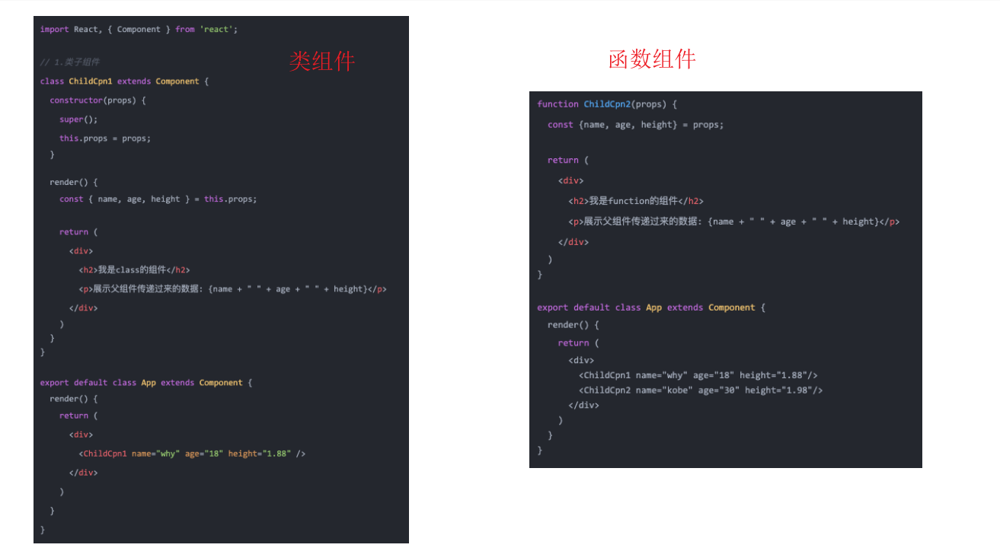

##### **参数propTypes**

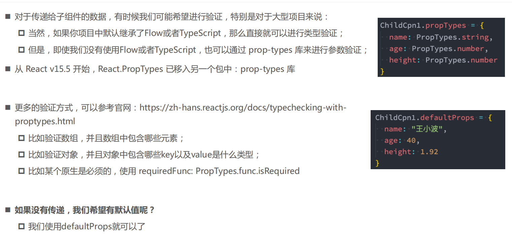

