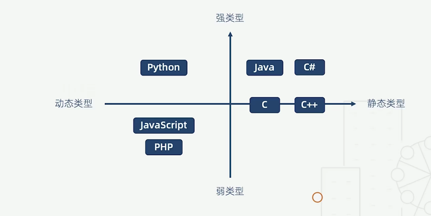
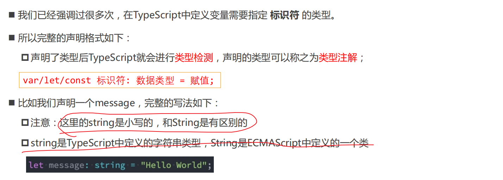

## TypeScript简单介绍

###  数据类型对比

### 类型声明

#### 推荐数组写法

#### unknown类型

#### never类型

#### tuple (元组) 类型

#### 可选类型

当参数为可选类型时，它本质上表示的是这个参数是 类型|undefined的联合类型

#### 类型别名 type

#### 类型断言 as

#### 非空类型断言

#### 可选链(ECMAscript)

#### !!和??(js原生)

#### 字面量类型

##### 字面量推理

#### 类型缩小

#### 函数类型

##### 函数的重载

#### 类  

#### 接口

##### 索引类型

##### 交叉类型

##### interface和type的区别

#### 类与接口

#### 枚举类型

#### 泛型

##### 类型参数化

##### 泛型类的使用

##### 泛型的类型约束

##### 泛型的好处

#### 类型的查找

##### 内置类型声明

https://github.com/microsoft/TypeScript/tree/main/lib

##### 外部类型声明

https://github.com/DefinitelyTyped/DefinitelyTyped/

https://www.typescriptlang.org/dt/search?search

##### 自定义声明

###### declare

