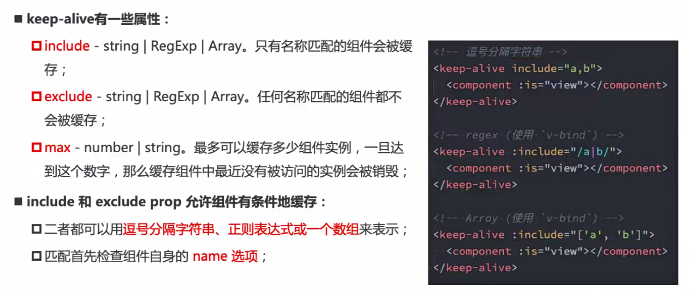
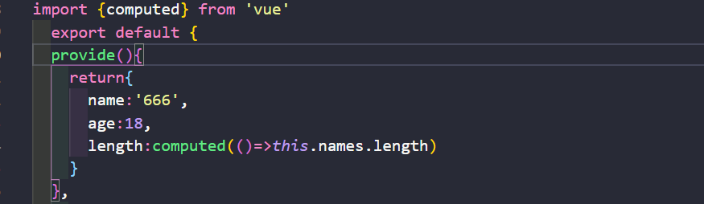
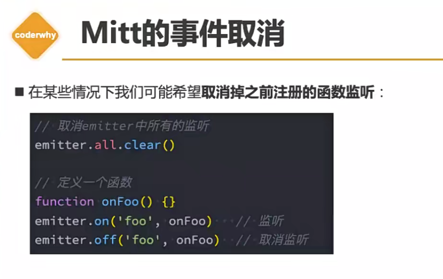
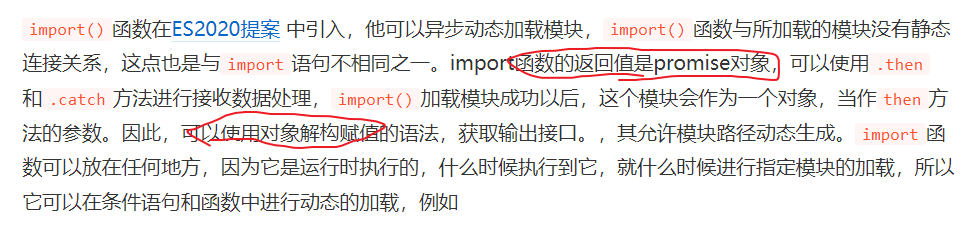
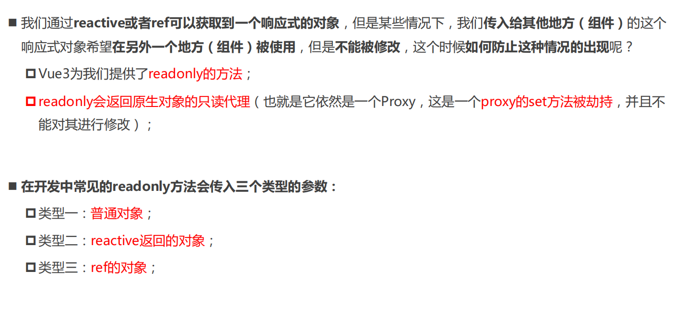
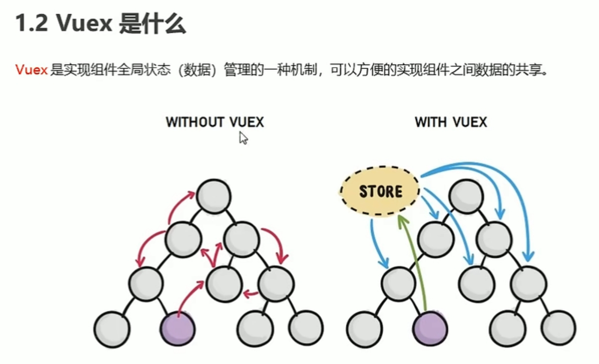
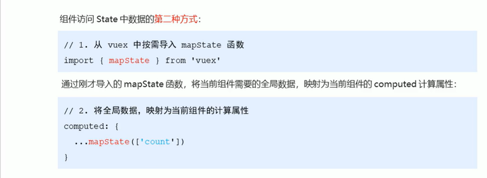

## Vue

###  简单认识Vue.js

Vue是一个渐进式的框架

Vue有很多特点和Web开发中常见的高级功能

​	解耦视图和数据

​	可复用的组件

​	前端路由技术

​	状态管理

​	虚拟DOM

### Vuejs的安装

#### 方式一 直接CDN引入

```
//开发环境版本 包含了有帮助的命令行警告
<script src = "https://cdn.jsdelivr.net/npm/vue/dist/vue.js"></script>
//生产环境版本，优化了尺寸和速度
<script src = "https://cdn.jsdelivr.net/npm/vue"></script>
```

#### 方式二 下载和引入

```
开发环境 https://vue.js.org/js/vue.js
生产环境 https://vue.js.org/js/vue.min.js
```

#### 方式三 NPM安装

#### 编程范式

原生js编程开发的编程范式为：命令式编程

用vue.js管理的编程范式为：声明式编程

### Vue.js初体验

```
<div id="app">{{message}}</div>
    <script src="../vue.js"></script>
    <script>
        const app = new Vue({
            el: '#app',
            data: {
                message: 'Hello Vue.js'
            }
        })
	
	//创建Vue对象的时候，传入了一些options:{}
	//{}中包含了el属性：该属性决定了这个Vue对象挂载到哪一个元素上，很明显，这里挂载到了id为app的元素上
	//{}中包含了data属性：该属性中通常会存储一些数据
		这些数据可以是我们直接定义出来的，如上
		也可以是来自网络，从服务器中加载出来的
    </script>

```

### Vue中的MVVM


### Vue的options选项

#### el

类型：string | HTMLElement

作用：决定Vue实例会管理哪一个DOM

#### data

类型：Object | Function （组件当中data必须是一个函数）

作用：Vue实例对应的数据对象

#### methods

类型：{ [key:string] : Function}

作用：定义属于Vue的一些方法，可以在其它地方调用，也可以在指令中使用

## Vue相关语法

#### Mustache(胡子)语法 {{}}(双大括号)

#### v-once

该指令表示元素和组件之渲染一次，不会随着数据的改变而改变

与v-for不同 后面不需要用表达式

```
<h2 v-once>{{counter}}</h2> 只会显示counter的初始值，值改变后仍显示原来的值
```

#### v-html

某些情况下，我们从服务器请求到的数据本身就是一个html代码

如果我呢们直接通过{{}}进行输出，会将html代码也一起输出

此时我们需要将其解析

```
<h2 v-html='url'></h2>
//url即从服务器获得的代码
例：url='<a href="www.baidu.com">百度一下</a>'
```

#### v-text （不够灵活）

v-text和Mustache比较相似，都是用于将数据显示在界面中

```
<h2 v-text='counter'>123</h2>
//但是v-text不够灵活 会将里面的标签里面内容覆盖掉
```

#### v-pre

```
<h2 v-pre>{{counter}}</h2> //{{counter}}  将标签内的内容原封不动的展示
```

#### v-cloak(斗篷)

某些情况下，浏览器可能会直接显示出未编译的Mustache标签

此时给该标签添加v-cloak属性 再在css中设置为none即可隐藏未变异的标签

```
<h2 v-cloak>{{counter}}</h2>
<style>
	[v-cloak]{
		display:none;
	}
</style>
```

#### v-bind 语法糖 :

##### 基本介绍

除了内容需要动态来决定外，某些属性我们也希望动态来绑定

比如动态绑定ａ元素的href属性

比如动态绑定img元素的src属性

```
<div></div>
//imgURL为从服务器获取的超链接
```

##### v-bind动态绑定class(对象语法)

```
  <style>
        [v-cloak] {
            display: none;
        }
        
        .Red {
            color: red;
        }
    </style>
<body>
    <div id='app'>
        <h2 :class='getclass()' v-cloak>{{message}}</h2>
        <button v-on:click='btn()'>按钮</button>
    </div>
    <script src="../vue.js"></script>
    <script>
        const app = new Vue({
            el: '#app',
            data: {
                message: '你好',
                isRed: true,
                isBlack: true
            },
            methods: {
                btn: function() {
                    this.isRed = !this.isRed
                },
                getclass: function() {
                    return {
                        Red: this.isRed,
                        Black: this.isBlack
                    }
                }
            }
        })
    </script>
</body>
```

##### v-bind动态绑定style(对象语法)

```
 <div id='app'>
        <h2 :style="{fontSize: finalsize + 'px'}">{{message}}</h2>
    </div>
    <script src="../vue.js"></script>
    <script>
        const app = new Vue({
            el: '#app',
            data: {
                message: '你好',
                finalsize: 100
            }
        })
    </script>
```

#### 计算属性 computed

计算属性写在实例的computed选项中，用于将多个数据结合

计算出来的属性值可以被模板结构或methods方法使用

##### getter和setter

每一个计算属性都包含一个getter和setter属性

计算属性一般是没有set方法，为只读属性

```
computed:{
	fullname:{
		get:function(){
			return this.firstname
			}
		}
	}
}
因为省略了set方法 所以上面的代码最终可以写为
computed:{
	fullname:function(){
		return this.firstname
	}
}
```

#### v-on 事件监听

语法糖 @

```
<button v-on:click='add'>+</button>
@click='add'
```

##### v-on参数传递问题

在定义事件时，写方法时省略了小括号，但是方法本身是需要一个参数的，这个时候，Vue会默认

将浏览器生产的event事件对象作为参数传入到方法中

手动的获取到浏览器参数的event对象：$event

##### v-on的修饰符

###### .stop

```
相当于调用了event.stopPropagation() 阻止冒泡
@click.stop='add'
```

###### .prevent

相当于调用event.preventDefault() 阻止默认事件

#### $event

场景一：

在DOM事件的回调函数中传入参数$event，可以获取到该事件的事件对象

场景二：

在子组件中通过`$emit`注册事件，将数据作为参数传入，在父组件中通过`$event`接收

#### v-if、v-else-if、v-else

v-if后面的条件为false时，对应的元素以及其子元素不会渲染

```
<p v-if="score>=90">优秀</p>
<p v-else-if="score>=80">良好</p>
<p v-else-if="score>=60>及格</p>
<p v-else>不及格</p>
```

#### v-show

v-show的用法和v-if相似，也用于决定一个元素是否渲染

#### v-if和v-show的对比

v-if当条件为false时，根本不会有对应的元素出现在DOM中

v-show当条件为false时，仅仅是将元素的display属性设置为none而已

当需要在显示与隐藏之间切换频繁时，使用v-show

当只有一次切换时，使用v-if

#### v-for

在遍历对象的过程中，如果只是获取一个值，那么获取到的是value  key-value

v-for="(key,value,index) in object"

官方推荐我们在使用v-for时，给对应的元素或组件添加上一个key属性

```
<li v-for="item in letters" :key="item">{{item}}</li>
同时保证key属性的唯一性
key的作用主要是为了高效的更新虚拟DOM

当某一层有很多相同的节点时，也就是列表节点时，我们希望插入一个新的节点：
diff算法就会没有效率的去往后逐个修改
用key来作标识 就可以加快效率
```

#### Vue2 filter过滤器

过滤器常用于文本的格式化

如果调用过滤器 则messsage的值变为过滤器的返回值

```
过滤器可以连续调用
<p>message的值为{{message | capi}}</p>

filters与el同级
filters:{
	注意：过滤器中函数形参中的val，永远都是管道符前面那个值
    capi(val){
    	强调：过滤器中一定要有一个返回值
		return 'abc'
	}
}
```

##### 构造全局过滤器

```
VUe.filter()方法接收两个参数：
第一个参数为全局过滤器的"名字"
第二个参数为全局过滤器的“处理函数”

Vue.fileter('capitalize',(str) =>{
	return ....
})

如果全局过滤器和私有过滤器重名，此时按照“就近原则” 调用的是“私有过滤器”
```

#### watch 侦听器

侦听器本质上是一个函数，要监听哪个数据的变化，就把数据名作为方法名即可

所有的侦听器都应该被定义到watch节点下

```
watch与el同级
watch:{
	newval代表变化后的值 oldval代表变化前的值
	username(newval,oldval){
		console.log(newval,oldval)
	}
}
```

##### 侦听器的对象格式及好处

深度监听 和 立即执行

```
watch:{
	//定义对象格式的侦听器
	username:{
		//侦听器的处理函数
		hander(newval,oldval){
			console.log(newval,oldval)
		},
		deep:true,
		immediate:true
	}
	//如果要侦听的是对象的子属性的变化，则必须包裹一层单引号
	'info.username'(){}
}
```

好处1：可以通过immediate选项，让侦听器自动触发

好处2：可以通过deep选项，让侦听器深度监听对象中每个属性的变化

#### JS高阶函数使用

##### filter函数

filter中的回调函数又一个要求：必须返回一个boolean值

true：当返回true值时，函数内部会自动将这次回调的n加入到新的数组当中

false：当返回false值时，函数内部会自动过滤掉这次的n

```
const nums = [10,20,30,40,50,111,222];
let newNums = nums.filter(function(n){
	return n<100;
})
```

##### map函数

```
let newNums = nums.map(function(n){
	return n*2
})
```

##### reduce函数

reduce作用就是对数组中所有的内容进行汇总

```
let total = newNums.reduce(function(preValue,n){
	return preValue + n
}，0)
//total的值就是整个数组总和
```

##### 三个函数嵌套

```
let total = nums.filter(function(n){
	return n<100
}).map(function(n){
	return n*2
}).reduce(function(preValue,n){
	return preValue + n
},0)
```

#### v-model表单绑定

使用v-model指令来实现表单元素和数据的双向绑定

```
v-model其实是一个语法糖，它的背后本质上是包含两个操作：
1.v-bind绑定一个value属性 ：modelValue 和 update：‘modelValue’
2.v-on指令给当前元素绑定Input（v-on:input）事件
<input type = 'text' v-model = 'message'
等同于
<input type = 'text' v-bind:value="message" v-on:input='message = $event.target.value'>
```

因为Input中的v-model绑定了message，所以会实时将输入的内容传递给message，同时message发生改变

##### 修饰符

###### lazy

v-model.lazy

默认情况下，v-model是在input事件中同步输入框的数据的，

lazy修饰符可以让数据在失去焦点或者回车时才会更新

###### number

v-model.number

默认情况下，再输入框中无论我们输入的是数字还是字母，都会被当作字符串类型进行处理

number修饰符可以让在输入框中输入的内容自动转成数字类型

###### trim

v-model.trim

trim修饰符可以过滤内容左右两边的空格

#### 组件的V-model


### axios

axios是一个前端圈最火 专注于网络请求的库

调用axios方法的到的返回值是Promise对象

#### 基本语法

```
axios({
	method:‘请求的类型’
	url:'请求的URL地址'
}).then(result)=>{
	//.then用来指定请求成功之后的回调函数
	//形参中的result是请求之后的结果
}
```

发起GET请求

```
axios({
	//请求方式
	method:'GET',
	//请求的地址
	url:'http://www.....',
	//URL中的查询参数
	
	//params是添加到url的请求字符串中的，用于get请求
	params:{
		id:1
	}
	//params是添加到url的请求字符串中的，用于get请求
}).then(function(result){
	cosole.log(result)
})
```

#### 请求方式


#### 基本配置


### 组件的使用


#### 注册组件的基本步骤

##### 创建组件构造器

调用Vue.extend()方法创建组件构造器

##### 注册组件

调用Vue.component()方法注册组件

##### 使用组件

在Vue实例的作用范围内使用组件

##### 全局组件和局部组件

Vue.component()方法创建的为全局组件

即意味着可以在多个Vue的实例下使用

如何创建局部组件：

```
const cpnC = Vue.extend({
	template:`
		<div>123</div>`
})

const app = new Vue({
	el:'app',
	components:{
		cpn:cpnC
	}
})
```

##### 父组件和子组件

在父组件中加入components属性 去注册组件

该属性指定的组件即为该组件的子组件

##### 注册组件的语法糖写法

```
//直接省略了创建组件构造器的步骤（const cpnC1 = Vue.extend()）直接用一个对象来代替
Vue.component('cpn1',{
	template:`
	<div>
		<h2></h2>
	</div>
	`
})
```

##### 注册局部组件的语法糖

```
const app = new Vue({
	el:'#app',
	components:{
		'cpn2':{
			template:`
			<div>
				<h2></h2>
			</div>
			`
		}
	}
})

```

#### 组件模板抽离

###### 通过script标签 

指定type类型为 text/x-template

```
<script type="text/x-template" id="cpn1">
           <div>
               <h2>12312</h2>
           </div>`
</script>
```

###### 通过template标签

```
 <template id="cpn2">
            <div>
                <h2>12312</h2>
            </div>
        </template>
```

#### 组件数据存放

组件中不能直接访问Vue实例中的data

组件对象也有一个data属性（也可以有methods等属性）

这个data属性必须是一个函数 且这个函数返回一个对象，对象内部保存着数据

```
   Vue.component('cpn2', {
            template: "#cpn2",
            data() {
                return {
                    title: '123'
                }
           }
```

#### 父子组件的通讯

由于自组件不能引用父组件或者Vue实例的数据，而开发中一些数据确实需要从上层传递到下层

这个时候，并不会让子组件再次发送一个请求，而是直接让父组件直接将数据传递给小组件


##### 父传子通过props属性

```
<cpn :cmessage='message'></cpn>

        <template id="cpn">
            <div>
                <h2>{{cmessage}}</h2>
            </div>
        </template>
       
const cpn = {
            template: '#cpn',
            props: {
                cmessage: {
                    type: String,
                    default: 'aaaaaa',
                    required: true
                }
            }
```

###### props驼峰标识问题

组件的标签中的v-bind不能写成驼峰式  因为v-bind不能识别大写字母 

可以使用c-Message的方式来改善


##### 子级向父级传递

当子级需要向父组件传递数据时，需要用到自定义事件

###### 自定义事件

v-on不仅仅可以用来用于监听DOM事件，也可以用与组件间的自定义事件

自定义事件的流程：

​		在子组件中，通过$emit()来触发事件

​		在父组件中，通过v-on来监听子组件事件

具体代码见案例

#### **获取元素对象或者子组件实例**

##### $refs

##### $parent 或 $root


#### Vue2 EventBus

```
1、创建eventBus.js模块，并向外共享一个Vue的实例对象
2、在数据发送方，调用bus.$emit('事件名称'，要发送的数据)方法触发自定义事件
3、在数据接收方，调用bus.$on('事件名称'，事件处理函数)方法注册一个自定义事件
```


### 内置组件

#### slot(插槽) 

组件插槽的目的是让我们的组件具备更多的扩展性

让使用者可以决定组件内部的一些内容到底展示什么

##### 插槽的基本使用

```
<slot></slot>

插槽中可以有默认值
<slot><button></button></slot>

如果有多个值，同时放入到组件中进行替换时，一起作为替换元素
```

##### 具名插槽的基本使用 

```
当我们想具体改变某一个插槽的时候，给slot一个name 然后用在标签内增加slot='name'来替换指定内容

<div id="app">
        <cpn><span slot="left">替换</span></cpn>
    </div>
    <template id="cpn">
        <div>
            <slot name='left'>左边</slot>
            <slot name='middle'>中间</slot>
            <slot name='right'>右边</slot>
        </div>                     
```

##### v-slot

语法糖：# = (v-slot:)

如果想要把内容填充到指定名称的插槽中，需要使用v-slot这个指令

v-slot指令不能直接作用在元素上，必须作用在template标签上

##### 作用域插槽

在封装组件时，为预留的slot提供属性对应的值，这种用法，就是作用域插槽

```
<slot name='right' mess='123'>右边</slot>
```

#### 动态组件


#### keep-alive

包裹在keep-alive中的组件的状态将会被保留



##### 缓存组件的生命周期


#### 动画&过渡

##### Transition组件


###### 原理


v

###### animation实现


###### 同时设置过渡和动画


###### duration属性


###### mode属性


###### appear属性


##### animate.css库


##### gsap库


##### Javascript钩子


#### transiton-group


##### 列表过渡


#### Teleport  (Vue3）


### 模块化

我们可以使用将需要暴露到外面的变量，使用一个模块作为出口

常见的模块化规范：
CommonJS、AMD、CMD、ES6的Modules

#### ES6导入和导出

##### export

```
let name = 'why'
let age = 18

export{name,age}
```

###### export default

```
导入者可以自行命名 但default只能有一个
export default name; 
```

##### import

在html代码中引入js文件，并且类型需要设置为module

```
<script src='aaa.js' type="module"></script>

导入js文件
import {name,age} from "./aaa.js";

统一全部导入
import * as aaa from "./aaa.js";
```

### webpack

##### 简单介绍

从本质上讲，webpack是一个现代的JavaScript应用的静态的模块打包工具

webpack其中一个核心就是让我们尽可能进行模块化开发，并且会帮助我们处理模块间的依赖关系

不仅仅js文件，css，图片，.json文件在webpack中都可以被当作模块化来使用


##### 准备工作

```
文件和文件夹解析：
	dist文件夹:用于存放之后打包的文件
	src文件夹：用于存放源文件
		main.js：项目的入口文件
		xxx.js：其他js文件
	index.html:首页html
	package.json:通过npn init 生成的，npm包管理的文件(暂时用不上)
```

##### 基本使用

```
下面的命令可以将 main.js和其所依赖的文件打包为boundle.js 这样html文件才可以引入模块化后的js文件

webpack ./src/main.js ./dist/bundle.js
```

##### webpackp.config.js配置

```
这一步代替了webpack ./src/main.js ./dist/bundle.js

const path = require('path')
module.exports = {
    entry: './src/main.js',
    output: {
        path: path.resolve(__dirname, 'dist'),
        filename: 'bundle.js'
    },
}
配置完之后 在终端敲webpack命令
```

##### loader

loader是webpack中一个非常核心的概念

webpack会自定处理js之间相关的依赖，但是，在开发中我们不仅仅有基本的js代码处理，我们也需要加载css、图片，也包括一些将ES6转成ES5代码，将TypeScript转成ES5代码

这时就需要给webpack拓展对应的loader

###### 使用步骤

1、通过npm安装需要使用的loader

2、在webpack.comfig.js中的modules关键字下进行配置

大部分loader都可以在webpack中找到，且有对应的语法

###### ES6语法处理

如果希望将ES6的语法转成ES5 需要使用babel 方法官网上有

###### 引入Vue.js

在webpack环境中集成Vuejs

```
npm install vue --save（运行时依赖）{-dev(开发时依赖）这里不需要}

然后导入Vue
import Vue from 'vue'

最后配置webpack.config.js 添加
resolve:{
	alias:{
		'vue$':'vue/dist/vue.esm.js'
	}
} 
```

创建Vue时template和el关系

```
 el: "#app",
    template: `
        <div> 
            <h2>{{message}}</h2>
        </div>    
    `,
template中的内容会将app绑定的元素中的内容全部替换
```

.vue文件封装处理

```
安装vue-loader和vue-template-compiler

npm install vue-loader vue-template-compiler --save-dev

之后修改config配置文件
{
	test:/\.vue$/,
	use：[‘vue-loader’]
}
```

##### plugin

plugin是插件的意思，对现有的某个框架进行扩展

###### 使用过程 

```
一、通过npm安装需要使用的plugin(某些webpack已经内置的插件不需要安装)
二、在webpack.config.js中的plugins中配置插件
```

###### 打包html的plugin

```
npm install html-webpack-plugin --save-dev

```

###### 丑化js的plugin

```
npm install uglifyis-webpack-plugin@1.1.1 --save-dev
之后修改webpack.config.js文件，使用插件
moudule.exports ={
	...
	plugins:{
		new uglifyJsPlugin()
	}
}
```

##### 搭建本地服务器

###### webpack-dev-server

webpack提供了一个可选的本地开发服务器，这个服务器基于Node.js搭建，内部使用express框架，能实现让浏览器自动刷新显示我们修改后的结果 

```
npm install --save-dev webpack-dev-server@2.9.1

之后修改webpack.config.js文件配置如下
devServer:{
	contentBase:'./dist',
    inline:true
}

可以再配置另外一个scripts(build的地方):
"dev":"wepack-dev-server --open"
```

##### 模块热替换（HMR）


###### 原理


### Vue CLI 脚手架

#### 简单介绍

CLI是Command-line Interface 翻译为命令行界面 俗称脚手架

Vue CLI是一个官方发布的vue.js项目脚手架

使用Vue-CLI可以快速搭建Vue开发环境以及对应的webpack配置

#### Vue CLI2使用

安装Vue脚手架

```
npm install -g @vue/cli
此时安装的为vue最新版本
如果想要使用旧版本的vue init功能，可以在全局安装一个桥接工具
npm install -g @vue/cli-init

Vue CLI2初始化项目
vue init webpack my-project
运行项目
npm run dev
```


#### Vue CLI3使用

```
Vue CLI3初始化项
vue create my-project
运行项目
npm run serve
```


使用vue ui图形化界面查看脚手架3的配置

#### untime-Compiler 和 Runtime-noly的区别

如果在之后的开发中，依然使用template，就需要选择Runtime-Complier

如果使用.vue文件夹开发，那么选择Runtime-only

#### Vue CLI3 和 Vue CLI2的区别


### 打包构建 线上部署

进入Vue官网 配置 vue.config.js

配置路由懒加载  (按需加载)

（已配置路由按需加载）删除预加载


## Vue3


#### Vnode 和 Vdom

`VNode` 本身就是一个 `JavaScript` 对象

Vdom就是由许多Vnode组成的树结构

他们两个存在的意义就是让Vue实现跨平台和做适配  并且可以把多次 DOM 修改合并为一次 避免性能问题

#### Vue打包后不同版本解析


###  Vite

**官方的定位：下一代前端开发与构建工具**

#### Vite的服务器原理


#### ESbuild


### 数据共享

####  Vue2 Provide和Inject





#### Vue3 Provide和Inject


#### 局事件总线（EventBus）mitt库




### import函数

**通过import函数导入的模块,后续webpack对其进行打包的时候就会进行分包的操作**



#### 使用场景

##### vue项目路由按需加载

```
{
    path:'/xxx'
    name:'/XXX'
    component:()=>import(../xxx/xxx.vue)
    
}
```

##### 模块的按需加载

```
xxx.click=function(){
    import('../xxx').then(fn=>{
        ...
    })
}
```

##### 条件加载

```
if(true){
    return import('./xxx/aaa').then(msg=>{
        //加载内容
    }).catch(err=>{
        //error codo
    })
}
```

### 异步组件

vue2和vue3的异步组件都调用了import函数 且webpack在打包时会进行分包操作

#### Vue2异步组件

```
const asyncPage = () => import('./Lazy.vue')
```

#### Vue3异步组件

##### difineAsyncComponent


##### Suspense


### Composition API

##### 了解Mixin(Vue2)


**使用**


###### 合并规则


###### 全局混入


##### extends(了解)


#### options API的弊端


#### setup

##### 参数


#####  返回值


#####  不能使用this的原因


#### Reactive API


#### Vue3为什么选择proxy


#### readonly API





##### 原理


#### Reactive判断的API


#### Ref API (能用尽量用ref）

vue官方推荐ref  方便代码数据的抽离和解耦


##### ref的解包


##### toRefs API


##### toRef API


##### ref其他API

##### customRef


#### computed


#### watchEffect


##### watchEffect的停止侦听


##### watchEffect清除副作用


#### setup中使用ref(获取元素)


##### watchEffect的执行时机


#### watch


##### watch的选项


#### 生命周期钩子


#### h()函数

##### render函数的作用


##### h()的使用


#### jsx

高版本的脚手架不需要配置babel

##### 配置


##### 使用


#### 自定义指令


##### 局部自定义指令 directives


##### 全局自定义指令 directive


##### 指令的生命周期

对比vue2指令的生命周期有所改变


##### 指令的参数和修饰符


#### Vue插件


#### Vue源码三大核心


### Vue-Router       

##### 基本使用流程


##### HTML5的History模式


##### router-link补充


##### 嵌套路由


#### 路由懒加载的使用

##### 对路由懒加载的认识


##### 懒加载的方式


##### 路由的其他属性


#### 动态路由


##### 获取动态路由的值


##### 获取多个参数


#### 未匹配(找到)的路由


#### 路由跳转（编程式导航）

##### vue2跳转

this.$router.push('/order/pay')

```vue
this.$router.push({
    name:'order-pay',
    query:{
    	orderNo
   	 }
    })
```

```vue
this.$router.push({
	path:'/order/pay',
    query:{    
    	orderNo 
    }
  })
```

##### 在setup中跳转

首先从vue中导入 useRouter 模块


```
const router = useRouter()
router.push({
        path: '/index',
        // name: 'index',
        query: {
          id: 123,
          name: 'nick'
        }
      })
     其中的query值能从route对象中获取到
```

#### router-link中的v-slot


#### router-view中的v-slot


#### 动态添加路由


#### 动态删除路由


#### 路由导航守卫


##### 案例


##### 导航解析流程


### require.context()用法

```
  require.context()自动导入文件

  \* require.context函数接受三个参数

  \- directory {String} -读取文件的路径

  \- useSubdirectories {Boolean} -是否遍历文件的子目录

  \- regExp {RegExp} -匹配文件的正则

```


```
 * require.context函数执行后返回的是一个函数,并且这个函数有3个属性
    - resolve {Function} -接受一个参数request,request为test文件夹下面匹配文件的相对路径,返回这个匹配文件相对于整个工程的相对路径
    - keys {Function} -返回匹配成功模块的名字组成的数组
    - id {String} -执行环境的id,返回的是一个字符串,主要用在module.hot.accept
```


### Vuex





#### 单一状态树


#### 基本使用


#### 核心概念及用法

##### State


##### mapState



###### setup中使用


##### Getters


##### mapGetters


###### setup中使用


###### getters的第二个参数


###### getters的返回函数


##### Mutation


##### mapMutation


###### setup中使用


##### Action


##### mapAction


##### Module


###### Module的命名空间 namespaced


###### Moudule的辅助函数


#### Hooks


### nextTick


vue中watch回调、生命周期回调等都是微任务 最终都会加入浏览器的微任务队列

nexttick本质上也是一个微任务 执行的时候加入到了上面回调函数的之后

### 环境变量


