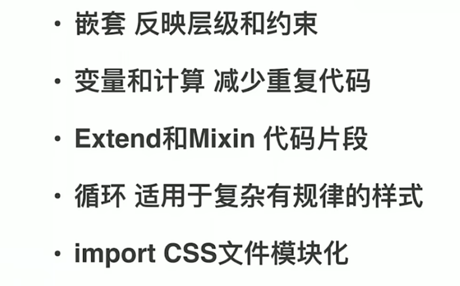
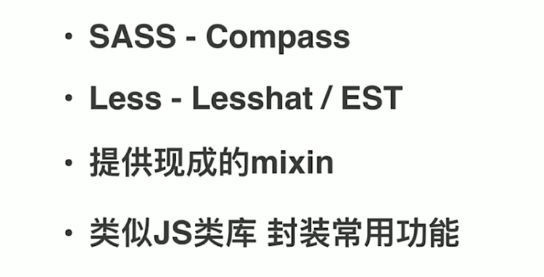
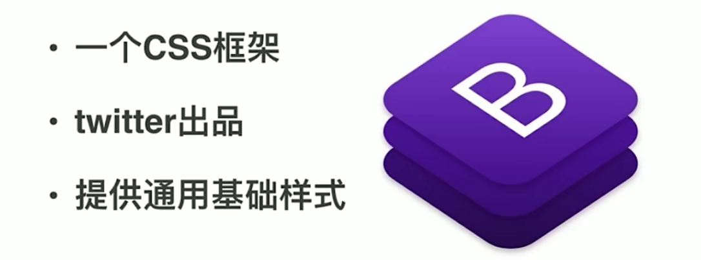
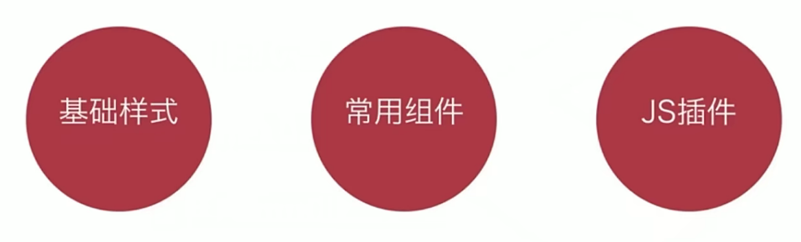
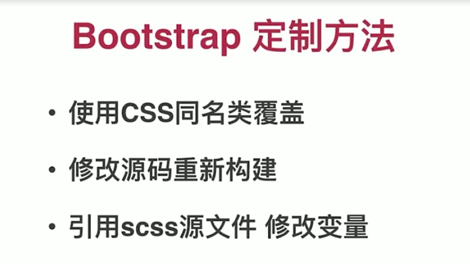
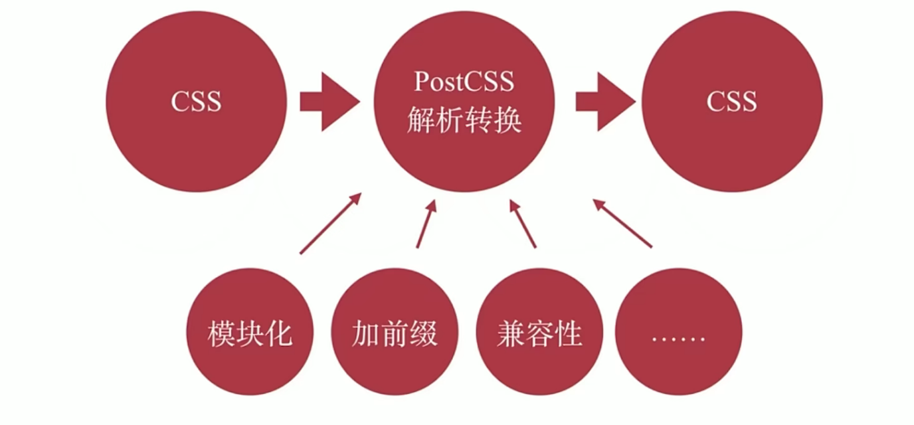
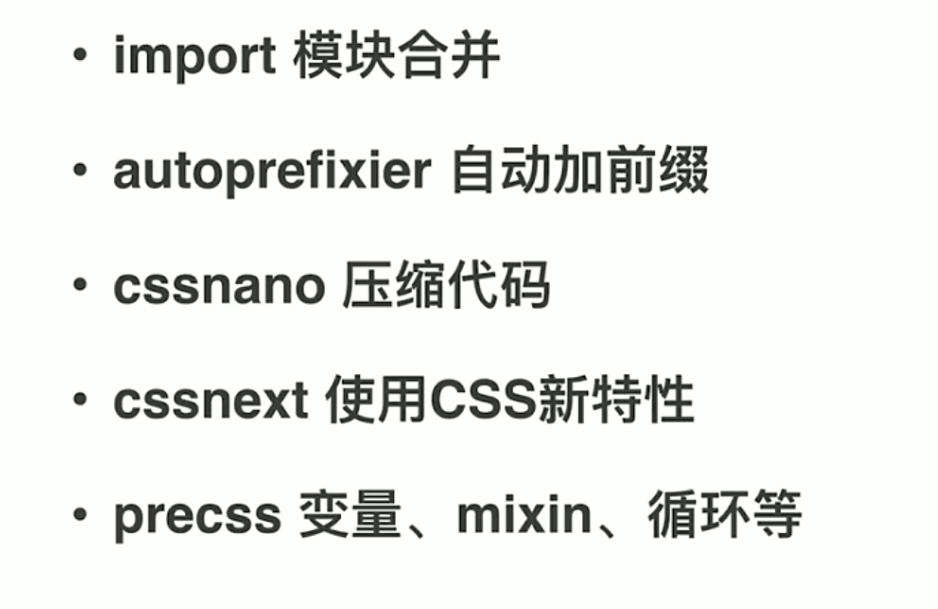

#### 常用

<strong></strong>加粗
<em></em>
<del></del>删除线
<ins></ins>下划线

图像

```
<br/>换行
<p></p>段落
```

<p1>-<p6>标题

<div></div>盒子单独成行
<span></span>一行多个盒子

##### img

图像不存在显示alt里面的东西
鼠标移动至图像 显示title里面的内容
设置图像宽度
设置图像高度
设置边框

##### 链接

```
<a href="网址" target="网址窗口弹出方式">文本或图像</a>（外部链接,内部链接,空链接：<a href="#"）
target="网址窗口弹出方式(_self为默认值 _blank为在新窗口打开)
<a href="链接的是文件 .exe 或者是 zip 等形式">下载链接
```

```
(将链接储存至图片)<a href="网址"></a>
```

##### 锚点链接

```
<a href="#名字">文字</a>
对应<h3 id="名字">文字</h3>
```

<!--  -->(注释)ctrl+/

块级注释 alt+shift+a

##### 字符

&nbsq(空格) &lt(小于号) &gt(大于号) &amp(和号)
&yen（人民币） &copy(版权) &reg(注册商标) &deg(摄氏度)
&plusmn(正负号) &times(乘号) &divide（除号）&sup2(平方上标2)
（统一加";"）
表格基本语法v

```
<table><tr><td></td> <td></td> </tr></table>
```

跨行合并:rowspan="合并单元格个数"
跨列合并:colspan="合并单元格个数"

##### 列表

###### 无序列表

```
<ul>只能放<li>可以放其他东西</li></ul>
```

(去掉li前面的小圆点:list-style:none)

###### 有序列表

```
<ol><li></li></ol>(前面自动加上序号)
```

###### (重点)自定义列表

```
<dl><dt>大哥</dt><dd>小弟</dd></dl>
(<dl>里面只能包含<dt>和<dd>)
```

##### 表单标签

###### 表单域

```
<form action="url地址" method="提交方式(get/post)" name="表单域名称"> 各种表单元素控件</form>
```

###### 表单元素

button(按钮 搭配JS使用) checkbox(定义多选框)

hidden(定义隐藏的输入字段) image(定义图像形式的提交按钮)

password(掩码输入的符号) radio(定义单选按钮)

reset(重置输入内容)  submit(提交至服务器)

text(输入文本 默认为20个字符)

###### 用法

```
< type="">
(文字代表按钮)<lable for="1">男</lable>< type="radio" id="1">
下拉列表<select><option selected="selected"(默认)></option></select> 
文本域：<textarea cols="20" rows="5">用于定义多行文本输入
```

### CSS:

#### 选择器

###### 标签选择器

例：p{color(颜色) font-size 数字(文字大小)}

###### 类选择器

例：.red{color: red;}定义后用class调用
<class="red">

###### id选择器

例：#定义，id调用，只能调用一次，其他切勿使用

###### 通配符选择器

例：*{}规定所有标签

###### 后代选择器

例：ol li{样式声明;}

###### 子选择器

例：div>p{样式声明;}

###### 并集选择器

例：div,p{样式声明;}

###### 链接伪类选择器

(顺序不能改变)
a:link（选择所有未被访问的链接)
a:visiter(选择所有已被访问的链接)
a:hover(鼠标移动至该链接)
a:active(鼠标按下未弹起的链接)

实际开发的写法

例：a{color: red;}
		a:hover{color: bule; text-decoration: underline;}

:focus伪类选择器

例：(用于选取获得焦点的表单元素)
一般表单元素可以获得光标，所以也主要针对表单
:focus{background-color:blue;}

###### CSS3新增属性选择器

E[att] 选择具有att属性的E元素
E[att="val"] 选择具有att属性且属性值等于val的E元素
E[att^="val"] 匹配具有att属性且值以val开头的E元素
E[att$="val"] 匹配具有att属性且值以val结尾的E元素
E[att*="val"] 匹配具有att属性且值中含有val的E元素

###### 结构伪类选择器

E:first-child 匹配父元素中的第一个子元素E
E:last-child 匹配父元素中的最后一个E元素
E:nth-child(n)（n可以为表达式）匹配父元素中的第n个子元素E
E:first-of-type指定类型E的第一个
E:last-of-type指定类型E的最后一个
E:nth-of-type(n)指定类型E的第n个
nth-child对父元素里面所有孩子排序选择(序号是固定的) 先找到第n个孩子 然后是否和E匹配
nth-of-type对父元素里面指定子元素进行排序选择。先去匹配E,然后再根据E找第n个孩子

###### 伪元素选择器

after before 必须有content:'';

字体图标使用时必须引用font-family:'icomoon';

伪元素用来清除浮动
1.额外标签法
2.父级添加overflow属性
3.父级添加after伪元素

```
.clearfix:after{
	content:'';
	display:block;
	height:0;
	clear:both;
	visibility:hidden;
}
```

4.父级添加双伪元素

```
.clearfix:before,.clearfix:after{
	content:'';
	display:table;
}
.clearfix:after{
	clear:both;
}
```

#### 字体系列

文字文体:h1{font-family: "宋体";}

文字大小:p{font-size: 16px;}(标题标签文字需要单独指定大小)

可以给body定义一个统一的大小 标题单独改;

文字粗细;h1{font-weight: normal|bold|bolder|lighter|数字}
(400不加粗 700加粗)

倾斜:p{font-style italic|normal;}

##### 复合属性

{font: font-style font-weight font-size font-family}
(重点){font: italic(可省) 700（可省） 16px "宋体";}

#### 文本颜色表示

##### 预定义的颜色值

例：red，blue；

##### 十六进制:#ff0000;(常用)

##### RGB代码

例：rgb(255,0,0)或rgb(100%,0%,0%)

#### 文本

##### 对齐文本

例：div{text-align: center|lift(默认)|right; }

##### 装饰文本

例:div{text-decoration :none(默认)|underline|overline(上划线)|line-through(删除线);}

a{text-decoration:none;} 用来去除a标签默认的下划线

##### 文本缩进

例：div{text-indent: 20px;}(文本首行缩进)

em是一个相对单位，为当前一个文字的像素大小		

##### 行间距

例：p{line-hight : 26px;}

#### 内部样式表

```
<style>标签理论上可以放到html里任何地方，但一般放在<head>里
行内样式表:
<div style="color: red;">只控制当前标签(不推荐大量使用)
外部样式表:(适用样式比较多的情况)
(样式单独写到CSS文件中，之后把CSS文件引入到html页面中使用)
分两步:
1.新建一个.css的文件
2.在html页面用<link>引入这个文件
<link rel="stylesheet" href="css文件路径">
```

#### Emmet 快捷键

```
div+回车  多个：div*3 父子级:ul>li 同级:div+p
带有类名或id名字的:.demo或者#demo
若是有顺序的:.demo$*5
```

#### 块级元素和行类元素

##### 常见块级元素

```
<h1-h6>,<p>,<div>(典型),<ul>,<ol>,<li>
<p><h1-h6>里面不能放其他块级元素，尽量包含文字
独占一行;高度宽度外边距和内边距都可控;宽度默认为<body>宽度;
里面可以放行类或者块级元素;
```

##### 常见行内元素

```
<a>,<strong>,<b>,<em>,<i>,<del>,<s>,<span>(典型)<u>,<ins>
一行可以放多个；宽高直接设置无效；默认宽度为文本内容长度；
行内只能容纳文本或其他行内元素；
特殊情况下a里面可以放块级元素，但是尽量给a转换一下块级模式
```

##### 行内块元素

、<td>他们同时具有块元素和行内元素的特点。
一行可以放多个;默认宽度为本身内容宽度;(行内元素特点);
高度，行高，外边距和内边距都可控(块级元素特点);

##### 元素显示模式转换

display:block;display:inline;display:inline-block;

小技巧:如何单行的文字垂直居中
解决方法:让文字的行高等于盒子的高度就行

#### 背景

背景颜色:background-color:transparent(默认透明)

背景图片:background-image:url(图片地址)

(logo或者小图片,优点是非常便于控制位置)

背景平铺:background-repeat(默认)|repeat-x|repeat-y|no-repeat

背景图片位置:background-position:x(坐标) y;

(可以使用方位名词或精确单位)
例：{background-position: center right;}
		{background-position: 20px 20px;}

如果只写一个,默认为x，另一个默认垂直居中;

混合单位:{background-position: center 20px;}

背景固定:background-attachment:scroll(滚动)|fixed(固定)背景(重点)

复合写法:background:颜色 图片地址 平铺 滚动 位置

##### 背景色半透明

background: rgba(0,0,0,0.3);(最后一个为透明度alpha)

#### CSS三大特性

##### 层叠性

1.层叠性:样式冲突,遵循就近原则,谁近执行哪个;
覆盖前一个冲突的样式，不冲突不会层叠;

##### 继承性

2.继承性:子标签会继承父标签的某些样式;
(text-,line-,font-，color可以继承);12px/1.5(行高=12*1.5)

##### 优先级

3.优先级:选择器相同，执行层叠性
!important最优先

#### 盒子模型

border:边框 conter:内容 padding:内边框 margin:外边框
边框:border-width|border-style|border-color
style:solid(实线) dashed(虚线) dotted(点线)
边框复合写法:border:1px solid red;(无顺序)
边框可分开(top bottom left right)
border-collapse:collapse;表示相邻边框合并在一起

!(边框会改变盒子的实际大小)
内边距:padding-left|right|top|boottom|
padding:(1个值代表上下左右)
(2个值第一个值代表上下,第二个值代表左右)
(3个值第一三个值代表上下,第二个值代表左右)
(4个值上右下左 顺时针)
外边距:margin-left|right|top|boottom|
写法与padding一样

外边距可以让块级盒子水平居中必须满足两个条件:
1.盒子必须设定了宽度width;

2.盒子左右的外边距都设置为auto;
margin: 0 auto;

行内元素或行内块元素水平居中只需给其父元素添加text-align:center即可

对于两个父子关系的块元素,父元素有上外边距,同时子元素也有上外边距,此时父元素会塌陷较大的外边距值;(浮动的盒子不会)
解决方案:
1.为父元素定义上边框;
2.为父元素定义上内边框;
3.为父元素添加overflow:hidden;

清楚内外边距:*{padding: 0; margin: 0;}
行内元素尽量只设置左右内外边距,不要设置上下内外边距,但是转换完块级和行内块元素就可以;

#### 圆角边框

border-radius:length(四个值) 顺时针;
另一个写法为:border-top-left-radius:值;
圆角矩形设置为高度的一半;
圆形设置为正方形边长的一半;

#### 盒子阴影

box-shadow:h-shadow v-shadow blur spread color inset;
h-shadow 必需。水平阴影的位置。允许负值。 
v-shadow 必需。垂直阴影的位置。允许负值。
blur 可选。模糊距离。 
spread 可选。阴影的尺寸。 
color 可选。阴影的颜色。请参阅 CSS 颜色值。
inset 可选。将外部阴影 (outset) 改为内部阴影。 

文字阴影:text-shadow:h-shadow v-shadow blur color;

#### 浮动

浮动:float:left|right;
如果行内元素有了浮动,则不需要转换为块级或行内块元素就可以直接给高度和宽度;
浮动元素都会有行内块元素特性;
先用标准流父级元素排列上下位置,之后内部子元素采取浮动排列左右位置;
浮动的盒子只会影响浮动盒子后面的标准流,不会影响前面的标准流

浮动不占有位置,父级盒子高度为0时,就会影响下面的排版;

##### 清除浮动

清除浮动:div{clear:left|right|both(重点);}
清除浮动方法:(闭合浮动)
1.额外标签法;(在浮动元素末尾加一个(块级)空标签 <div style="clear:both"></br>)
2.父级添加overflow属性;
3.父级添加after伪元素;

```
.clearfix:after{
	content: "";
	display: block;
	height: 0;
	clear: both;
	visibility:hidden;
}
```

(照顾低版本浏览器).clearfix{
*zoom: 1;}
4.父级添加双伪元素;

```
.clearfix:before,
.clearfix:after{
	content: "";
	display: table;
}
.clearfix:after{
	clear: both;
}
.clearfix{
	*zoom: 1;
}
```

PS切图:
合并图层:shift选中两个后ctrl+e(图层菜单)右键导出png
切片切图:利用切片工具手动划出 文件-导出-存储为web..-选择格式

#### CSS书写建议顺序

##### 1.布局定位属性

(display(第一个)/position/float/clear/visibility/overflow)

##### 2.自身属性

width/heigth/margin/padding/border/background

##### 3.文本属性

color/font/text-decoration/text-align/(white-space:nowrap[让文字强制一行内显示])
/break-word 

##### 4.其他属性(CSS3)

content/cursor/border-radius/box-shadow/text-shadow/background:linear-gradient

导航栏实际开发中,不会直接使用链接a,而是采用（li+a）的做法
因为导航栏里面文字不一样多,所以最好给链接a左右padding撑开盒子,而不是指定宽度;

#### 定位

定位=定位模式+边偏移;
定位模式用于指定一个元素在文档中的定位方式;
position:static(少见)|relative|absolute|fixed

##### 1.relative

(相对与自己原来的位置进行移动,并保留原来位置)

##### 2.absolute

(如果没有祖先元素或祖先元素没有定位,以浏览器为准)

(如果祖先元素有定位,以最近一级有定位的元素参考位置,不保留原位置)

子绝父相:子元素绝对定位,父元素要用相对定位;

##### 3.固定定位

(以浏览器的可视窗口为参照)
与父元素没有任何关系;不随滚动条滚动;不保留原来位置;
边偏移决定了该元素的最终位置;

##### 4.(了解)粘性定位:

(以浏览器可视窗口为参照;保留原来位置)
必须添加top bottom left right中的一个属性)
(有top bottom left right四个属性 left>right top>bottom)
		
将盒子固定在版心右侧:
{position:fixed left:50% margin-left:版心一半距离}

定位叠放次序:(z轴)z-index:1;(数值越大 盒子越靠上)

绝对定位的盒子居中:
{position:absulote left:50% margin-lift:本盒子宽度一半负值}

行内元素添加绝对或固定定位,可直接设置高度和宽度;
块级元素添加绝对或固定定位,如果不给高度和宽度,默认大小是内容的大小;
浮动元素,绝对定位(相对定位)都不会触发外边距合并的问题;
绝对定位(相对定位)会完全压住盒子;
浮动元素不同,只会压住下面标准流的盒子,但不会压住里面的文字和图片;(因为浮动最初产生的目的是做文字环绕效果)

#### 显示与隐藏:(搭配JS重点)

1.display:none;隐藏对象(不保留位置)
2.display:block;除了转换块级元素之外,同时还有显示元素的含义

visibility:visible|hidden(隐藏后继续占有原来的位置)

overflow(对溢出的部分进行操作)
visible 默认值 内容不会被修剪，会呈现在元素框之外
hidden内容会被修剪,并且其余内容是不可见的。 
scroll内容会被修剪,但是浏览器会显示滚动条以便查看其余的内容
auto 需要时,浏览器会显示滚动条以便查看其余的内容
						  (两个数字)

#### 精灵图

精灵图的使用:background: url(图片/abcd.jpg) no-repeat 0 0;
(缺点:图片文件较大 更换复杂 放大缩小会失真)

#### 字体图标

字体图标:样式结构比较简单,用于小图标,不能替代精灵图;
字体图标下载网站:一定要指定font-family:'icomoon';
www.icomoon.io  www.iconfont.cn/
三角做法:
div{
width: 0; height 0;  line-height: 0; font-size :0;
border 50px solid transparent;
border-left-color: pink;
}

#### 鼠标样式cursor

li{cursor:pointer|default|move|text|not-allowed;}

#### 其他常用

去掉表单的轮廓线:{outline:none;}

防止文本域的拖拽:textarea{resize:none;}

vertical-align使用场景:经常用于设置图片或者表单(行内块元素)和文字垂直对齐;(只针对于行内元素或行内块元素有效)

baseline (默认)元素放置在父元素的基线上。 

text-top 把元素的顶端与父元素字体的顶端对齐

middle 把此元素放置在父元素的中部

bottom 把元素的顶端与行中最低的元素的顶端对齐

text-bottom 把元素的底端与父元素字体的底端对齐

#### CSS3盒子模型

box-sizing:content-box 盒子大小为width+padding+border(默认)
box-sizing:border-box 盒子大小为width

#### CSS3滤镜filter:

filter:函数();例如:filter:blur(5px);  blur模糊处理 数值越大越模糊;

calc函数:在声明CSS属性值时执行一些计算
width:calc(100%-80px);(加减乘除)

#### CSS3过渡(重点)

transition:要过渡的属性(all 也可以用逗号隔开) 花费时间 运动曲线(默认为ease) 何时开始(设置延迟出发时间 默认为0s);
谁做过渡给谁加;

#### 网站favicon图标 

(放到网站的根目录下)

favicon.ico一般作为缩略的网站图标 显示在浏览器的地址栏或者标签上
将图片转换为ico图标借助于第三方转换网站 例:比特虫:http://www.bitbug.net/
之后用link引入到html中

#### 网站TDK三大标签SEO(搜索引擎优化)优化

1.title 网站名+网站的介绍

2.description 网站说明

3.keyword 页面关键字

#### logo SEO优化

1.logo里面首先放一个h1标签(告诉搜索引擎这个地方很重要)

2.h1放一个链接,可以返回首页的,把logo的背景图片给链接即可

3.链接里面要放文字(网站名称),但是文字不要显示出来

1)text-indent 移到盒子外边(text-indent: -9999px;)然后overflow:hidden;(淘宝的做法)

2)直接给font-size:o;就看不到文字了(京东的做法)

4.最后给链接一个title属性,这样鼠标放到logo上就可以看到提示文本了

#### 2D转换

##### 1.移动 translate

###### 语法 

​		transform:translate(x,y)

​		 transform:translateX(n)

​		 transform:translateY(n)

###### 重点

1.定义2D转换中的移动,沿着X和Y轴移动元素

2.translate最大的优点:不会影响到其他元素的位置

3.translate中的百分比单位是相对于自身元素的translate(50%,50%)

4.对行内标签没有效果

##### 2.旋转rotate

###### 语法

​		transform:rotate(度数)

###### 重点

1.rotate里面跟度数，单位是deg  比如 rotate(45deg)

2.角度为正数时，顺时针，负数，为逆时针

3.默认旋转的中心点是元素的中心点

##### 3.转换中心点 transform-origin

###### 语法

​		transform-origin: x y;

###### 重点

1.注意后面的参数x和y用空格隔开

2.x y默认转换的中心为元素的中心点(50% 50%)

3.还可以给x y 设置 像素 或者 方位名词 (top bottom left right center)

##### 4.缩放 scale

###### 语法

​		transform:scale(x,y); （只写数字，代表倍数）

###### 注意

1.注意其中的x和y用逗号隔开

2.transform:scale(2) 只写一个参数，第二个参数和第一个参数相同，相当于scale(2,2)

3.scale最大的优势：可以设置转换中心点缩放，默认以中心点缩放的，而且不影响其他盒子

##### 5.2D转换综合写法

1.同时有多个转换，其格式为：transform:translate() rotate() scale() ... 等

2.其顺序会影响转换的结果 **（先旋转会改变坐标轴的方向）**

**3.当我们同时有位移和其他属性的时候，记得要将位移放到最前面**

#### 动画

##### 制作动画

###### 1.先定义动画

用ketframes定义动画(类似定义类选择器)

```
@keyframes 动画名称{
	0%{
		width:100px;
}
	100%{
		width:200px;
	}
}
```

###### 动画序列

1.0%是动画的开始，100%是动画的完成，这样的规则就是动画序列

2.在@keyframes中规定某项CSS样式，就能创建由当前样式逐渐改为新样式的动画效果

3.请用百分比来规定变化发生的时间，或用关键词"from“和"to"，等同于0%和100%

###### 2.调用动画

```
div{
	width:200px;
	height:200px;
	background-color:aqua;
	margin:100px auto;
	/*调用动画*/
	animation-name:动画名;
	/*持续时间*/
	animation-duration:持续时间;
}
```

##### 动画常用属性


##### 动画简写属性

元素可以添加多个动画，用逗号分隔

>animation：动画名称 持续时间 运动曲线 何时开始 播放次数 是否反方向 动画起始或者结束的状态;
>animation: move 5s linear 2s infinite alternate;

1.简写属性里面不包含animation-play-state

2.暂停动画：animation-play-state：puased;经常和鼠标经过等其他配合使用

3.想要动画走回来，而不是直接跳回来：animation-direction:alternate;

4.盒子动画结束后，停在结束位置：animation-fill-mode:frowards;

#### 3D转换


##### 移动 translate3d

###### 语法

transfrom:translateX(100px)：仅仅是在x轴上移动

transfrom:translateY(100px)：仅仅是在y轴上移动

transfrom:translateZ(100px)：仅仅是在y轴上移动(一般用px单位)

transform:translate3d(x,y,z)：x,y,z分别指要移动的轴的方向的距离(x,y,z不能省略，没有就写0)

##### 透视 perspective

如果想要在网页产生3D效果需要透视(理解成3D物体投影在2D平面上)

透视也称为视距：就是人的眼睛到屏幕的距离

###### 视距越小，盒子越大      z轴越大，盒子越大

距离视觉点越近的在电脑平面成像越大，越远成像越小

透视的单位是像素

######  透视写在被观察元素的父盒子上面

##### 旋转 rotate3d

###### 语法

transform:rotateX(45deg)：沿着x轴正方向旋转45度

transform:rotateY(45deg)：沿着y轴正方向旋转45度

transform:rotateZ(45deg)：沿着z轴正方向旋转45度

transform:rotate3d(x,y,z,deg)

###### 左手准则

左手的拇指指向x轴的正方向

其余手指的弯曲方向就是该元素沿着x轴旋转的方向s

左手的拇指指向y轴的正方向

其余手指的弯曲方向就是该元素沿着y轴旋转的方向

##### 3D呈现 transfrom-style(重)

控制子元素是否开启三维立体环境

1.transform-style:flat 子元素不开启3d立体空间 默认的

2.transform-style:preserve-3d 子元素开启立体空间

3.代码写给父级，但影响的是子盒子 

#### 浏览器私有前缀

浏览器私有前缀是为了兼容老版本的写法，比较新版本的浏览器无需添加

##### 私有前缀

1.-moz-：代表firebox浏览器私有属性

2.-ms-：代表ie浏览器私有属性

3.-webkit-：代表safari、chrome私有属性

4.-o-：代表Opera私有属性

##### 提倡的写法

```
-moz-border-radius:10px;

-webkit-border-radius:10px;

-o-border-radius:10px;

border-radius:10px;
```

### CSS预处理器

#### less和scss(sass)



##### 声明变量

less中声明变量：@

scss中声明变量：$

##### mixin

less中:

```
声明和使用：
.block(@fontSize){}
```

scss中:

```
声明：
@mixin block($fontSize){}
使用：
@include block($fontSzie) 包括其他样式
```

##### extend

避免重复样式

less中：

```
声明：
.block:{}
使用：
.nav:extend(.bliock){不重复样式}
```

scss中：

```
声明：
.block:{}
使用：
@extend .block;
```

##### loop

less中：

```
.gen-col(@n) when (@n>0){
	.gen-col(@n-1);
	.col-@{n}{
		width: 1000px/12*@n;
	}
}
.gen-col(12);
```

scss中：

```
@mixin gen-col($n){
	@if $n>0 {
		include gen-col($n - 1);
		.col-#{$n}{
			width: 1000px/12*$n;
		}
	}
}
@include gen-col(12);

scss中支持循环：
@for $i from 1 through 12 {
	.col-#{$i} {
		width:1000px/12*$i;
	}
}
```

#### CSS预处理框架



### Bootstrap





 



### CSS工程化

##### PostCSS



##### 插件

##### 

