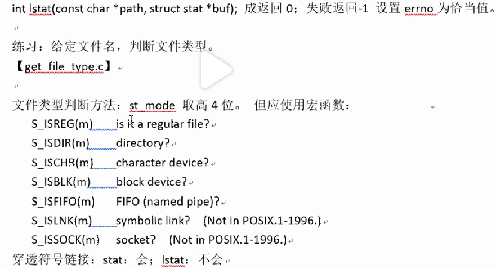
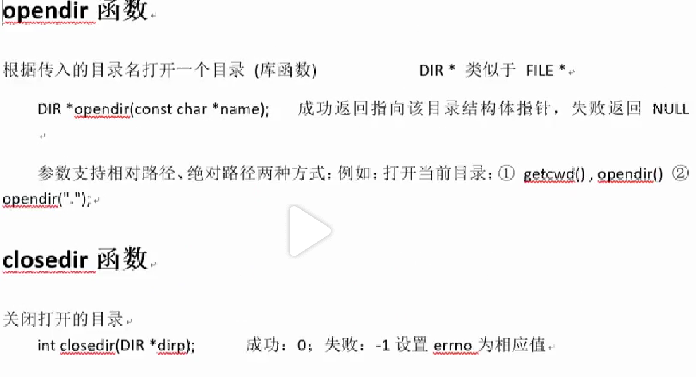
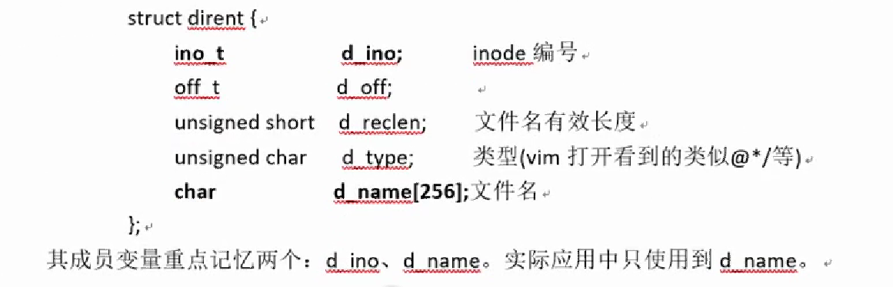

在linux世界中,一切皆文件;
	ifconfig 查看IP地址 
	setup 
关机和重启命令;
关机:
1.init 0;
2.shutdown -h now 或 shutdwown -h 20:30;
3.poweroff;
4.halt;

重启:
1.init 6;
2.reboot;
3.shutdown -r now;
注销命令:exit; ctrl+D 组合键;

更改身份：
su- 用于以root用户身份创建新shell;
exit命令用于可以切换回上一个用户; 
sudo command 用于以root用户身份运行command;
id用于显示有关当前用户的信息;

简单shell命令:
1.pwd 显示当前目录的绝对路径
2.cd 切换到指定目录 
  cd.. 回到当前目录的上一级目录
  cd~ 或 cd/ 回到家目录                                                                                                                                                                                                                                                                                                                                                                                                                                                                                                                                                                                                                                                                                                                                                                                                                                                                                                                                                                                                                                                                                                                                                                                                                                                                                                                                                                                                                                                                                                                                                                                                                                                                                                                                                                                                                                                                                                                                                                                                                                                                                                                                                                                                                                                                                                                                                                                                                                                                                                                                                                                                                                                                                                                                                                                                                                                                                                                                                                                                                                                                                                                                                                                                                                                                                                                                                                                                                                                                                                                                                                                                                                                                                                                                                                                                                                                                                                                                                                                                                                                                                                                                                                                                                                                                                                                                                                                                                                                                                                                                                                                                                                                                                                                                                                                                                                                                                                                                                                                                                                                                                                                                                                                                                                                                                                                                                                                                                                                                                                                                                                                                                                                                                                                                                                                                                                                                                                                                                                                                                                                                                                                                                                                                                                                                                                                                                                                                                                                                                                                                                                                                                                                                                                                                                                                                                                                                                                                                                                                                                                                                                                                                                                                                                                                                                                                                                                                                                                                                                                                                                                                                                                                                                                                                                                                                                                                                                                                                                                                                                                                                                                                                                                                                                                                                                                                                                                                                           3.ls -a 显示指定目录下的内容(包括隐藏)
  ls -l 显示内容 时间
4.date 查看或修改系统时间 date -s “2018-10-10 11:22:22”
5.cal 显示日历 cal 2020 显示一年日历
6.mkdir 创建目录 mkdir /home/dog
  mkdir -p 创建多级目录 mkdir /home/animal/tiger
7.rmdir 删除空目录 rmdir /home/dog
  rm -rf /home/dog 删除非空目录
8.who 显示当前已登陆到系统的所有 用户名及其终端名和登陆到系统的时间
9.clear 清除当前终端的屏幕内容
10.touch指令(可一次性创建多个文件) 创建空文件 touch hello.txt
11.cp 拷贝 cp aaa.txt bbb/ 将aaa.txt 拷贝到bbb/中
   cp -r(递归执行) text/ zwj/ 将/home/text整个目录拷贝到/home/zwj 目录           
12.rm 删除指令 rm aaa.txt 删除文件  rm -rf bbb/ 删除整个目录 -f(不显示提示)
13.mv 移动文件与目录或重命名  重命名:mv aaa.txt pig.txt 移动:mv aaa.txt /root/
14.cat 查看文件内容 (只读) -n显示行号 cat -n /etc/profile | more(管道命令) 分页显示
15.more /etc/profile  空格代表向下翻一页  Enter向下走一行  q代表离开more不再显示内容
		      ctrl+f向下滚动一屏  ctrl+b返回上一屏  :f输出文件名和当前的行号  =输出当前行号
16.less 在显示文件内容时,并不是一次将整个文件加载之后才显示,而是根据显示需要加载内容,对显示大型文件有较高效率
	less /etc/profile 基本和more一致
17.echo 输出内容 echo $Atest 或 echo ${A}test
18.head 用于显示文件的开头部分,默认情况下head显示文件的前10行内容
	head -n 5+文件 显示前5行
19.tail 输出文件中尾部的部分,默认情况下tail显示文件的后10行内容
	tail -n 5+文件 显示后5行
	tail -f+文件 实时追踪该文档的所有更新
20.ln 软链接也叫符号链接,类似于windows的快捷方式,主要存放了链接其他文件的路径
	ln -s /root linkToRoot 创建软链接 rm -rf linkToRoot 删除软链接
21.env 查看环境变量
22.history 查看历史命令 调用历史命令: !19
23.find 将从指定目录向下递归地遍历其各个子目录,将满足条件的文件或目录显示出来
	find /home(搜索的范围) -name hello.txt 查找home目录下hello.txt
	find /opt -user nobody 查找opt目录下,用户名为nobody的文件
	find / -size +20M 查找整个liunx系统下大于20m的文件(+n大于 -n小于 n等于)
	find / -name *.txt 查找后缀名为txt的文件
24.locate 可以快速定位文件路径 locate指令无需遍历整个文件系统,查询速度更快
	  第一次运行前,必须使用updatedb指令创建locate数据库
	  locate hello.txt
25.grep(过滤查找)  管道符"|" 表示将前一个命令的处理结果输出传递给后面的命令处理
	cat hello.txt | grep -n(-ni表示不区分yes的大小写) yes 显示hello.txt中yes和其行数
26.gzip 用于压缩文件(原文件不保留)  gunzip用于解压文件
27.zip -r 递归压缩,即压缩目录 unzip -d 制定解压后文件的存放目录 
	zip -r mypackage.zip /home/ 将home整个目录压缩到mypackage.zip中
	unzip -d /opt/tmp/ mypackage.zip 将mupackage.zip解压到/opt/tmp中
28.tar 打包指令,最后打包后的文件是.tar.gz的文件 
	tar -zcvf a.tar.gz a1.txt a2.txt 得到a.tar.gz的压缩包
	tar -zxvf a.tar.gz 解压到当前目录
	tar -zxvf a.tar.gz -C /opt/tmp/ 解压到/opt/tmp/目录

vim替换:
1.  替换当前行中的内容：    :s/from/to/    （s即substitude）
    :s/from/to/     ：  将当前行中的第一个from，替换成to。如果当前行含有多个
                        from，则只会替换其中的第一个。
    :s/from/to/g    ：  将当前行中的所有from都替换成to。
    :s/from/to/gc   ：  将当前行中的所有from都替换成to，但是每一次替换之前都
                        会询问请求用户确认此操作。

    注意：这里的from和to都可以是任何字符串，其中from还可以是正则表达式。

2.  替换某一行的内容：      :33s/from/to/g
    :.s/from/to/g   ：  在当前行进行替换操作。
    :33s/from/to/g  ：  在第33行进行替换操作。
    :$s/from/to/g   ：  在最后一行进行替换操作。

3.  替换某些行的内容：      :10,20s/from/to/g
    :10,20s/from/to/g   ：  对第10行到第20行的内容进行替换。
    :1,$s/from/to/g     ：  对第一行到最后一行的内容进行替换（即全部文本）。
    :1,.s/from/to/g     ：  对第一行到当前行的内容进行替换。
    :.,$s/from/to/g     ：  对当前行到最后一行的内容进行替换。
    :'a,'bs/from/to/g   ：  对标记a和b之间的行（含a和b所在的行）进行替换。
                            其中a和b是之前用m命令所做的标记。

4.  替换所有行的内容：      :%s/from/to/g
    :%s/from/to/g   ：  对所有行的内容进行替换。

获取帮助:
1.whatis + 命令
2.command --help
3.man cp:
4.info cp:详细手册,很少用
5./usr/share/doc/:下面有很多文件夹,下面又有许多帮助文档

别名:
使用alias查看设置的所有别名
alias cp ='cp -i'
unalias cp 取消别名

去除特殊符号的意义:
单引号'':任何特殊符号都不转义 原样输出
双引号"":只有以下四种情况转义:
	$ 取变量的值
	``(反引号) 命令替换
	\(反斜杠) 单个字符禁止
	!(感叹号) 历史记录替换

将输出重定向到文件:
1.>或1>输出重定向：把前面输出的东西输入到后边的文件中,会清除文件原有的内容
2.>>或1>>追加输出重定向：把前面输出的东西追加到后边的文件尾部,不会清除文件原有的内容
3.<或0<追加输出重定向：把前面输出的东西追加到后边的文件尾部,不会清除文件原有的内容
4.<<或0<<追加输入重定向：后面跟字符串，用来表示“输入结束”,也可用Ctrl + D 来结束输入
5.2>错误重定向：把错误的信息输入到后边的文件中,会删除文件原有的内容
6.2>>错误追加重定向：把错误的信息追加到后边的文件中,不会删除文件原有的内容
	find /etc -name passwd >find.out

ls -ahl查看文件的所有者
groupadd police添加组
useraddd -g police tom 创建组中的用户
passwd tom 设置密码  id tom 查看tom的组
chown 用户名 文件名：修改文件所有者  chown -R tom kkk/ 将kkk目录下所有文件和目录的所有者都修改为tom
chgrp 组名 文件名：修改文件所在的组  chown -R bandit kkk/ 将kkk目录下所有文件和目录的所在组都修改为bandit
usermod -g 组名 用户名：改变用户所在组

权限:
drwmr-xr-x   d(文件目录) rwx所有者用户权限 r-x所在组用户权限 r-x其他用户权限 r只读 w只写 x可执行
chmod 修改权限
u:所有者 g:所有组 o:其他人 a:所有人(包含u g o)
1.chmod u=rwx,g=rx,o=x 文件目录名
2.chmod o+w 文件目录名
3.chmod a-x 文件目录名
4.chmod 751 文件目录名 (r=4 w=2 x=1)

rpm包和yum包
rpm包的简单查询指令：
	rpm -qa 查询所安装的所有rmp软件包
	rmp -q 软件包名 查询软件是否安装
	rmp -qi 软件包名　查询软件包信息
	rpm -qa | grep xx 查询已安装的xx信息
	rpm -ql 软件包名 查询软件包中的文件
	rmp -qf 文件全路径名 查询文件所属的软件包
卸载 rpm -e 软件包名 加上 -nodeps 强制删除
安装 rpm -ivh 软件包名  i=install(安装) v=verbose(提示) h=hash(进度条) 

yum是一个Shell前端软件包管理器,能够从指定的服务器自动下载rpm包并且安装,
	可以自动处理依赖性关系,并且一次性安装所有依赖的软件包  (使用yum需要联网)
下载安装：yum install xxx 
查询yum服务器是否有需要安装的软件 yum list | grep xx软件列表

任务调度：是指系统在某个时间执行的特定的命令或程序
	如果只是简单的任务,可以不用写脚本,直接在crontab中加入任务即可
	对于比较复杂的任务,需要写脚本(Shell编程)
任务调度分类：
1.系统工作：有些重要的工作必须周而复始地执行
2.个别用户工作：个别用户可能希望执行某些程序,比如对mysql数据的备份
基本语法  crontab[选项]
	常用选项 -e 执行crontab定时任务 
		-l 查询crontab任务 
		-f 删除当前用户所有的crontab任务
		-r 终止任务调度
		service crond restart 重启任务调度
	案例：执行crontab -e命令
		接着输入任务到调度文件
		如：*/1****ls -l /etc/>/tmp/to.txt
		每小时的每分钟执行ls -l /etc/>/tmp/to.txt命令
	第一个* 代表一小时当中的第几分钟 范围0-59
	第二个* 代表一天当中的第几小时 范围0-23
	第三个* 代表一个月中的第几天 范围1-31
	第四个* 代表一年当中的第几月 范围1-12
	第五个* 一周当中的星期几 范围0-7(0和7都代表星期日)

磁盘分区和挂载
增加一个硬盘：(lsblk -f)
1.首先在设置中增加一个硬盘
2.分区命令 fdisk /dev/sdb
	开始对/sdb分区
	m 显示命令列表
	p 显示磁盘分区 同 fdisk -1
	n 新增分区
	d 删除分区
	w 写入并退出
	说明：开始分区后输入n,新增分区,然后选择p,分区类型为主分区 两次回车默认剩余全部空间。
	最后输入w写入分区并退出,若不保存退出输入q
3.格式化磁盘  分区命令：mkfs-t ext4 /dev/sdb1  其中ext4是分区类型
4.挂载(将一个分区与一个目录联系起来)
      mount 设备名称 挂载目录  例： mount /dev/sdb1 /newdisk
      umount 设备名称 挂载目录 例：umout /dev/sdb1或者 umout /newdisk

磁盘情况查询
	df -lh 查询系统整体磁盘使用情况
	du -h /目录 查询指定目录的磁盘占用情况,默认为当前目录
		-s 指定目录占用大小汇总
		-h 带计量单位
		-a 含文件
		--max-depth=1 子目录深度
		-c 列出明细的同时,增加汇总值
		例：du -ach --max-depth=1 /opt 查询/opt目录的磁盘占用情况,深度为1
磁盘情况-工作使用指令
1.统计/home文件夹下文件的个数
	ls -l /home | grep "^-" | wc -l
2.统计/home文件夹下目录的个数
	ls -l /home | grep "^d" | wc -l
3.统计/home文件夹下文件的个数,包括子文件夹里面的
	ls -lR /home | grep "^-" | wc -l
4.统计文件夹下目录的个数,包括子文件夹里面的
	ls -lR /home | grep "^d" | wc -l
5.以树状显示目录结构
	yum install tree(先安装) tree(执行)

Shell命令：
输出Hello world：首先创建编辑一个.sh文件 vim HelloWorld.sh 
		 输入#!/bin/bash 换行 echo "Hello World！"
		 赋予它+x权限 chmod 744 HelloWorld.sh
		 执行此文件  ./HelloWorld.sh 或 没有+x权限 sh ./HelloWorld.sh
read 读取控制台输入
read(选项)(参数)
-p 指定读取时的指示符
-t 指定读取值时等待的时间(秒,如果没有在指定时间内输入,就不在等待
shell变量
定义变量规则
1.变量名称可以由字母,数字,下划线组成,但是不能以数字开头
2.等号两边不能有空格
3.变量名一般为大写

将命令的返回值赋给变量
1. A=`ls -la` 反引号,运行里面的命令 并把结果返回给变量A
2. A=$(ls -la) 等价于反引号

自定义变量：
1.变量的设置格式：变量名 = 值
2.变量引用格式：$变量名 或 ${变量名} 
3.撤销变量：unset 变量
4.声明静态变量：readonly 变量 静态变量不能被unset

系统变量：
1.PS1:系统提示符环境变量
2.HISTSIZE:默认保存的历史记录数 /etc/profile文件可设置历史记录大小 但用户只能查看自己的历史记录
3.PATH:执行文件查找的路径
4.USER:当前登录用户
5.HOME:当前用户的家目录
6.EUID:当前用户的UID

位置参数变量：
$n n为数字 $0 代表命令本身 $1-$9代表第一到第九个参数 10以上的参数如 ${10}
$* 代表命令行的所有参数 (把所有的参数看成一个整体)
$@ 也代表命令行的所有参数 (把每个参数区分对待)
$# 代表命令行中的所有参数个数

预定义变量 (shell设计者事先已经定义好的变量 可以直接在shell脚本中使用)
$$ 代表当前的进程号(PID)
$! 后台运行的最后一个进程的进程号
$? 最后一次执行命令的返回值 返回值为0,证明上一个命令正确执行 若为非零,证明命令不正确

运算符
1.$((运算式)) 或 $[运算式]
2.expr m + n 运算符左右要加空格  例: sum=`expr $sum　+　１`

条件判断：
= 字符串比较
-lt 小于
-le 小于等于
-eq 等于
-gt 大于
-ge 大于等于
-ne 不等于
按照文件权限进行判断
-r 读  -w 写  -x执行
按照文件类型进行判断
-f 文件存在并且是一个普通的文件
-e 文件存在
-d 文件存在且是一个目录

流程控制：
if判断 if[条件判断式];then 程序 fi或 if[条件判断式]then 程序 elif[条件判断式] then 程序 fi

case语句  case $1 in
	  "1")
	  echo "周一"
	  ;;
	  "2")
	  echo "周二"
	  ;;
	  *)
	  echo "other"
	  ;;
	  esac

for循环	基本语法1：				基本语法2：
							for 变量 in 值1 值2 值3 ...
	for((初始值;循环控制条件;变量变化))		do
	do						程序
	程序						done 
	done 

while循环
while [条件判断式]
do
程序
done 

系统函数：
basename 返回完整路径最后/后的部分 常用来获取文件名
dirname 返回完整路径最后/前面的部分 常用来返回路径部分
自定义函数：
fun(){}

## vim

### 工作模式的切换

命令模式 文本模式 末行模式


### 跳转和删除字符

#### 跳转到指定行

```
1.88G(命令模式)
2.:88（末行模式）
```

#### 跳转到行 首 尾

gg(命令模式)   G(命令模式)

#### 自动格式化程序

gg=G(命令模式)

#### 括号对应

选中一个括号 然后在命令模式输入 %

#### 删除光标一行

dd(命令模式)

#### 删除指定n行

n+dd(命令模式)

#### 删除单个字符

x (命令模式) 执行结束 工作模式不变

#### 替换单个字符

将待替换的字符用光标选中 r(命令模式) 再按要替换的字符

#### 删除一个单词

dw (命令模式) 光标放到首字母

#### 删除光标至行尾

D(命令模式)

#### 删除光标至行首

d0(命令模式)

#### 删除指定区域

按 v(命令模式) 进入 ‘可视’ 模式 移动光标选中待删除区域 按 d 删除该区域

### 复制 粘贴

复制一行 yy(命令模式) 

粘贴 p(命令) 粘贴到光标所在行的下一行 P(命令模式)粘贴到光标所在行的上一行

**其实本质上删除都是剪切 都可以粘贴**

### 查找和替换

#### 查找

找目标内容：命令模式下 输入‘/’ +关键字 用 n 检索下一个

找光标所选内容：“*”向后找 “#”向前找

#### 替换

单行替换：将光标置于该行 进入末行模式 输入 s/原数据/新数据

通篇替换：末行模式 %s/原数据/新数据/g    g:不加 则只替换每行的首个

指定行的替换：末行模式  开始行号，末尾行号s/原数据/新数据/g 

### 撤销 反撤销

u、ctrl+r

### 分屏

末行模式：

sp：上下分屏 后可跟文件名

vsp：左右分屏 后可跟文件名

ctrl+ww:切换窗口

### 跳转至man手册

将光标置于查看函数单词上，使用K(命令模式) 跳转指定卷 nK

### 查看宏定义

将光标置于宏定义单词上 使用 [d 查看定义语句

### 在末行模式执行shell命令

:!命令 例：:!ls -a

## gcc编译4步骤


### gcc常用选项

-I：指定头文件所在目录位置

-c：只做预处理、编译、汇编 即前三步一键执行 得到二进制文件

-g：编译时添加调试语句，主要支持gdb调试

-Wall：显示所有警告信息

-D：向程序中"动态"注册宏定义

## gdb调试

### 常用命令

-g：使用该参数编译可执行文件，得到调试表

list(l)：list 1 从第一行列出源码 根据源码指定行号设置断点

b: b20 在20行位置设置断点

run(r)：运行程序

next(n)：下一条指令(会越过函数)

step(s)：下一条指令(会进入函数内部)

print(p)：p i 查看变量 i 的值

continue：继续执行断点后续指令

quit：退出当前调试

## 静态库制作及使用步骤

1.将 .c 生成 .o 文件

​	gcc -c add.c -o add.o

2.使用 ar 工具制作静态库

​	ar rcs lib库名.a add,o sub,o div.o 等

3.编译静态库到可执行文件中

​	gcc test.c lib库名.a -o a,out

## 动态库制作及使用

1.将 .c 生成 .o 文件 （生成与位置无关的代码 -fPIC）

​	gcc -c add.c -o add.o -fPIC

2.使用  gcc -shared 制作动态库

·	gcc -shared lib库名.so add.o sub.o div.o

3.编译可执行程序时，指定所使用的动态库  -l：指定库名  -L：指定库路径

​	gcc test.c - o a.out -lmath -L./lib

4.运行可以执行程序 ./a.out 出错!!

​			原因：

​				链接器： 		工作于链接阶段，工作时需要 -l 和 -L

​				动态链接器：  工作于程序运行阶段，工作时需要提供动态库所在目录位置

​										通过环境变量：  export LD_LIBRARY_PATH = 动态库路径

​										./a.out 成功！ （临时生效，终端重启 环境变量失效）

​										永久生效：写入 终端配置文件  .bashrc  建议使用永久路径

​											1)vi ~/.bashrc

​											2)写入 export LD_LIBRARY_PATH = 动态库路径 保存	

​											3)..bashrc/    source  .bashrc  / 重启 终端 -->让修改后 .bashrc 生效


## makefile

### 1个规则

​	目标：依赖条件

​		（一个tab缩进）命令

​	1.目标的时间必须晚于依赖条件的时间，否则，更新目标

​	2.依赖条件如果不存在，找寻新的规则去产生依赖条件

ALL:指定makefile的终极目标

### 2个函数

​	src = $(wildcard ./*.c) : 匹配当前工作目录下的所有 .c 文件。将文件名组成列表，赋值给变量src  src = add.c...

​	obj = $(patsubst %.c , %.o $(src)) : 将参数3中，包含参数1的部分，替换为参数。obj = add.o sub.o.....

clean：（没有依赖）

​	-rm  -rf $(obj) a.out    “-” : 作用是，删除不存在文件时，不报错。顺序执行结束

### 3个自动变量

$@：在规则的命令中，表示规则的目标

$^：在规则的命令中，表示所有依赖条件

$<：在规则的命令中，表示第一个依赖条件。

​		如果将该变量应用在模式规则中，它可将依赖条件列表中的依赖依次取出，套用模式规则

### 规则模式

%.o : %. c

 	gcc -c $< -o $@

### 静态模式规则

$(obj) : %.o : %.c

​	gcc -c $< -o %@

### 伪目标 (防止目标文件重复)

.PHONY : clean ALL

```
src = $(wildcard *.c)
obj = $(patsubst %.c,%.o,$(src))

ALL:a.out

a.out:$(obj)
	gcc $^ -o $@

%.o:%.c
	
```

## 文件IO

### open/close函数

#### 头文件

```
open/close函数头文件：
#include <sys/types.h>
#include <sys/stat.h>
或
#include<unistd.h>

flags参数头文件:
#include<fcntl.h>

errno头文件：
#include<errno.h>
```

#### 函数原型

```
int open(const char *pathname, int flags);

int open(const char *pathname, int flags, mode_t mode);

int close(int fd);
```

#### 常用参数

##### pathname

//pathname: 要打开或创建的目标文件或路径

##### flags

O_RDONLY: 只读打开

O_WRONLY: 只写打开

O_RDWR : 读，写打开

这三个常量，必须指定一个且只能指定一个

O_CREAT : 若文件不存在，则创建它。需要使用mode选项，来指明新文件的访问权限

O_APPEND: 追加写

O_TRUNC:截断函数 相当于清空 

##### mode

mode:

参数mode具体指明了使用权限，他通常也会被umask影响

所以一般新建文件的权限为（mode&~umask）

mode只有当在flags中使用O_CREAT时才有效，否则被忽略

```
#include<unistd.h>
#include<fcntl.h>
#include<string.h>
#include<stdio.h>

int main(){
	int fd;
	fd = open("dic.txt",O_RDONLY | O_CREAT,0644);
	printf("fd = %d\n errno = %d:%s\n",fd,errno,strerror(errno));
	close(fd);
	return 0;
}
```

### read函数

read(int fd, void *buf,size_t count);

参数：fd 文件描述符 buf 存数据的缓冲区  count 缓冲区大小

返回值：0 读到文件末尾  成功：读到的字节数 失败：-1 设置 errno

-1：并且errno=EAGIN 或EWOULDBLOCK 说明不是read失败 而是read在以非阻塞方式读一个设备文件(网络文件) 并且文件无数据

### write函数

write(int fd, void *buf,size_t count);

参数：fd 文件描述符 buf 存数据的缓冲区  count 缓冲区大小

返回值：成功：读到的字节数 失败：-1 设置 errno

### 错误处理函数

errno：printf("xxx errnr:%d\n",errno);

strerror(errno)：printf("xxx errnr:%s\n",strerror(errno));

perror("open error");

### 阻塞、非阻塞

阻塞、非阻塞是设备文件、网络文件的属性

产生阻塞的场景：读设备文件、网络文件 (读常规文件没有阻塞的概念)

/dev/tty--终端文件

open("/dev/tty",O_RDWR|O_NONBLOCK)  --- 设置 /dev/tty 非阻塞状态

### fcntl函数

fcntl函数改变一个 已经打开的文件的 访问控制属性

int flgs = fcntl (fd , F_GETFL)

获取文件状态：F_GETFL 

设置文件状态：F_SETFL

### lseek函数

off_t lseek(int fd , off_t offset ,int whence)

offset：偏移量

whence：SEEK_SET（开头）　SEEK_CUR（当前位置）	SEEK_END（文件末尾）

返回值：成功 较起始位置偏移量 	失败：-1 errno

应用场景：1.文件“读”和“写”使用同一偏移位置

​				   2.获取文件大小：int lenth = lseek(fd,0,SEEK_END)

​				   3.拓展文件大小：要想使文件大小真正拓展，必须真正输入数据

​											使用truncate函数，直接拓展文件

### 传入参数

1、指针作为函数参数

2、通常有const关键字修饰

3、指针指向在函数内部做读操作

### 传出参数

1、指针作为函数参数

2、在函数调用之前，指针指向的空间可以无意义，但必须有效

3、在函数内部，做写操作

4、函数调用结束后，充当函数返回值

### 传入传出参数

1、指针作为函数参数

2、在函数调用之前，指针指向的空间有实际意义

3、在函数内部，先做读操作，后做写操作

4、函数调用结束后，充当函数返回值

### 目录项(dentry)和inode

目录项，本质为结构体，重要成员变量有两个{文件名，inode....} 而文件内容(data)保存在磁盘块中

inode本质也为结构体，存储文件的属性信息，如：权限、类型、大小、时间、用户、盘块位置...

也叫做文件属性管理结构

### stat函数

引入头文件 sys/stat.h

获取文件属性名，（从inode结构体中获取）

int stat(const char *path , struct stat *buf)

成功返回0	失败返回-1 设置errno为恰当值

参数1：文件名 		参数2：inode结构体指针(传出参数)

### lstat函数



### 目录操作函数

头文件<dirent.h>



readdir函数

struct dirent *readdir(DIR *dirp)；成功返回目录项结构体指针；失败返回NULL设置errno为相应值



