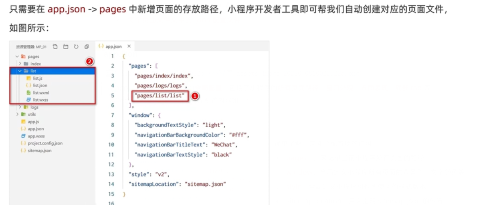
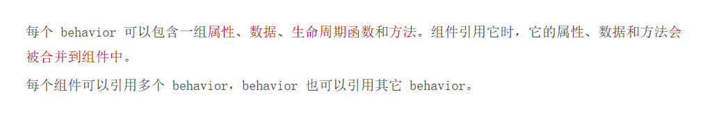
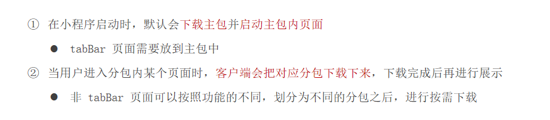

## 	小程序

### 简介

### 基本结构

#### 项目结构

#### 页面组成

#### JSON配置文件

##### app.json

###### 新增页面

###### 修改项目首页

#### WXML

#### WXSS

#### JS文件分类

#### 通讯模型

### 组件 

#### scroll-view 

#### swiper-view

#### rich-text

#### button

#### image

### API

### 发布上线

#### 上传代码

#### 查看版本

#### 提交审核

#### 发布

#### 小程序码

#### 运营数据

### 模板语法

#### 事件绑定

##### 属性

##### target和currentTarget

##### bindTap

##### setData

##### 事件传参 data-*

##### bindinput

#### 条件渲染

##### wx:if

##### block (template)

 

##### hidden (v-show)

##### wx:if 与 hidden 对比

##### wx:for

### 模板样式

#### WXSS 与 CSS

#### rpx

#### 样式导入 @import

#### 全局样式和局部样式

 

### 全局配置

#### 常用配置项

#### window

##### 配置项

##### 设置导航栏的标题

##### 设置导航栏的背景色

##### 设置导航栏的标题颜色

##### 开启下拉刷新

##### 设置下拉刷新时窗口的背景色

##### 设置下拉刷新时 loading 的样式

##### 设置上拉触底的距离

#### tabBar

##### tabBr配置项

##### 每个 tab 项的配置选项

##### 示例

##### 自定义tabBar

https://developers.weixin.qq.com/miniprogram/dev/framework/ability/custom-tabbar.html 

### 网络数据请求

#### 小程序中网络数据请求的限制

#### 配置 request 合法域名

#### 发起 GET 请求

#### 发起 POST 请求

#### onLoad

#### 跳过 request 合法域名校验

#### 关于跨域和 Ajax 的说明

### 页面导航

#### 声明式导航

##### 导航到 tabBar 页面

##### 导航到非 tabBar 页面

##### 后退导航

#### 编程式导航

##### 导航到 tabBar 页面

##### 导航到非 tabBar 页面

##### 后退导航

#### 声明式导航传参

#### 编程式导航传参

#### 在 onLoad 中接收导航参数

### 页面事件

#### 监听页面的下拉刷新事件

#### 停止下拉刷新的效果

#### 监听页面的上拉触底事件

#### 自定义编译模式

### 生命周期 Life Cycle

#### 分类

#### 应用的生命周期函数

#### 页面的生命周期函数

### WXS

#### 应用场景

#### wxs 和 JavaScript 的关系

#### 内嵌wxs

#### 外联wxs

#### 隔离性

****

#### 性能好

### 自定义组件

#### 小程序对npm的支持与限制

#### 组件样式隔离选项

#### properties （props)

#### 小程序data和properties的区别

#### 使用serDate修改properties的值

#### 数据侦听observers

#### 监听所有属性变化

#### 纯数据字段

#### 组件的生命周期

#### lifetimes结点

#### 组件所在页面的生命周期

#### pageLifetimes结点

#### 插槽

##### 启用多个插槽

##### 使用多个插槽

#### 组件通信

##### 父子组件通讯

##### 属性绑定

##### 事件绑定

##### 获取组件实例

##### behaviors

behaviors中所有可用的结点

###### 同名字段的覆盖和组合规则

https://developers.weixin.qq.com/miniprogram/dev/framework/custom-component/behaviors.html

### 项目相关

#### 组件的创建与引用

##### 创建

##### 局部引用

##### 全局引用

#### 组件和页面的区别

#### API Promise化

每次安装完第三方包时 都需删除miniprogram_npm 然后重新构建npm

#### 全局数据共享

##### 创建 MobX 的 Store 实例

##### 将 Store 中的成员绑定到页面中

##### 将 Store 中的成员绑定到组件中

#### 分包

##### 分包的加载规则

##### 配置方法

##### 打包原则

##### 独立分包

##### 独立分包的配置

##### 引用原则

##### 分包预下载

###### 分包预下载的配置

###### 分包预下载的限制

