### html大纲算法工具

http://h5o.github.io/

### css样式统一

normalize.css

### Fastclick

FastClick 是一个简单易用的库，它消除了移动端浏览器上的物理点击和触发一个 `click` 事件之间的 300ms 的延迟。目的就是在不干扰你目前的逻辑的同时，让你的应用感觉不到延迟，反应更加灵敏

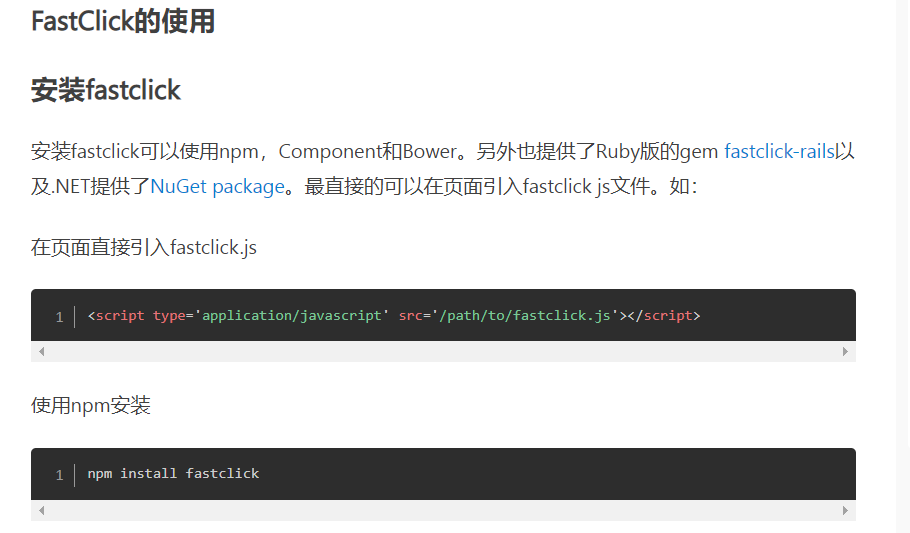

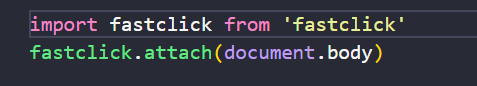

### Vue-Lazyload

图片懒加载插件

### Vue-cookies

设置cookie

### AST和代码互换

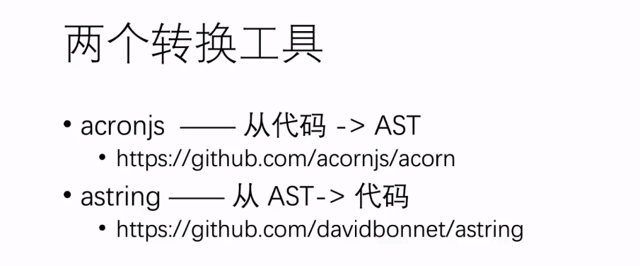

### qrcode

将字符串转换为二维码

### vue-infinite-scroll

实现自动加载 滚动

### prettier

### BootstrapVue

Bootstrap vue 将 Bootstrap 组件与Vue结合使用。它可以帮助你构建响应迅速、移动优先的项目。它是Vue.js和世界上最受欢迎的前端CSS库Bootstrap的组合。BootstrapVue将 Bootstrap的强大功能带到了Vue。它使所有Bootstrap 元素（如行、列和卡）都可以用作Vue 组件。

此外，它还提供了适用于Vue .js v2.6 的Bootstrap v4 组件和网格系统的最全面的实现之一，并带有广泛且自动化的WAI-ARIA 辅助功能标记。

### Vuexy 管理模板

它基于bootstrapVue。此外，它是一个可高度定制，高级，最受客户喜爱的多用途管理模板。

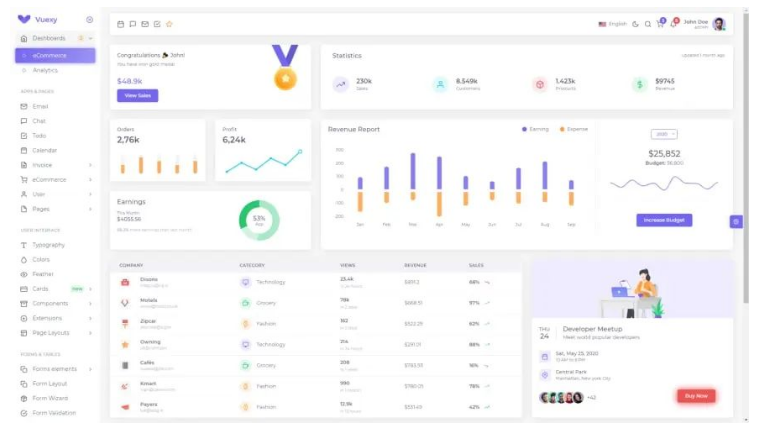

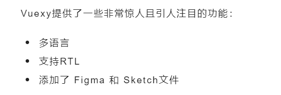

### Vuetify

Vuetify是一个VueUI库，其中包含使用MaterialDesign规范的精美手工制作的组件。它由形状、卡片、交互、深度效果（如阴影和灯光等）的UI 指南组成。

它可以帮助你使用成功所需的所有工具来加快开发过程。此外，它支持所有现代浏览器，并与VueCLI-3兼容。它还为Simple HTML，Webpack，NUXT，PWA，Electron，ALa Carte，ApacheCordova提供了基本模板。

### MaterioVuetify VueJS AdminTemplate

Materio还提供了宝贵的功能，旨在帮助创建完全符合你想象的优质单页应用程序。

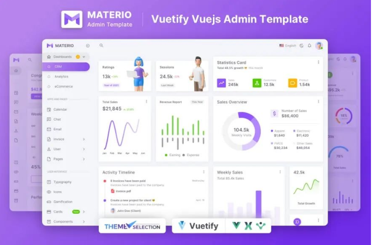

此外，MaterioVuetify VueJS AdminTemplate还附带了独特而有用的工具，例如模糊搜索，Dark，Semi-Dark和Bordered布局选项，AdvancedCards和Chart。此外，它还提供了以下惊人功能。

### Quasar

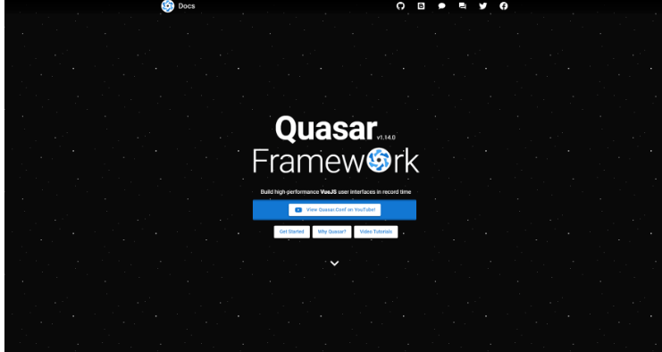

Quasar是一个高性能的MaterialDesign组件套件，具有SPA，SSR，PWA，Mobile（Cordova和Compacter），Desktop（Electron）和浏览器扩展的构建器。这使你作为Web开发人员可以快速创建多种风格的响应式网站/应用程序。它专注于遵循材料2.0。

Quasar提供了一个UMD（统一模块定义）版本，你可以将其作为CSS和JSHTML标签添加到现有项目中，然后就可以使用它了。

### Vuesax

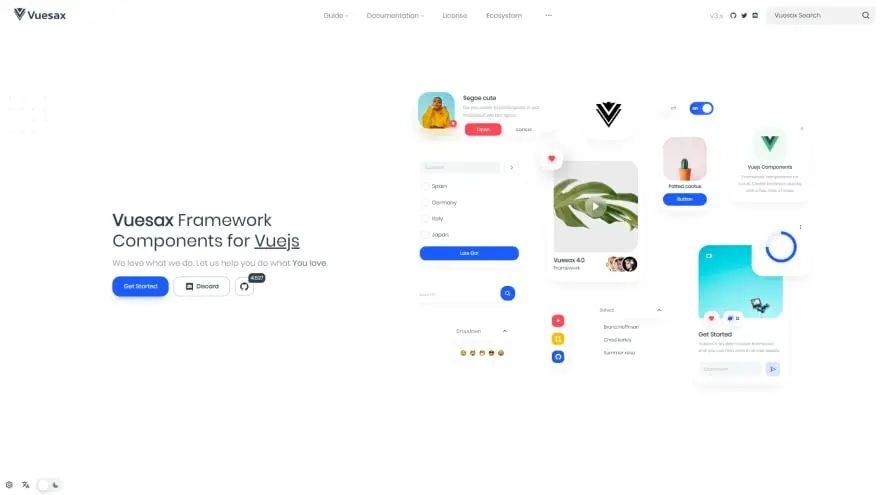

Vuesax是一个基于Vuejs的组件框架，它是一个从头开始设计为可增量采用的框架。它提供了独特且可重用的UI组件。该框架的重点是促进应用程序的开发，在不删除必要功能的情况下改进其设计。此外，所有组件都具有独特的颜色，形状和设计，因此你可以自由使用它们而不会失去创建和生产的速度。

### Nuxt.js

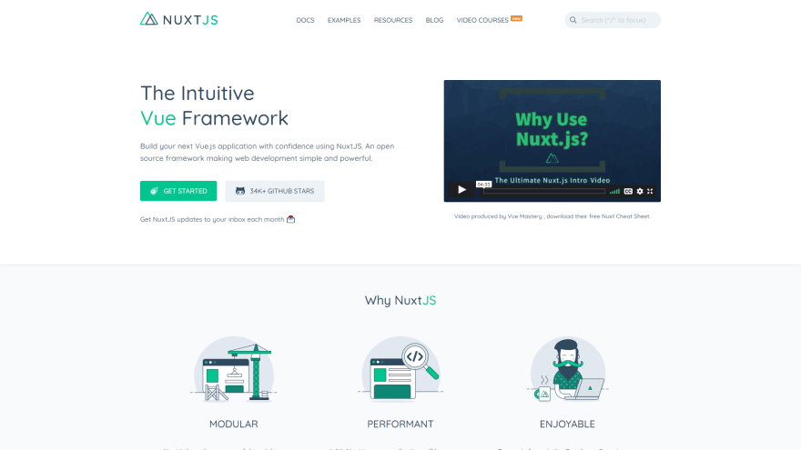

Nuxt是一个基于Vue的渐进式框架.js来创建现代Web应用程序。它基于Vue.js官方库（vue，vue-router和Vuex）和强大的开发工具（Webpack，Babel和PostCSS）。

### Ream

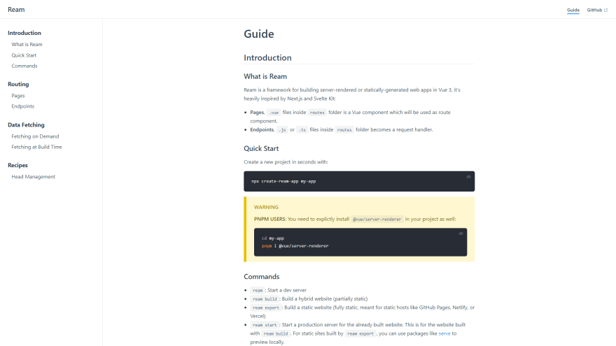

Ream是一个用于在Vue3中构建服务器渲染或静态生成的Web应用程序的框架，它受到Next.js和SvelteKit的启发。

###  Pagekit

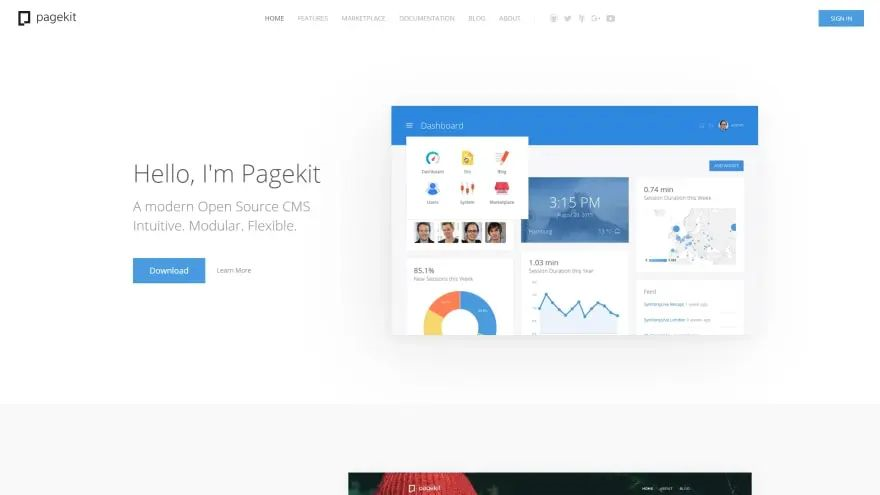

模块化轻量级CMS由Symfony组件和Vue.js构建而成。无论是个人博客还是公司的网站。使用Pagekit，可以为网络创建功能强大的内容，这些内容可以在每台设备上完美运行。Pagekit干净直观的界面使您可以专注于最重要的事情，管理你的内容。

### Koel

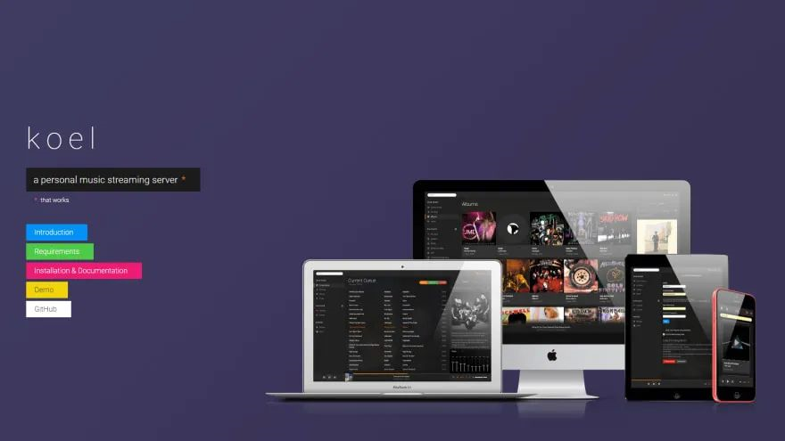

Koel是一个简单的基于Web的个人音频流媒体服务，在客户端用Vue编写，在服务器端用Laravel编写。针对Web开发人员，Koel采用了一些更现代的Web技术- CSS网格，音频和拖放API等来完成它的工作。

### Flox

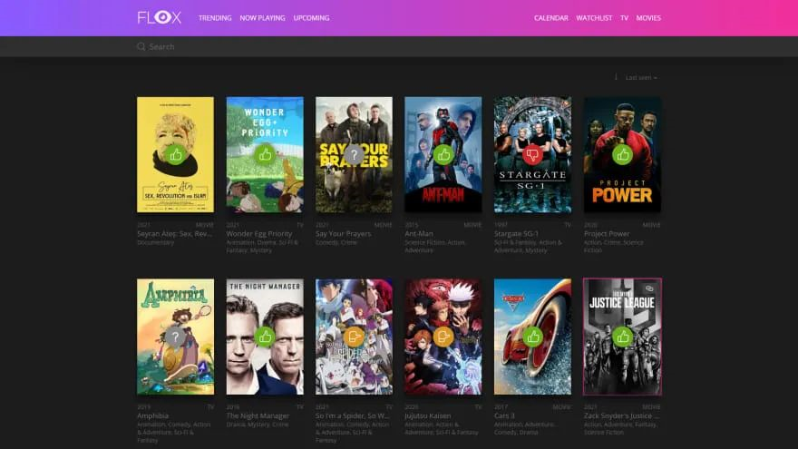

Flox是一个自托管的电影，系列和Amines观看列表。它建立在Laravel和Vue之上.js并使用电影数据库API。该评级基于3分制：goodmedium bad

### Vuegg

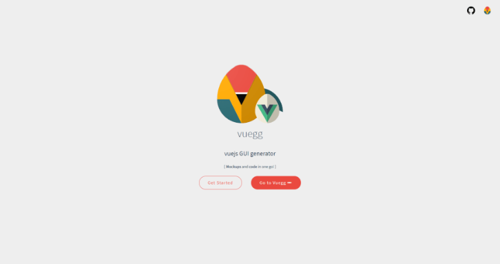

VueJS项目通过将组件直接拖放到可视化编辑器中，并移动、调整它们的大小到你的选择。Vuegg利用应用程序/网站的页面和路由的创建，简化了样式设计工作，并有助于实现快速原型制作工作流程。

该项目的目的是将设计和原型设计合并到一个单一的流程中。每当你对屏幕上看到的内容感到满意时，只需获取代码即可。

### Vue CRUD

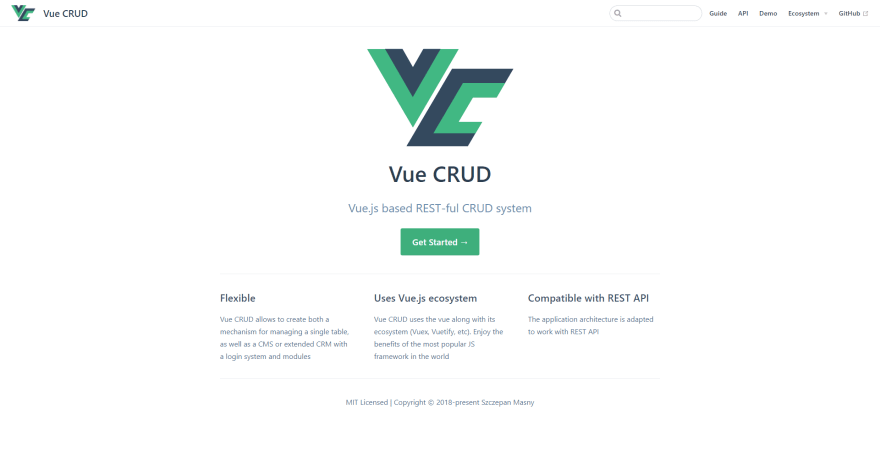

VueCRUD允许创建用于管理单个表的机制，以及具有登录系统和模块的CMS或扩展CRM。VueCRUD使用vue及其生态系统（Vuex，Vuetify等）。享受世界上最流行的JS框架的好处。

### Wjimo

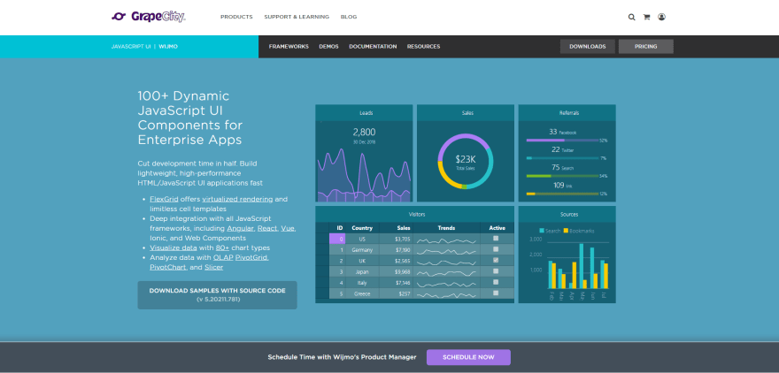

Wjimo有100多个用于企业应用程序的动态JavaScript UI组件。在Wjimo的帮助下，你可以将开发时间缩短一半。此外，你还可以快速构建轻量级，高性能的HTML/ JavaScript UI应用程序。

### Vuejs laravel管理模板

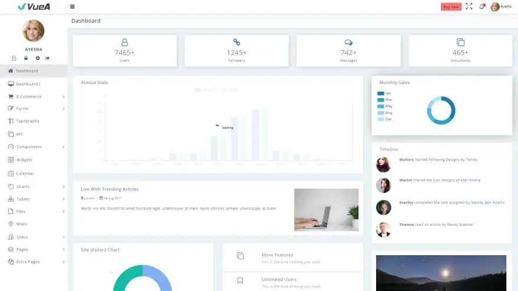

此管理模板是使用Vuejs2、Laravel5.4 和 Bootstrap4构建的。**VueJS**专为从头开始开发任何项目而设计，也可以与任何其他开发项目集成。vue的核心库主要与表示层相关联，很容易与其他库或现有项目一起使用。

### Coloban

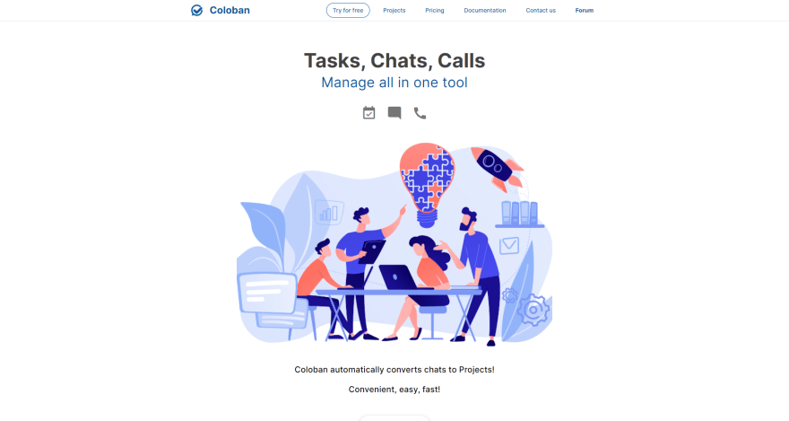

具有聊天，看板，通话，屏幕共享等功能的一体化项目管理工具。

### Commander

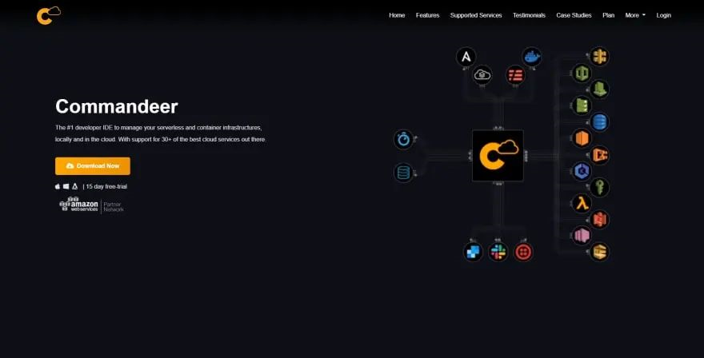

它是在本地和云中管理无服务器和容器基础结构的最佳开发人员IDE 之一。支持30 多种最佳云服务。借助10 多个部署和测试运行程序，你可以配置一次，然后一遍又一遍地重复。配置Ansible 和无服务器环境变量。直接调用lambda，或使用我们的测试运行程序测试S3、SQS、SNS、DynamoDB流 Lambda 调用。

### Vuelibs

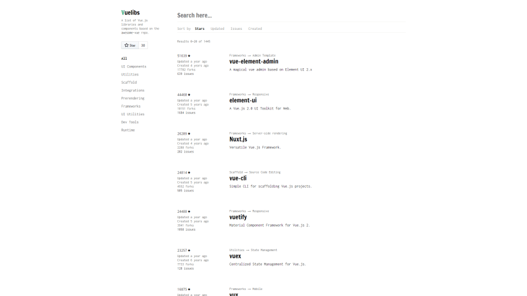

Vuelib是Vue.js库，框架，实用程序和组件的列表。

### Vuejs examples

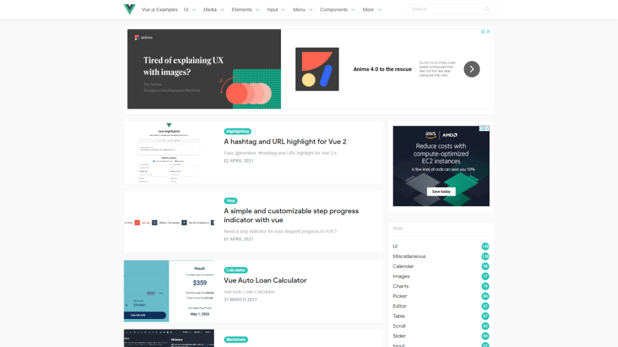

VueJS示例，顾名思义，它是使用VueJS制作的简单且可自定义的步骤进度指示器，Vue自动贷款计算器，通知/Toast组件等示例的集合。不仅如此，它还提供了使用VueJS制作的UI，游戏，元素，媒体等组件。

### **表格**

以下是Vue的一些表组件和ag-grid组件。

- Vue Materialize Data table - 一个花哨的Materialize CSS 数据表VueJS组件。
- Vue Tables-2 - Vue.js 2 个网格组件。
- 猎豹网格 - 最快的网络开源数据表。
- vue-datasource - 一个 vue.js服务器端组件来创建动态表。
- ag-grid-vue – 适用于ag-Grid的vue适配器.

- vue-data-tables
- vue-teible - 用于 Web 的轻量级和灵活的表格组件
- vuejs-smart-table - 使用 vanilla HTML Table结构的直线表组件
- fancy-grid-vue -适用于 FancyGrid的vue适配器

### **通知**

使用无模式临时小弹出窗口通知用户

- Vue Toasted - 适用于 VueJS 2+ 的响应式触摸兼容 Toast 插件
- Vuex Flash - Vuex 中的 VueJs Flash Message Component
- Vue Notification Bell - 用于显示通知的 Vue UI 组件。
- Vue Notification – 具有被动方法的vue.js3的加载器管理器。
- Vue Toast Notification - 又一个 Vue.js Toast 通知插件

- VueToastify - 一个大惊小怪的免费通知组件。
- vue-toaster - Vue.js Vue 3 的 toast notification plugin

### **加载**

加载程序/微调器/进度条— 让用户知道正在加载某些内容

- Vue 径向进度 - Vue 的径向进度条组件.js。
- Vue wait - 用于 Vue/Vuex 和 Nuxt 应用程序的复杂加载程序管理。
- Vue-ultimate-skeleton-cards - 用于 Vue的终极、完全可定制的 Skeleton Card 插件
- Vue-wait-for - Vue.js 3 的加载程序管理器，带有反应式方法
- Vue-content-loader - SVG组件，用于创建占位符加载，如Facebook卡片加载
- vue-element-loading - 在容器内加载或全屏加载 Vue.

- tb-skeleton - 用于 Vue 的骨架屏幕加载.js
- vue-spinners - 用于 Vuejs 的加载微调器组件的集合

### **图标**

- Vue ionicons - 来自 Ionic Team 的组件。
- Vue awesome -使用内联SVG为vue.js子体更改组件
- Mdi vue - Vuejs 的 材料设计图标组件
- vue-zondicons -美丽的 Zondicon svg 图标的Vue 组件
- vue-eva-icons – 简单的开源eva图标作为Vue组件。
- vue-unicons - 1000+ 像素完美的 svg unicons，用于你的下一个项目作为 Vue 组件。

### **菜单**

- VueJS 下拉列表 - Vue.js 2 下拉菜单组件。重量轻，使用方便，扩展方便，无需外部设备。
- Vue 简单菜单 - 具有一组基本功能的简单菜单组件。
- Vue 树导航 - Vue.js 2 树导航，支持 vue 路由器
- bp VueJS 下拉列表 - Vuejs => 2 下拉列表。易于使用，无需外部，可选。

- Vue Bulma 手风琴 - 简单、易于配置的手风琴或可折叠样式，提供 Bulma 自定义或内置图标
- Vue-stripe-menu - 创建一个带有动画的导航菜单，就像在Stripe上一样

### **图表**

- Flowchart-vue - Vue 的 Flowchart & Flowchart designer component for Vue.js。
- Vue-d3-barchart - 使用 d3 绘制图表的小组件。
- Vue3-highcharts -Vue 3 的 Highcharts.JS包装器组件
- Echarts-for-vue - Vue 3 and 2的包装组件
- Vue3-chart-v2 - 基于 Vue 3 的 Chart.JS 的 Vue 包装器组件
- vue-apexcharts - ApexCharts 的Vue.js组件
- vue-doughnut-chart - 用于 Vue 的 Doughnut 图表组件.js。
- v-charts - 基于 Vue2.x 和 Echarts 的图表组件。

### **日历**

- Vue datepicker ui - Vue的日期选择器组件
- Vue 日期工具 - 最轻量级的 VueJS 日期选取器和日期范围选取器，使用 date-fns 且没有其他依赖项
- Vue 春季日历 - 它是一个基于 Vue 的组件，提供显示每日事件的完整日历的功能。
- Vue jquery calendar - 适用于jquery ui
- Vue 日程安排板 - 一个易于使用的组件，用于显示某人的日程安排列表，以帮助安排面试或访问安排。
- Vue 阴历 pro - 阴历的 vue 组件。使用日历.js进行日期操作。

### **播客**

- DNE 138 - Vale a pena VueJS？(01-05-2018)
- 愤世嫉俗的开发人员 #99 （10-15-2018）
- 语法 #130 （03-27-2019）
- 享受 Vue：新的 Vue.js播客

### **求职：**

- Vue.js Jobs - VueJobs - 一个Vue.js工作门户，用于雇用或被雇用所有Vue.js工作。
- Vue.js面试问题 - 300个VueJS面试问题和答案列表

- Prokarman简历生成器 - 一个免费的简历生成器，用于为您梦想的工作制作简历。

### **服务器端呈现**

- 通用 vue
- 因子平台 - 扩展驱动的 VueJS 平台 （Factor.dev → 文档)
- Vapper - 基于 Vue 的服务器端渲染框架。

### **静态网站生成器**

- VuePress - 极简主义的Vue供电的静态站点生成器。
- Peco - 人类的静态网站生成器。未维护
- Saber - 一个静态网站生成器，用于使用Vue.js构建超快的网站。
- Gridsome - 使用 Vue 构建超快速、现代的网站.js
- Servue - 服务器端渲染引擎，将 vue 文件渲染为 HTML 字符串。

### **社区**

- 推特
- 官方论坛
- vueslack - 全球2300 +注册用户
- Vue Land - Discord chat server