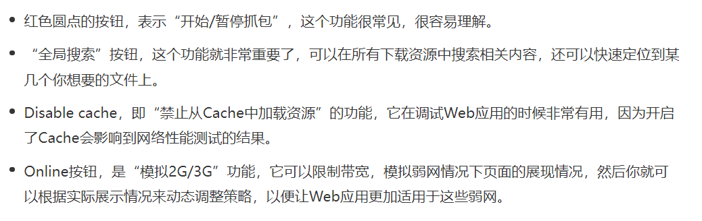
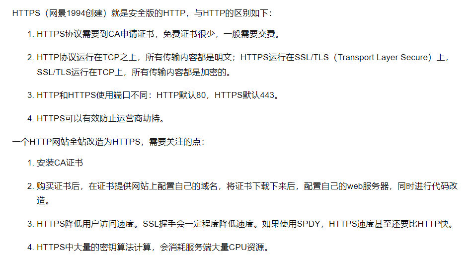

##  调用栈

### 利用调用栈

### 栈溢出

## 编译器和解释器

## 语言类型

## 开发者工具

### Network面板

#### 控制器

#### 过滤器

#### 抓图信息

#### 时间线

#### 详细列表

#### 下载信息概要

## 网络协议

### OSI和TCP/IP网络模型

### HTTP/1的缺陷

###  HTTPS

### SPDY

### HTTP/2

### TCP协议僵化

### QUIC协议（Http3 ）

