# 计算机网路

## 三种交换方式

### 电路交换

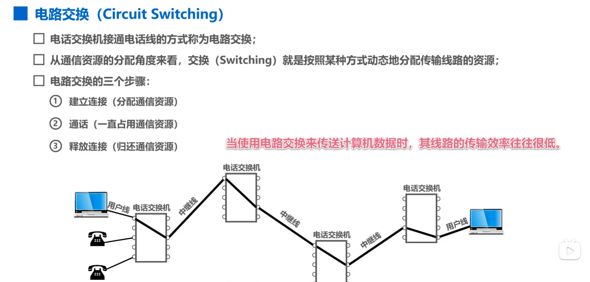

### 分组交换

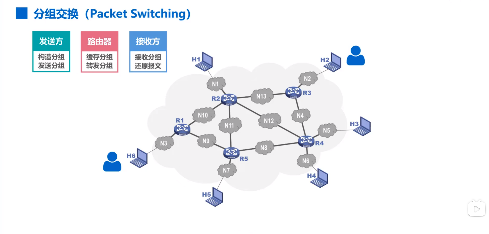

### 三者对比

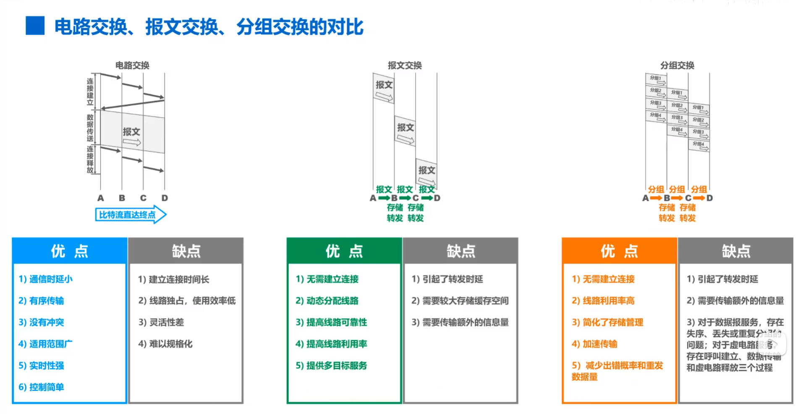

## 计算机网络的分类

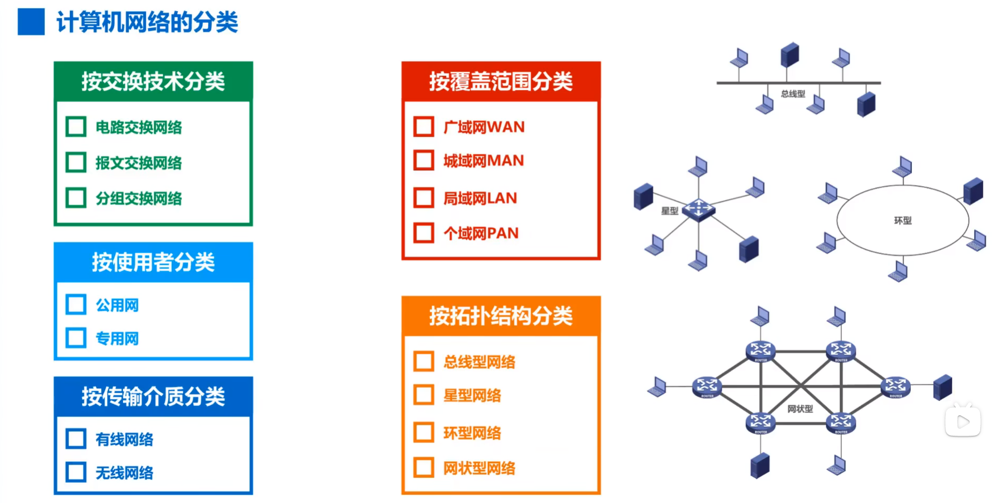

## 计算机网络的性能指标

### 速率

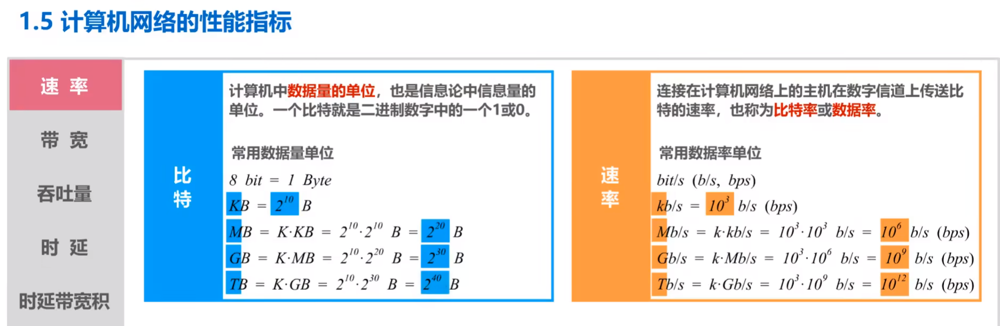

### 带宽

 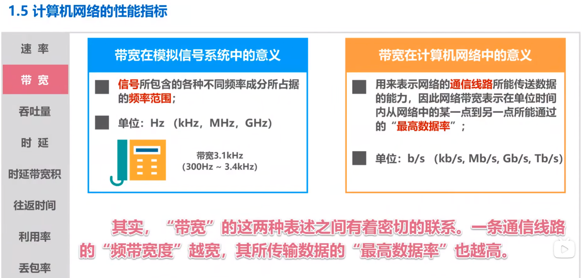

### 吞吐量

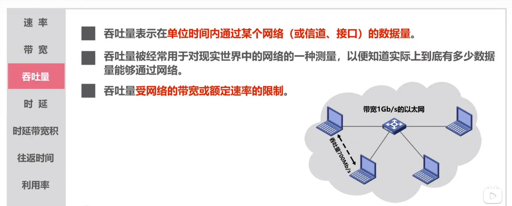

### 时延

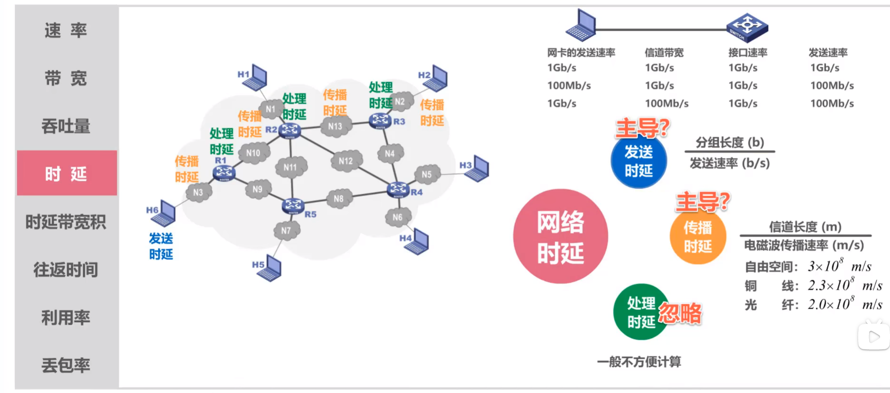

### 时延带宽积

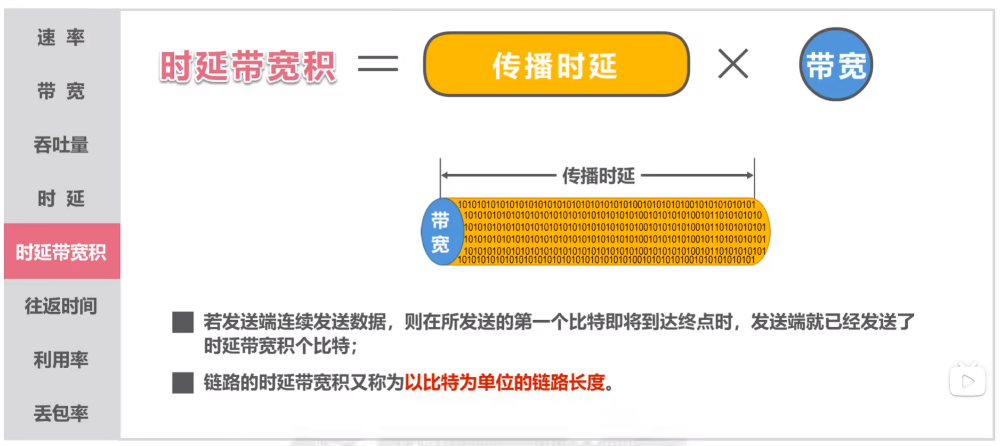

###  往返时间

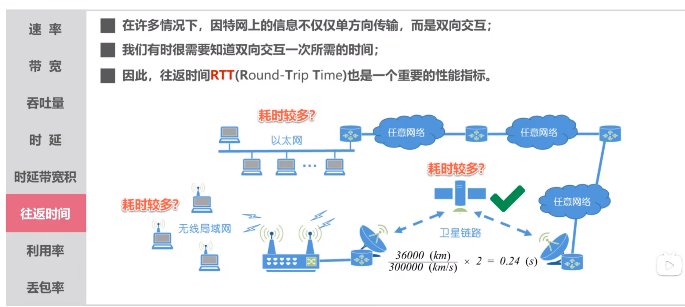

### 利用率

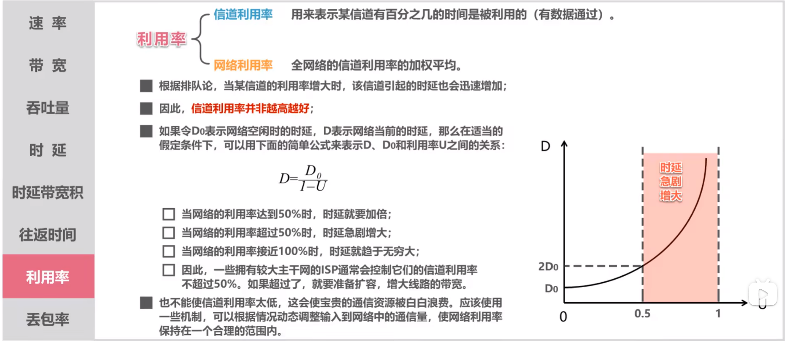

### 丢包率

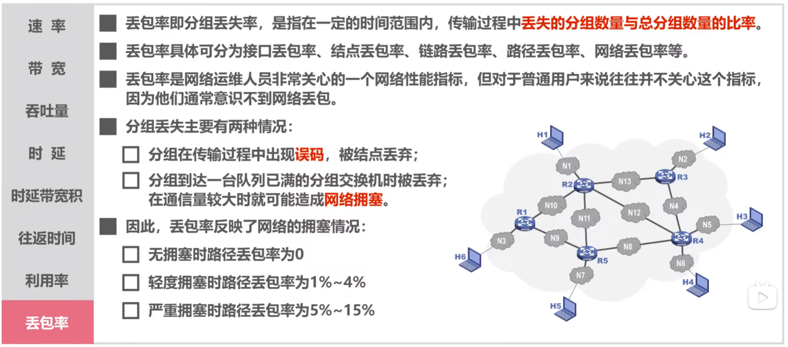

## 计算机网络体系结构

###  常见的计算机网络体系结构

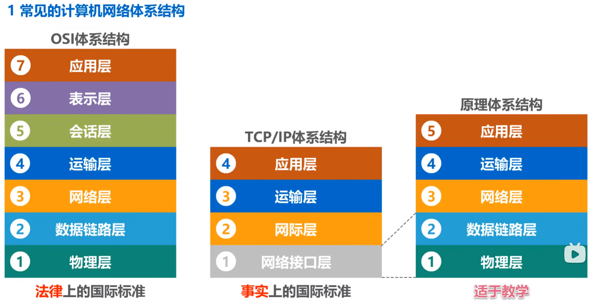

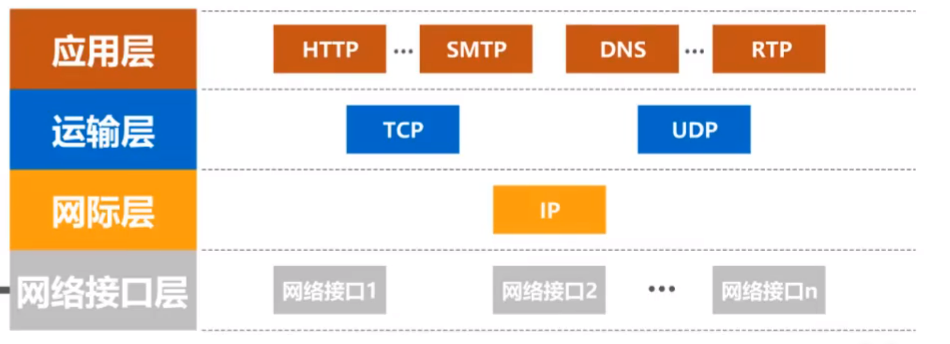

### 计算机网络体系结构分层的重要性

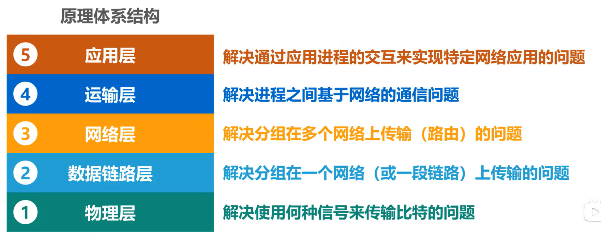

### 分层思想举例

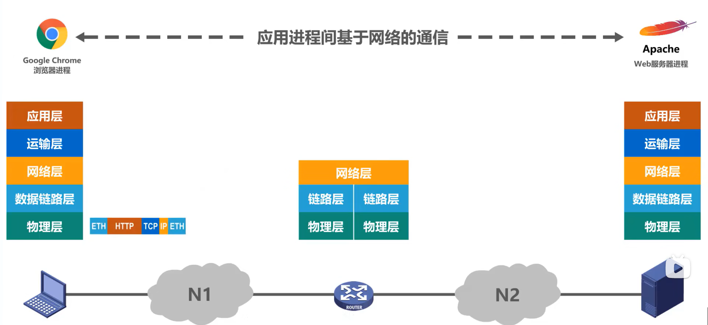

###  网络体系中的专业术语

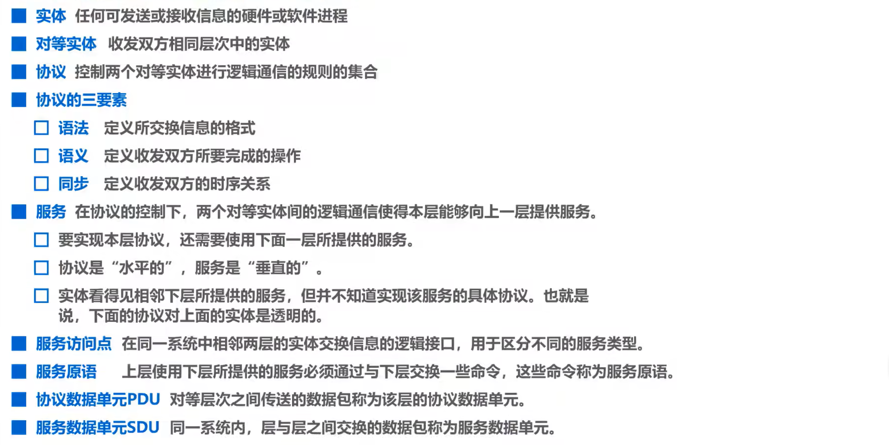

## 物理层概述

### 物理层的基本概念

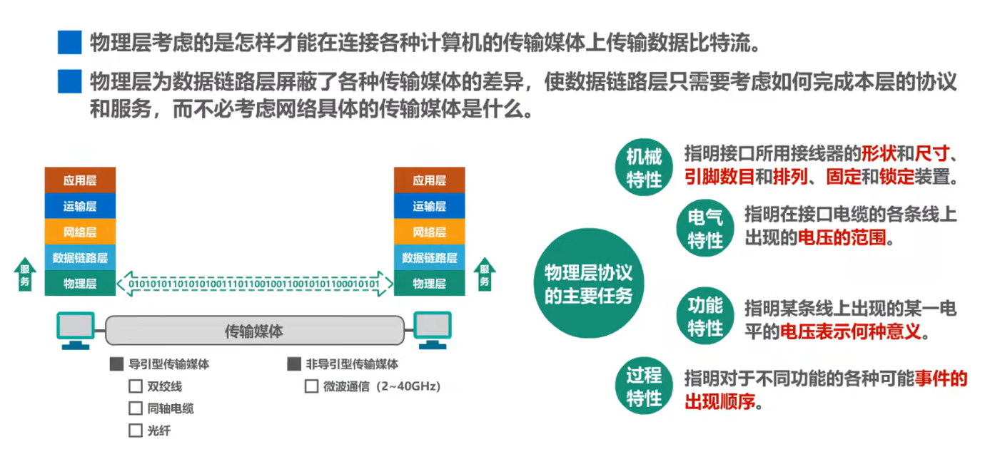

### 传输方式

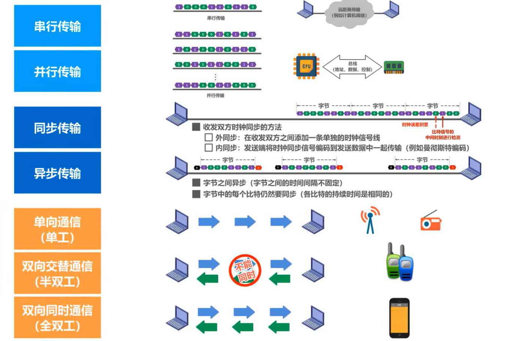

### 编码与调制

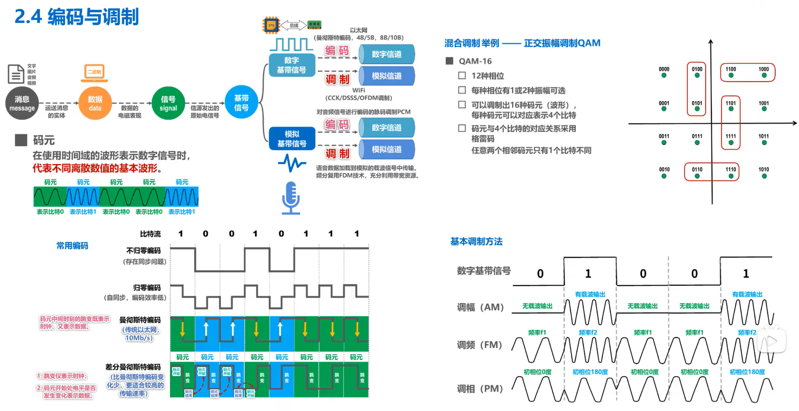

### 信道的极限容量

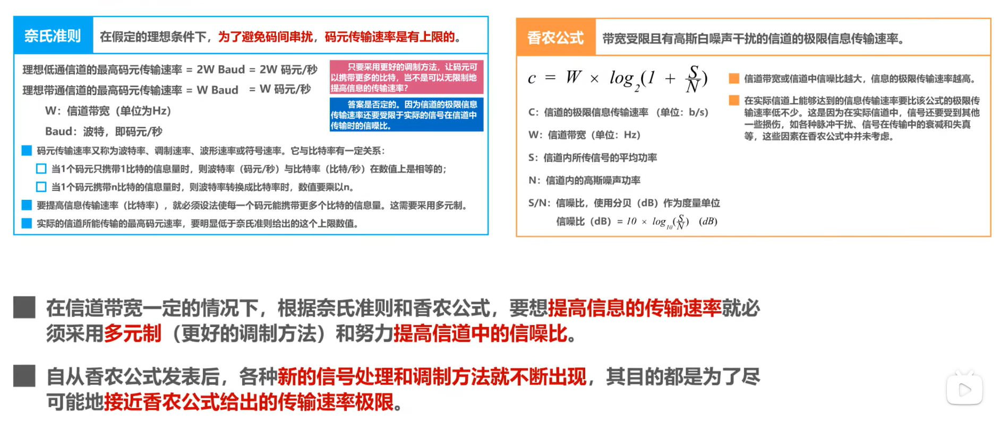

