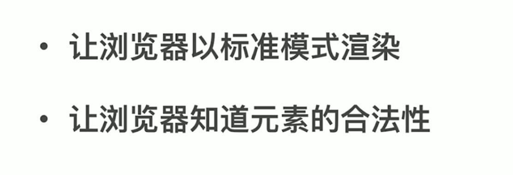
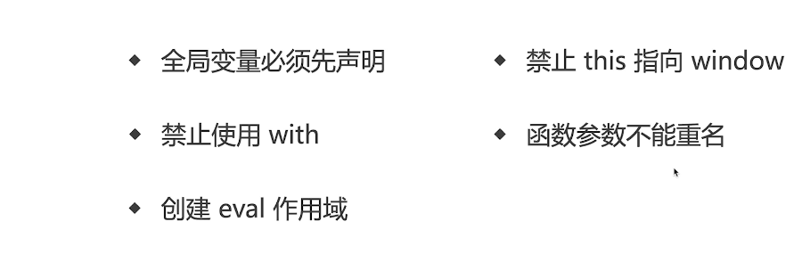
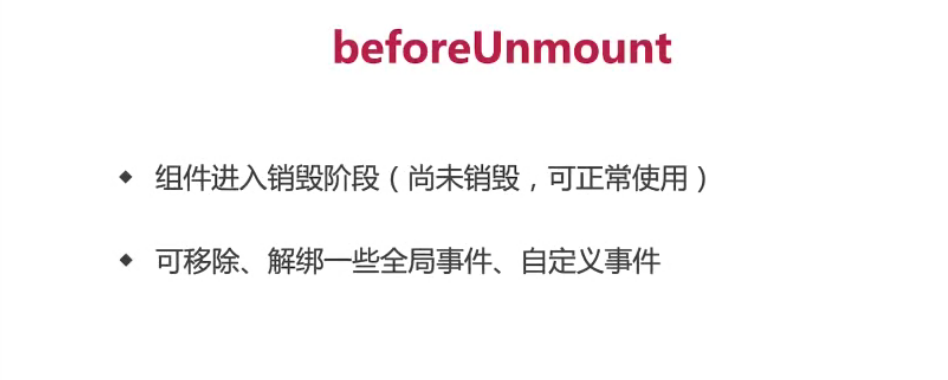
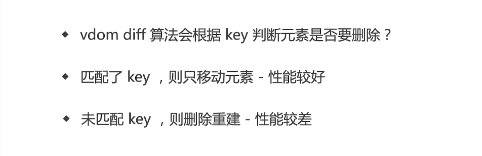
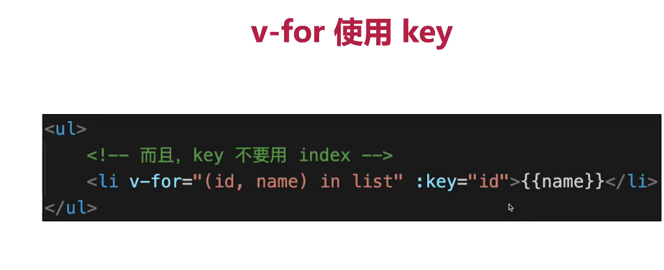
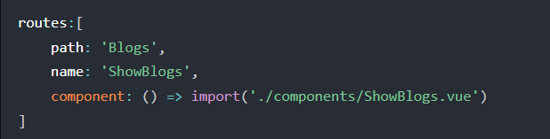
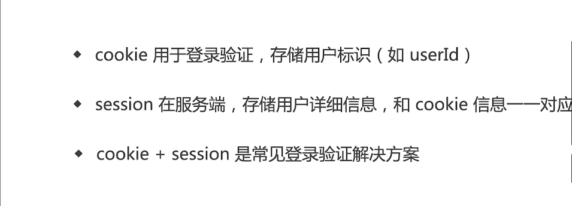
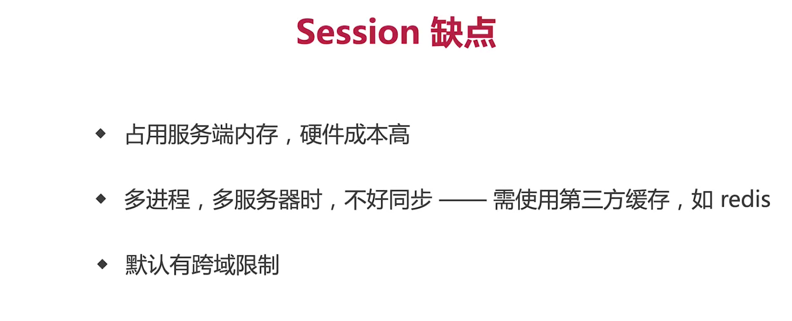
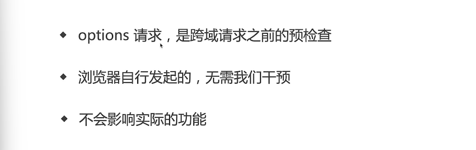

### HTML面试题

#### HTML和DOM的关系


#### 语义化的意义是什么


#### HTML5有什么变化


#### HTML XHTML HTML5的关系


#### doctype的意义是什么



#### property和attribute的区别


form的作用有哪些


### CSS面试题

#### CSS样式(选择器)的优先级


#### base64的使用


#### 伪类和伪元素的区别


#### 如何美化checkbox


#### 实现两栏(三栏)布局的方法


#### 如何用一个div画XXX


#### 如何产生不占空间的边框


 

#### offsetHeight scrollHeight clientHeight 区别


#### 重绘、重排和回流

**重绘**：元素外观改变，如颜色、背景色

但元素的尺寸、定为不变，不会影响其他元素的位置 （影响较小）

**重排**：重新计算尺寸和布局，可能会影响其他元素的位置

如元素高度增加，可能会使相邻元素位置下移

重排比重绘要影响更大，消耗也更大 所以，要避免无意义的重排

**减少重排的方法**


### JS面试题

#### pormise Generator async/await 区别

- `promise`和`async/await`是专门用于处理异步操作的
- `Generator`并不是为异步而设计出来的，它还有其他功能（对象迭代、控制输出、部署`Interator`接口...）
- `promise`编写代码相比`Generator`、`async`更为复杂化，且可读性也稍差
- `Generator`、`async`需要与`promise`对象搭配处理异步情况
- **`async`实质是`Generator`的语法糖，相当于会自动执行`Generator`函数**
- **`async`使用上更为简洁，将异步代码以同步的形式进行编写，是处理异步编程的最终方案**

#### bind、call、apply的区别

bind只改变this指向 不会调用

call与apply 改变this指向后 并且执行一次

call与apply 传入的参数不同 apply传入数组 call和bind传入的是一个参数列表 但bind的参数列表可以分多次传入

#### JS闭包的理解

闭包就是能够读取其他函数内部变量的函数 即闭包就是将函数内部和函数外部连接起来的一座桥梁

它的最大用处有两个，一个是可以读取函数内部的变量，另一个就是让这些变量的值始终保持在内存中。

使用闭包的注意点：

1）由于闭包会使得函数中的变量都被保存在内存中，内存消耗很大，所以不能滥用闭包，否则会造成网页的性能问题，在IE中可能导致内存泄露。解决方法是，在退出函数之前，将不使用的局部变量全部删除。

2）闭包会在父函数外部，改变父函数内部变量的值。所以，如果你把父函数当作对象（object）使用，把闭包当作它的公用方法（Public Method），把内部变量当作它的私有属性（private value），这时一定要小心，不要随便改变父函数内部变量的值。 

闭包的作用：

1.避免变量被污染

2.私有化

3.保存变量 常驻内存

4.闭包的应用场景：防抖 节流 库的封装（保证数据的私有性）

#### import与 require 的区别


#### 节流和防抖

- 节流: n 秒内只运行一次，若在 n 秒内重复触发，只有一次生效
- 防抖: n 秒后在执行该事件，若在 n 秒内被重复触发，则重新计时

**二者的区别**


#### 说明Ajax Fetch Axios三者的区别

三者都用于网络请求  但是不同纬度


#### 箭头函数的缺点以及什么时候不能使用箭头函数


  

由于vue组件本质上是对象 导致箭头函数中this不能使用

但是react组件本质上是一个class(ES6) 所以可以使用箭头函数中可以使用this

#### for in 与 for of 区别

for in 用于可枚举数据 如对象、数组、字符串 得到key

for of 用于可迭代数据 如数组、字符串、Map、Set 得到value

#### JS严格模式有什么特点




#### 垃圾回收 GC

算法


#### JS闭包是内存泄漏吗？

严格意义上讲 不是内存泄漏  但是闭包中的数据无法被垃圾回收机制回收

但是这是在意料之内的 使用闭包就无法自动回收数据

#### 遍历一个数组用for和forEach哪个更快 


#### 数组常用方法

##### 增

**下面前三种是对原数组产生影响的增添方法，第四种则不会对原数组产生影响**

- push()
- unshift() 在数组开头添加任意多个值，然后返回新的数组长度
- splice() 传入三个参数，分别是开始位置、0（要删除的元素数量）、插入的元素，返回空数组
- concat()


##### 删

**下面三种都会影响原数组，最后一项不影响原数组：**

- pop() 用于删除数组的最后一项，同时减少数组的`length` 值，返回被删除的项
- shift() 用于删除数组的第一项，同时减少数组的`length` 值，返回被删除的项
- splice() 传入两个参数，分别是开始位置，删除元素的数量，返回包含删除元素的数组
- slice()


##### 改

修改原来数组的内容，常用`splice`


##### 查

即查找元素，返回元素坐标或者元素值

- indexOf() 返回要查找的元素在数组中的位置，如果没找到则返回 -1
- includes() 返回要查找的元素在数组中的位置，找到返回`true`，否则`false`
- find() 返回第一个匹配的元素

##### 排序

数组有两个方法可以用来对元素重新排序：

- reverse()
- sort()

##### 转换方法


##### 迭代方法

**常用来迭代数组的方法（都不改变原数组）有如下：**

- some() 
- every() 
- forEach() 
- filter() 
- map() 


#### 原型与原型链

```
对应名称
prototype : 原型

__proto__：原型链（链接点）

从属关系
prototype -> 函数的一个属性：对象{}
__prpto__ -> 对象Object的一个属性：对象{}

一个对象的__proto__就等于该对象构造函数的prototype

对象的__proto__保存着该对象构造函数的prototype

 function Test() {
        this.a = 1;
    }

    let test = new Test();
    Test.prototype.b = 2;

    Object.prototype.c = 3;
    console.log(test);

    /**
     * test{
        a:1,
        __proto__ = Test.prototype ={
            b:2,
            __proto = Obejct.prototype ={
                c:3,
                __proto__:null;
            }
        }
     }
    */

    console.log(test.__proto__ === Test.prototype); //true
    console.log(test.__proto__.__proto__ === Object.prototype && Object.prototype === Test.prototype.__proto__); //true 
    
    原型继承：
    由test即可访问到b,c属性  如果test有b，c属性 覆盖底层的
```

##### Function 和 Object 的特殊性：函数 对象 

```
//构造函数的__proto__为function
console.log(Test.__proto__ === Function.prototype); //true

//函数的prototype属性和__proto__属性是全等的
console.log(Function.prototype === Function.__proto__); //true

console.log(typeof Object); //fuction 
console.log(Object.prototype === Object.__proto__); //false
console.log(Object.__proto__ === Function.prototype); //true
//由此推出 Obeject.__proto__ 与 Function.__proto__ 全等     
console.log(Object.__proto__ === Function.__proto__); //ture

```

##### 判断属性是否存在的方法

###### hasOwnProperty()  寻找自身属性

```
console.log(test.hasOWnProperty('a')); //判断自身是否含有a属性
```

###### in方法 寻找原型链继承属性

```
console.log('a' in test); //判断原型链上是否含有a属性
```

###### constructor与实例直接的关系和特性

test.constructor --> 实例化test对象的构造函数 即 Test()

### Vue面试题

####  Vue computed 和 watched 区别


#### Vue组件通信方式

  

#### Vuex中action和mutation的区别


 

#### Vuex使用时的优缺点


#### 刷新后vuex状态丢失如何解决


#### v-for中使用key的意义

使用不使用key 决定了vue底层采用哪个diff算法

patchKeyedChildren 和 patchUnkeyedChildren

**key的作用让每个item有一个唯一的识别身份，可以下标值index或者id, 主要是为了vue精准的追踪到每一个元素，高效的更新虚拟DOM**


####  内存泄漏场景(Vue为例)


#### 虚拟DOM(vdom)真的很快吗？

 

#### Vue生命周期都干了什么





#### Vue什么时候操作DOM比较合适


**使用this.$nextTick()可以等待dom生成以后再来获取dom对象**

####  Ajax应该放在哪个生命周期


#### Vue3 Composition API 生命周期有何区别


#### Vue2 Vue3 React 三者 diff 算法有何区别


#### Vue React 为何循环时必须使用key?



#### 对Vue的优化





#### 使用Vue中遇到的坑


#### 解决SPA首屏加载速度慢

路由懒加载（动态加载路由）



**静态资源本地缓存** 

localStorage

**UI框架按需加载**


**图片资源的压缩**

**组件重复打包**

**开启GZip压缩**

**使用SSR（服务端渲染）**


#### 对Vue.observable的理解

`Vue.observable`，让一个对象变成响应式数据。`Vue` 内部会用它来处理 `data` 函数返回的对象

在 `Vue 2.x` 中，被传入的对象会直接被 `Vue.observable` 变更，它和被返回的对象是同一个对象

在 `Vue 3.x` 中，则会返回一个可响应的代理，而对源对象直接进行变更仍然是不可响应的


#### SSR和SSG(静态站点生成)


#### Vue权限管理如何做？

https://vue3js.cn/interview/vue/permission.html#%E4%BA%8C%E3%80%81%E5%A6%82%E4%BD%95%E5%81%9A

### 计网

#### 关于TCP

###### TCP网络分层


###### 三次握手


**为什么不是两次或四次？**

如果只有两次 只会有服务器意识到建立连接 而服务端不会后续发送数据

没有四次的必要 浪费资源

###### 四次挥手


**为什么不能是三次？**

(会产生资源的浪费) 第二次和第三次中间会有时间间隔 如果合二为一 时间超过30s会一直重新发送请求

###### 为什么SYN/FIN不包含数据却要消耗一个序列号


###### 什么是半连接队列？什么是SYN Flood攻击？


###### TCP快速打开(TFO)的原理


Fast Open Cookie


TCP Fast Open 


**TFO的优势**


###### TCP中的流量控制 


###### TCP和UDP的区别


#### Cookie 相关的字段，Cookie 的作用域，父子域之间 Cookie 的联系


#### 网络请求中，token 和 cookie 有什么区别？




#### Cookie、localStorage、sessionStorage 三者区别  


####  Session 和 JWT





#### 前端攻击手段有哪些，如何预防


#### WebSocket 和 HTTP协议有什么区别


####  WebSocket和HTTP长轮询的区别


#### HTTP跨域时为何要发送options请求（了解）



#### 从输入URL到页面显示的完整过程


#### 从哪些点做性能优化

```
a:加载
    1.减少http请求（精灵图，文件的合并
    2.减小文件大小（资源压缩，图片压缩，代码压缩）
    3.CDN（第三方库，大文件，大图）
    4.SSR服务端渲染，预渲染
    5.懒加载
    6.分包
b:减少dom操作，避免回流，文档碎片
```

#### 跨域

##### 同源策略


##### 反向代理


###### node配置反向代理


###### vite配置代理

https://cn.vitejs.dev/config/server-options.html#server-proxy

###### vueCLI配置代理

https://cli.vuejs.org/zh/config/#devserver-proxy

在开发中可以在以上中配置反向代理

部署时只能在后端例如node中配置反向代理或同过nginx配置

##### 简单请求 


##### 复杂请求


## 实际工作经验

### 前端常用的设计模式和使用场景


### 观察者模式和发布订阅模式的区别


## 候机法则

面试尽量避免一问一答 而是交流探讨 沟通技术


什么是同源策略，跨域是什么，怎么解决，CORS具体的字段

https://zhuanlan.zhihu.com/p/66789473#:~:text=Access-Control-Expose-Headers%20%3A%20%E8%AF%A5%E5%AD%97%E6%AE%B5%E5%8F%AF%E9%80%89%E3%80%82%20CORS%20%E8%AF%B7%E6%B1%82%E6%97%B6%EF%BC%8C%20XMLHttpRequest%20%E5%AF%B9%E8%B1%A1%E7%9A%84,getResponseHeader%20%28%29%20%E5%AD%97%E6%AE%B5%E5%8F%AA%E8%83%BD%E6%8B%BF%E5%88%B06%E4%B8%AA%E5%9F%BA%E6%9C%AC%E5%AD%97%E6%AE%B5%EF%BC%9A%20Cache-Control%E3%80%81Content-Language%E3%80%81Content-Type%E3%80%81Expires%E3%80%81Last-Modified%E3%80%81Pragma%20%E3%80%82%20%E5%A6%82%E6%9E%9C%E6%83%B3%E8%A6%81%E6%8B%BF%E5%88%B0%E8%BF%996%E4%B8%AA%E5%80%BC%E4%B9%8B%E5%A4%96%E7%9A%84%E5%80%BC%EF%BC%8C%E5%B0%B1%E5%BF%85%E9%A1%BB%E5%9C%A8%20Access-Control-Expose-Headers%20%E6%8C%87%E5%AE%9A%E3%80%82

简单请求和复杂请求

https://www.jianshu.com/p/80469810d3e5

HTTPS、CA证书

https://www.jianshu.com/p/60d82b457174

Cookie 相关的字段，Cookie 的作用域，父子域之间 Cookie 的联系


https://blog.csdn.net/qq_32657025/article/details/79466583

https://blog.csdn.net/weixin_43813718/article/details/105920671

https://blog.csdn.net/qq_40990798/article/details/109701595

浏览器缓存相关，具体的字段，相关的状态码

https://blog.csdn.net/weixin_42232156/article/details/120948872

0.1 + 0.2！== 0.3，然后说一下JS数据类型存储，双精度、64位、符号位、指数位、有效数字位等等

https://blog.csdn.net/qq_34595425/article/details/119610620

性能优化相关，代码压缩，CDN，网络、分包、首屏懒加载

https://blog.csdn.net/weixin_46632912/article/details/118144979

渲染阻塞相关，js阻塞、css阻塞这些

https://blog.csdn.net/m0_54249336/article/details/113505676


