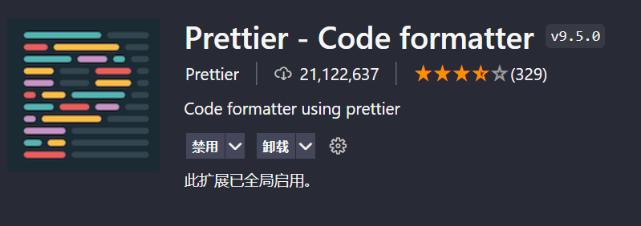
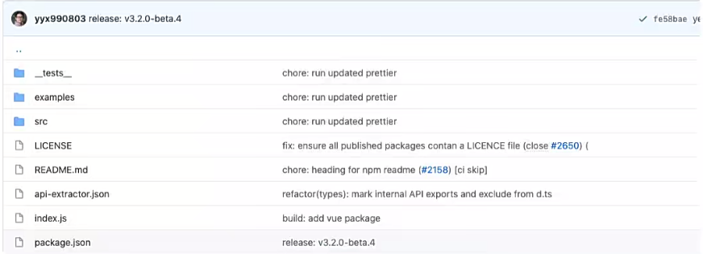
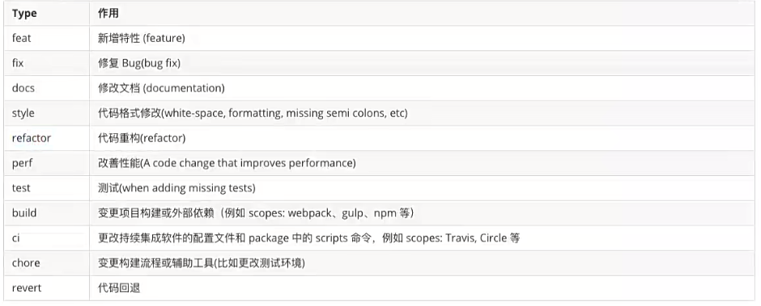
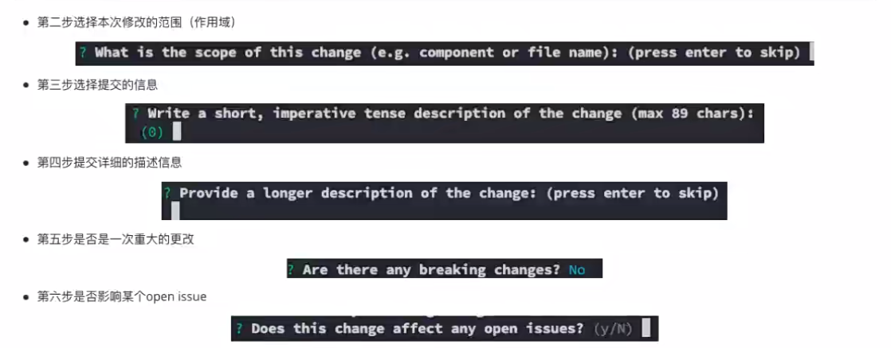

## 一、代码规范

### 1.1.集成`editorconfig`配置

```
# https://editorconfig.org

root = true

[*]
charset = utf-8
indent_style = space
indent_size = 2
end_of_line = lf
insert_final_newline = true
trim_trailing_whitespace = true

[*.md]
max_line_leng =off
trim_trailing_whitespace = false

```

### 1.2.便用prettier工具

1.prettier文件

```
{
  "useTabs": false,
  "tabWidth": 2,
  "printWidth": 80,
  "semi": false,
  "singleQuote": true,
  "trailingComma": "none"
}
```

2.prettierignore文件

```
/dist/*
.local
.output.js
/node_modules/**

**/*.svg
**/*.sh

/public/*

```

3.

4.测试prettier是否生效

- 在`package.json`中配置一个scripts：

  ```
  "prettier":"prettier --write ."
  ```

### 1.3.便用`ESLint`检测

#### 解决`eslint`和prettier冲突

安装插件（vue在创建项目时，如果选择prettier，那么这两个插件会自动安装)

```
npm es1int-plugin-prettier es1int-config-prettier -D
```

.eslintrc.js文件配置

```
 extends: [
    'plugin:vue/vue3-essential',
    'eslint:recommended',
    '@vue/typescript/recommended',
    '@vue/prettier',
    '@vue/prettier/@typescript-eslint',
    'plugin:prettier/recommended'//添加的代码
  ],
```

### 1.4.git Husky和`eslint`

虽然我们已经要求项目使用`eslint`了，但是不能保证组员提交代码之前都将`eslint`中的间题解决掉了:

- 也就是我们希望保证代码仓库中的代码都是符合`eslint`规范的;

- 那么我们需要在组员执行 `git commit` 命令的时候对其进行校验，如果不符合`eslint`规范，那么自动通过规范进行修复

  那么如何做到这一点呢？可以通过Husky工具：

  husky是一个git hook工具、可以帮助我们触发git提交的各个阶段：pre-commit、commit-msg、pre-push

  如何使用husky呢？

这里我们可以使用自动配置命令：

```
npx husky-init ; npm install 
```

### 1.5.gitcommit规范

通常我们的git commit会按照统一的风格来提交，这样可以快速定位每次提交的内容，方便之后对版本进行控制



##### 1.5.1.代码提交风格

但是如果每次手动来编写这些是比较麻烦的事情，我们可以使用一个工具：`Commitizen`

- `Commitizen`是一个帮助我们编写规范 commit message 的工具；

1.安装`Commitizen`

```
npm insta11 commitizen -D
```

2.安装`cz-conventional-changelog`，并且初始化`cz-conventional-changelog`：

```
npx commitizen init cz-conventiona]-change1og --save-dev --save-exact
```

这个命令会帮我们进行安装并且配置`package.json`文件

配置完毕之后我们提交代码需要 `npx cz`:

- 第一步是选择type，本次更新的类型





##### 1.5.2.代码提交验证

如果我们按照cz来规范了提交风格，但是依然有同事通过 git commit按照不规范的格式提交应该怎么办呢

- 我们可以通过`commitlint` 来限制提交

1.安装`@commitlint/config-conventional` 和`@commitlintcli`

```
npm i @commitlint/config-conventional @commit1int/c1i -D
```

2.在根目录创建commit.config.js文件，配置`commitlint`

```
module. exports = {
	extends: ['@ commit1int/config-conventiona1']
}
```

3.使用husky生成commit-msg文件，验证提交信息:

```
npx husky add .husky/conmit-msg "npx --no-insta11 commit1int --edit $1"
```

## 二，第三方库集成

### 2.1.vue.confg.js配置

### 2.2.vue-router集成

### 2.3.Vuex集成

### 2.4.element-plus集成

Element Plus，一套为开发者、设计师和产品经理准备的基于Vue 3.0 的桌面端组件库：

- 相信很多同学在Vue2中都使用过element-ui，而element-plus正是element-ui针对于Vue3开发的一个U组件库；

- 它的使用方式和很多其他的组件库是一样的。所以学会element-plus，其他类似于ant-design-vue、NaiveUl、VantUl都是差不多的；

  

安装element-plus

```
 cnpm install element-plus -D
```

#### 2.4.1.全局引入

一种引入element-plus的方式是全局引入，代表的含义是所有的组件和插件都会被自动注册

```
import ElementPlus from 'element-plus'
import 'element-plus/lib/theme-chalk/index.css'

app.use(Element-plus)
```

#### 2.4.2局部引入

用到某个组件对某个组件进行引入:

但是会发现是没有对应的样式的，引入样式有两种方式：

- 全局引用样式

- 局部引用样式(通过babel的插件)


1.安装babel的插件

```
npm install babel-plugin-import -D
```

2.配置babel.comfig.js

```
module.exports = {
  plugins: [
    [
      'import',
      {
        libraryName: 'element-plus',
        customStyleName: (name) => {
          return `element-plus/lib/theme-chalk/${name}.css`
        }
      }
    ]
  ],
  presets: ['@vue/cli-p1ugin-babe1/preset']
}
```

引入局部组件

```
import 'element-plus/dist/index.css'
import {
  ElAlert,
  ElAside,
  ElButton,
  ElForm,
  ElFormItem,
  ElInput,
  ElRadio
} from 'element-plus/lib/components'
```

### 2.5.axios集成


